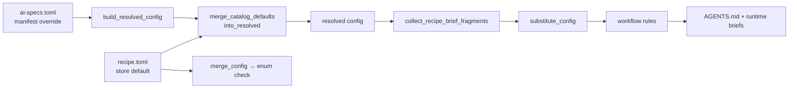

# Design: plan-build-delivery-contracts

## Context

`plan-build-flow` is today a config-less recipe: `catalog/recipes/plan-build-flow/recipe.toml`
declares a capability, an `on-sync validate-config` hook, one bundled skill, five
`provides.brief.workflow_rules`, one blocking pre-tool-use gate, and one doc. This change adds
one optional declarative delivery contract and materializes it through the existing
`{config.KEY}` path. Nothing new is rendered, imported, or orchestrated.

Grounding reads for this design:

- Schema: `lib/_internal/recipe_schema.py` (`ConfigField`, config parsing, brief fragments).
- Config merge + hooks: `lib/_internal/recipe-materialize.py` (defaults, merge, hooks, resolved config).
- Renderer: `lib/_internal/agents-render.py` (config substitution and workflow rules).
- Precedent: `catalog/recipes/git-pr-flow/recipe.toml` string config and placeholder.
- Gate to leave alone: `catalog/recipes/plan-build-flow/hooks/plan-build-gate.sh`.

## Goals / Non-Goals

**Goals:**

1. One optional `[config.artifact_store_default]` table with locked default and enum, validated
   by the existing schema/merge/hook path — no new validation code.
2. One additive `workflow_rule` whose `{config.artifact_store_default}` placeholder resolves
   through the existing renderer into `AGENTS.md` on `ai-specs sync`.
3. Version `1.2.0` → `1.3.0` plus README/catalog documentation.
4. Focused tests that pin the new surface and narrow the vocabulary guard precisely.

**Non-Goals:**

1. Any `chained_pr_default` or execution-mode field.
2. Any change to `plan-build-gate.sh` behavior, exit codes, or matcher set.
3. A recipe-specific renderer, substitution path, or orchestrator adapter.
4. Type coercion or a schema type-enforcement engine.
5. Any reference in the recipe surface to a specific external orchestrator package.
6. Review-budget configuration, interpolation, validation, or warning behavior. That decision is
   intentionally left to the external session preflight and is not a recipe contract.

## Decisions

### D-A. Config schema shape

**A.1 — the store table.** Placed after `[[hooks]]` and before `[provides]`, matching the
`git-pr-flow` layout:

```toml
[config.artifact_store_default]
required = false
type = "string"
default = "openspec"
enum = ["openspec", "engram", "both"]
help_text = "Where this project's planning artifacts live by default: openspec (files in the repo), engram (persistent memory), or both. Rendered into the project brief as a declared default."
```

`enum` is supported for string config and enforced at merge time. The existing
`on-sync = ["validate-config"]` hook remains unchanged. The exact store enum is intentionally
exempted only from the existing vocabulary guard's config-table prose scan, with a positive
enum assertion preventing the exemption from widening.

### D-B. Brief rule text and interpolation

**B.1 — one additive rule.** Append to the existing five in
`[provides.brief] workflow_rules`, preserving all current text and order:

```toml
"Default artifact store for this project's planning artifacts: `{config.artifact_store_default}`. When a session asks where planning artifacts should live, answer with this value unless the user overrides it.",
```

Keep string-array form (`key = None`) because the parser forbids mixing string and inline-table
entries. Existing generic substitution resolves a present key with `str(value)` and preserves
an absent placeholder verbatim; no new code is required.

**B.2 — decision boundary.** Review-budget handling is intentionally left to the external session
preflight by design. No recipe field, placeholder, validation pattern, warning section, or
recipe-level budget token is added; the preflight remains responsible for asking and respecting
that session decision.

### D-C. Version and documentation sync

| File | Change |
|---|---|
| `catalog/recipes/plan-build-flow/recipe.toml` | `version = "1.2.0"` → `"1.3.0"`; add the store table and one workflow rule |
| `catalog/recipes/plan-build-flow/README.md` | Add a `## Delivery contracts` section documenting store field, enum, default, override, and sync |
| `docs/recipes-catalog.md` | Plan-build row and entry list only `artifact_store_default`; version examples use `1.3.0` |

### D-D. Test plan

**1. `tests/test_plan_build_flow_recipe.py`**

- Replace the no-schema assertion with an exact one-field surface assertion: optional string,
  default `openspec`, exact enum, and unchanged hook pair.
- Amend the vocabulary test to excise only the store config table and intended README section.
- Add workflow placeholder, default, manifest override, enum rejection, and end-to-end
  materialization assertions.
- Add a negative surface assertion for absent `chained_pr_default`, execution mode, and any
  review-budget token in recipe schema/source/rules/skill.

**2. `tests/test_agents_render_brief_fragments.py`** — add a store enum substitution case while
preserving missing-key, bare-key, escape, and manifest-prose tests.

**3. `tests/test_recipes_catalog.py`** — pin `CONFIG_KEYS_IN_CATALOG` to
`plan-build-flow: ["artifact_store_default"]`.

**4. `tests/test_brief_render_policy.py` and `tests/test_runtime_brief_baseline.py`** — no change
expected unless an exact assertion genuinely fails because of the one intentional additive rule.

Verification remains focused on the recipe, renderer, catalog, baseline/policy, and gate tests.

## Data flow



Manifest override beats catalog default. Enum violations fail sync at `merge_config`; both
behaviors are pre-existing paths.

## Risks / Trade-offs

| # | Risk | Likelihood | Mitigation |
|---|---|---|---|
| **R1** | Vocabulary guard breaks on the `openspec` enum literal. | **Certain** | Excise exactly the store config table and one README section, with a positive enum assertion. |
| **R2** | Additive rule breaks exact-list brief baselines. | **Low (verified)** | Synthetic fixtures and render-flag tests remain unchanged; update only intentional additive expectations. |
| **R3** | Interaction with other recipes' string-form brief rules. | Low/Medium | String-form fragments preserve existing key/dedup behavior; order follows resolved enabled recipes. |
| **R4** | External session decisions drift from repository instructions. | Medium | The store value is the repository guarantee; session review policy remains explicitly outside this recipe contract. |

## Proposal notes

1. The parser requires one fragment representation per section, so the additive rule remains
   string-form rather than rewriting the existing five entries.
2. The brief-policy and runtime-baseline affected-area suggestions are retained only as focused
   verification surfaces; they are not changed speculatively.

## Open Questions

1. None for this change. Review-budget handling remains intentionally owned by the external
   session preflight and is not part of this recipe design.
