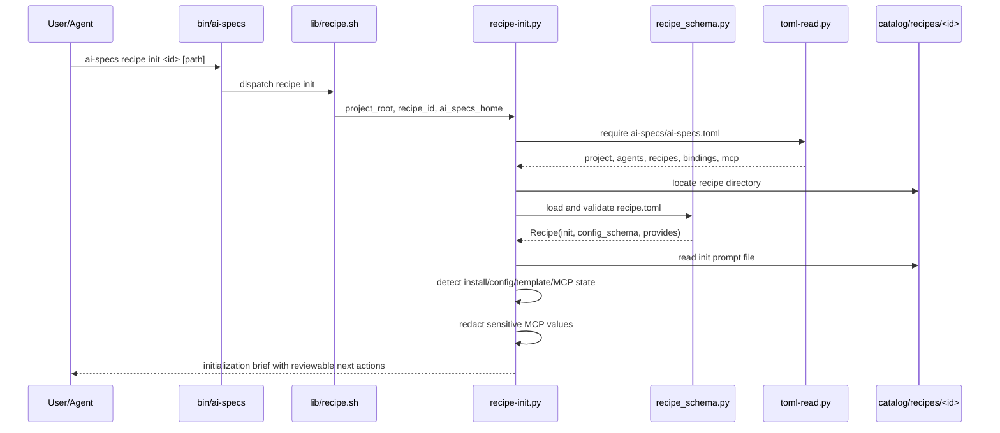

# Design: Recipe Init Prompts

## Context

Recipes currently support catalog metadata, install-time manifest entries, and sync-time materialization. They do not yet expose a standard agent-facing setup flow for project-specific choices such as tracker boards, MCP availability, per-recipe config, or reviewable template overrides.

This change adds an optional `[init]` declaration to `recipe.toml` and a CLI entry point, `ai-specs recipe init <id> [path]`, that produces an initialization brief. The brief is intended for an agent or human reviewer. It describes current project state, recipe init instructions, MCP availability, durable config targets, and reviewable next actions without silently mutating behavior.

The design intentionally avoids a general prompt execution engine. Init is a guided inspection and planning surface. Sync remains the only command responsible for recipe primitive materialization.

## Baseline Test Risk

A pre-artifact `./tests/run.sh` in this worktree currently exits 1 with three existing sync-related errors across 205 discovered tests. This design does not address those failures. Later apply and verify phases should record the baseline, add focused tests for recipe init behavior, and avoid treating unrelated sync failures as part of this design artifact.

## Architecture Decisions

### Decision: Init Metadata Lives In `recipe_schema.py`

Add a small `InitWorkflow` dataclass to `lib/_internal/recipe_schema.py` and an `init` field to `Recipe`.

Rationale: `recipe_schema.py` is already the canonical parser and validator for `recipe.toml`. Keeping `[init]` there ensures all consumers, including `recipe-read.py`, `recipe add`, and the future init helper, see the same validation errors and normalized shape.

The parser should validate:

- `[init]` is optional.
- If present, `[init].prompt` is required and non-empty.
- `description` is optional string.
- `needs_manifest` is optional boolean.
- `needs_mcp` is optional array of non-empty strings.
- Unknown `[init]` fields fail validation.
- `prompt` is a file path relative to the recipe directory, stays inside that directory, is not absolute, is not empty, is not a directory, and exists.

Because path existence requires the recipe directory, validation should either pass the recipe root into the init parser or perform prompt path validation in `load_recipe_toml(path)` after loading raw TOML. The lower-level `validate_recipe_toml(data)` can remain useful for pure schema tests by accepting no recipe root and only performing structural validation, but implementation should ensure catalog reads perform full path validation.

### Decision: `recipe-read.py` Emits Init Metadata, Not Init Execution

Extend `recipe_to_dict()` to include an `init` object when present, and `null` or no key when absent according to the final test fixture preference. The recommended output is always including the key for stable JSON consumers:

```json
{
  "id": "tracker",
  "init": {
    "prompt": "docs/init.md",
    "description": "Configure tracker board/list mappings",
    "needs_manifest": true,
    "needs_mcp": ["trello"]
  }
}
```

Rationale: `recipe-read.py` is a read/validation utility. It should expose init metadata and prompt path, but it should not assemble project-specific initialization briefs or query project state.

### Decision: Add A Dedicated Init Helper

Add a new internal helper, likely `lib/_internal/recipe-init.py`, invoked by a new shell wrapper `lib/recipe-init.sh` and dispatched from `lib/recipe.sh`.

Responsibilities:

- Resolve the target project root using the same path semantics as `recipe list` and `recipe add`.
- Require `ai-specs/ai-specs.toml`.
- Load the catalog recipe and validate `[init]`.
- Load manifest project, agents, recipes, bindings, and MCP sections through `toml-read.py` helpers.
- Determine install state and existing `[recipes.<id>.config]` keys.
- Redact MCP context before printing.
- Inspect recipe-provided MCP presets and template declarations for guidance.
- Read or reference the init prompt.
- Print an agent-readable initialization brief.
- Exit non-zero without mutation for uninitialized projects, missing recipes, invalid recipes, and recipes without init workflows.

Rationale: a dedicated helper keeps `recipe_schema.py` focused on validation, keeps `recipe-read.py` focused on JSON metadata, and avoids coupling sync materialization to init preview behavior.

### Decision: Default Init Is Read-Only And Reviewable

The first implementation should make `ai-specs recipe init <id> [path]` read-only. It may print proposed TOML snippets, patch guidance, or next commands, but it should not modify `ai-specs/ai-specs.toml`, templates, overrides, generated agent configs, or registries.

If a later spec requires applying reviewed changes, add an explicit flag such as `--apply` or a narrower `--write-manifest` flag. Do not add mutation by default.

Rationale: this matches the delta specs requiring reviewable actions before mutation, reduces risk around TOML round-tripping, and keeps init clearly separate from sync.

### Decision: Init Uses Existing Manifest Sections As Durable Storage

Durable per-recipe setup values belong in `[recipes.<id>.config]` unless an existing manifest section is explicitly responsible.

Examples:

- Tracker board selection for a recipe config field `board_id` belongs in `[recipes.tracker.config]`.
- MCP server declaration data belongs under `[mcp.<server>]`, not duplicated under recipe config, unless the recipe schema needs a separate reference value.
- Recipe install state belongs under `[recipes.<id>]` and should not be duplicated elsewhere.

Rationale: this keeps recipe init output aligned with sync-time config merge and the manifest contract.

### Decision: Init Preview Does Not Materialize Recipe Primitives

Init may describe or preview template targets declared by the recipe, but it must not call `recipe-materialize.py`, run `ai-specs sync`, vendor skills, copy commands, write `.recipe-mcp.json`, or update generated agent files.

Rationale: sync is already responsible for materializing enabled recipe primitives. Init exists to prepare project-specific inputs and reviewable setup decisions.

## Init Flow



## Data Model Changes

### `recipe.toml`

Add an optional top-level `[init]` table:

```toml
[init]
prompt = "docs/init.md"
description = "Configure tracker board and list mappings"
needs_manifest = true
needs_mcp = ["trello"]
```

Field semantics:

- `prompt`: required when `[init]` exists. Relative path to a prompt/instructions file inside the recipe directory.
- `description`: optional human-readable summary shown in init briefs and recipe metadata.
- `needs_manifest`: optional boolean. If true, the init brief should include relevant manifest context. Even when false or omitted, the CLI may still inspect minimal manifest state required for install/config idempotency.
- `needs_mcp`: optional list of MCP server IDs relevant to setup. The init brief should report whether each is configured in the project manifest and whether the recipe declares a preset for it.

Unsupported fields are rejected to keep the contract small and avoid accidental workflow-engine semantics.

### Python Dataclasses

Recommended shape:

```python
@dataclass
class InitWorkflow:
    prompt: str
    description: str = ""
    needs_manifest: bool = False
    needs_mcp: list[str] = field(default_factory=list)

@dataclass
class Recipe:
    ...
    init: InitWorkflow | None = None
```

### `recipe-read.py` JSON

Recommended JSON shape:

```json
{
  "id": "tracker",
  "name": "Tracker",
  "description": "...",
  "version": "0.1.0",
  "init": {
    "prompt": "docs/init.md",
    "description": "Configure tracker board and list mappings",
    "needs_manifest": true,
    "needs_mcp": ["trello"]
  },
  "provides": {
    "mcp": [],
    "templates": []
  }
}
```

For recipes without `[init]`, prefer `"init": null` to keep consumer parsing stable. If existing style strongly favors omitting absent optional sections, tests should lock that behavior explicitly.

## CLI Behavior

### Command Shape

Add:

```text
ai-specs recipe init <id> [path]
```

Path behavior should match existing recipe commands:

- `path` defaults to current directory.
- The shell wrapper resolves it to an absolute project root before invoking Python.
- A directory without `ai-specs/ai-specs.toml` fails with exit code 1 and no mutation.

### Dispatch

`lib/recipe.sh` should dispatch:

```text
list [path]
add <id> [path]
init <id> [path]
```

`bin/ai-specs` top-level help should mention the new subcommand only if it already enumerates recipe subcommands there. Otherwise the recipe subcommand help is sufficient.

### Exit Codes

Recommended behavior:

- `0`: recipe exists, project is initialized, recipe has valid init workflow, brief printed.
- `1`: uninitialized project, missing recipe, invalid recipe init declaration, or recipe has no init workflow.
- `2`: CLI usage error such as missing recipe ID, unknown flag, or extra positional argument.

### Brief Content

The brief should be plain text or markdown-like text optimized for agents. It should include:

- Recipe identity: id, name, version, description.
- Init metadata: prompt path, description, declared needs.
- Prompt content or prompt path. Prefer including prompt content for a self-contained brief if the file is reasonably sized; otherwise include path and a clear instruction to read it.
- Project context: project name, enabled agents, relevant recipes, recipe install state.
- Existing config state: current `[recipes.<id>.config]` keys and redacted values where needed.
- Config proposals: schema-aligned `[recipes.<id>.config]` targets and warnings for unknown keys.
- MCP context: configured/missing servers requested by `needs_mcp`, recipe MCP presets, and manifest-precedence reminder.
- Template/override preview: relevant recipe templates/docs and whether their targets already exist.
- Reviewable next actions: suggested manifest edits, setup questions to ask, commands to run later, and warnings.

The brief must not print literal secret values.

## Idempotent Manifest And Config Update Strategy

Initial implementation should print reviewable plan/patch output only. It should not write TOML by default.

When proposing manifest changes, the helper should classify operations rather than append text blindly:

- `recipe_table_exists`: whether `[recipes.<id>]` exists.
- `config_table_exists`: whether `[recipes.<id>.config]` exists.
- `existing_config_keys`: normalized keys already present.
- `missing_config_keys`: schema fields with no manifest value and no default.
- `updatable_config_keys`: existing keys that a prompt may replace.
- `unknown_config_keys`: manifest or proposed keys not declared in recipe config schema.

Proposed durable output should follow these rules:

- If `[recipes.<id>]` exists, propose updates to that table instead of adding a second table.
- If `[recipes.<id>.config]` exists, propose updates to existing keys instead of duplicate keys.
- If the config table is missing, propose adding exactly one `[recipes.<id>.config]` table.
- For missing recipe install state, propose adding `[recipes.<id>]` only once with catalog version and an explicit enabled value aligned with `recipe add` behavior.
- Do not claim init satisfies sync. Sync must still independently validate required config values.

Because Python stdlib lacks a TOML writer, later write support should either use an existing project-safe TOML patching strategy or remain explicit snippet output. Avoid introducing fragile text appends as the default behavior.

## MCP Discovery And Redaction

Init may read MCP declarations from:

- Project manifest `[mcp.<id>]` through `toml-read.py` normalization.
- Recipe MCP presets under `[[provides.mcp]]` or equivalent parsed `recipe.mcp` values.

Discovery is guidance-only:

- It reports whether requested `needs_mcp` servers are configured.
- It reports whether the recipe provides a preset that could guide setup.
- It does not create or update `[mcp.<id>]` unless a future explicit write flag is added.
- It states that project manifest MCP keys take precedence over recipe preset keys during sync.

Redaction should be conservative and recursive for any MCP context printed by init.

Redact values when:

- The key name contains `token`, `secret`, `password`, `passwd`, `api_key`, `apikey`, `key`, `credential`, or `auth`, case-insensitive.
- The value is an environment reference like `$TRELLO_TOKEN`, `${TRELLO_TOKEN}`, `{env:TRELLO_TOKEN}`, or `${env:TRELLO_TOKEN}`.
- The value appears in an `env` or `environment` map and is not a harmless placeholder.

Suggested replacement examples:

- Env reference: `<redacted:env:TRELLO_TOKEN>`.
- Literal secret: `<redacted>`.
- Present but null or empty values can remain visible as `null` or empty if that helps diagnose missing config.

Do not print raw environment variable values from the process environment. Init should inspect declared manifest values, not resolve secret-backed env references.

## Template And Override Preview

Init may preview templates or docs that are relevant to setup, but it must keep that preview separate from sync materialization.

For each relevant recipe template/doc target, the brief should report:

- Source path in the recipe.
- Target path in the project.
- Whether the target exists.
- Template condition such as `not_exists` when available.
- Recommended review action: create, skip, update, or inspect diff.

No file should be copied by default. If future explicit mutation is added, it must be idempotent and should prefer diff/review semantics over overwrite.

This preview must not update generated agent config files, `.recipe-mcp.json`, `.recipe/`, `.deps/`, skill registries, or runtime briefs. Those remain sync responsibilities.

## Testing Strategy

Later apply should use strict TDD: write failing tests for each behavior before implementation, commit implementation only after those tests fail for the intended reason, and record evidence in apply progress.

Focused tests should cover these layers:

- Schema unit tests in `tests/test_recipe_schema.py` for valid `[init]`, absent `[init]`, missing prompt, unknown fields, invalid `needs_mcp`, absolute prompt, parent traversal, directory prompt, and missing prompt file.
- Reader tests in `tests/test_recipe_read.py` for `init` JSON output shape and recipes without init.
- CLI tests for `ai-specs recipe init <id> [path]`, likely a new `tests/test_recipe_init.py`, covering success, missing recipe, uninitialized project, recipe without init, installed recipe, available-but-not-installed recipe, and usage errors.
- Manifest/config tests for existing `[recipes.<id>]`, existing `[recipes.<id>.config]`, existing config keys, missing config table, and unknown proposed config warnings.
- MCP redaction tests for env-backed values, literal token/secret/password/key fields, nested maps, configured/missing `needs_mcp`, recipe preset guidance, and manifest-precedence wording.
- Template preview tests for missing target, existing target, and no silent overwrite.
- Regression tests ensuring `recipe add`, `recipe list`, `recipe-read.py`, and `recipe-materialize.py` behavior remains unchanged for recipes without `[init]`.

Verification should include focused tests first. Full `./tests/run.sh` and `./tests/validate.sh` should be run when feasible, but apply/verify reports must distinguish new failures from the known pre-artifact sync-related baseline.

## Open Questions For Tasks Phase

- Whether `recipe-read.py` should always emit `"init": null` or omit absent init metadata. This design recommends `null` for stable consumers.
- Whether init prompt content should always be embedded in the brief or only referenced by path. This design recommends embedding content when reasonably sized and always including the path.
- Whether future mutation should be implemented as `--apply`, `--write-manifest`, or deferred entirely. This design recommends no mutation for the first implementation unless tasks/specs explicitly require a flag.

## Implementation Notes

- Keep changes minimal and localized: parser/dataclass, JSON reader output, CLI shell dispatch, new Python init helper, docs, and tests.
- Reuse `toml-read.py` for manifest normalization instead of reparsing divergent shapes.
- Do not change sync MCP merge semantics. If any discrepancy is found, preserve existing manifest-precedence contract and record it as a separate issue.
- Do not run `ai-specs sync` in this repository as part of this change.
- Do not solve the existing baseline sync test failures in this design or tasks phase unless a later apply phase proves they are directly caused by this change.
