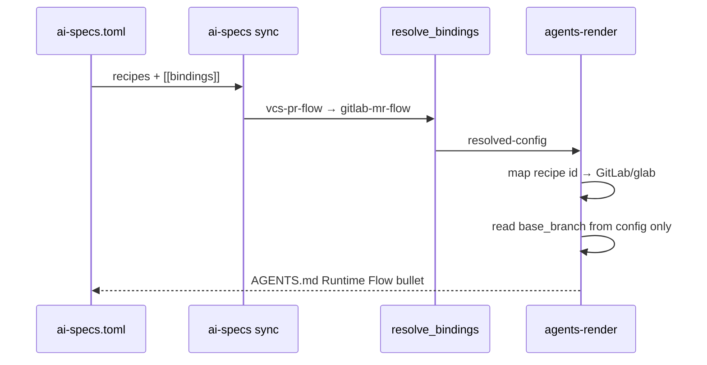

## Context

The capability model already selects the VCS host via `[[bindings]]`:

```toml
[[bindings]]
capability = "vcs-pr-flow"
recipe = "gitlab-mr-flow"
```

Recipe-specific skills/commands (`glab`, `gh`, `bb`) are bundled per recipe. The
`provider` config key adds a second, conflicting selector.

## Decision

**Keep sibling recipes; drop `provider` config.**

| Option | Verdict |
|--------|---------|
| Single multi-provider recipe | Rejected — branches inside skills/commands; duplicates binding |
| Separate recipes, no `provider` | **Selected** — recipe id is the provider identity |
| Shared cleanup skill (future) | Deferred — `worktree-flow` already owns post-merge cleanup |

## Recipe config contract (after)

Each VCS sibling recipe exposes only:

```toml
[config.base_branch]
required = false
type = "string"
default = "<recipe-default>"   # main | development per recipe
```

## Brief rendering

### Workflow rules (`[provides.brief]`)

Per-recipe fixed strings — no `{config.provider}`:

| Recipe | Fragment |
|--------|----------|
| `git-pr-flow` | `VCS/PR provider: GitHub (gh CLI). Use gh for all PR operations.` |
| `gitlab-mr-flow` | `VCS/MR provider: GitLab (glab CLI). Use glab for all MR operations.` |
| `bitbucket-pr-flow` | `VCS/PR provider: Bitbucket (bb CLI). Use bb for all PR operations.` |

### Runtime Flow VCS bullet (`agents-render.py`)

When `bindings.vcs-pr-flow` is set, map recipe id → display label:

```python
_VCS_RECIPE_LABELS: dict[str, tuple[str, str]] = {
    "git-pr-flow": ("GitHub", "gh"),
    "gitlab-mr-flow": ("GitLab", "glab"),
    "bitbucket-pr-flow": ("Bitbucket", "bb"),
}
```

Emit: `VCS/PR provider: {name} (`{cli}` CLI); base branch: `{base_branch}``

`base_branch` still read from `recipes[vcs_recipe_id].config.base_branch` with recipe
default fallback during render if unset.

## Migration

- Existing manifests with `provider = "..."` under `[recipes.*.config]`: **warn + ignore**
  (existing `recipe-materialize.py` behavior for unknown keys).
- No semver bump required for recipe assets beyond patch/minor catalog update.
- Authors remove stale `provider` lines when convenient; sync keeps working.

## Sequence



## Risks

| Risk | Mitigation |
|------|------------|
| Projects relied on overriding `provider` inside one recipe | Binding already selects recipe; document soft-breaking change |
| Dual-provider brief leak (both recipes enabled) | Unchanged — explicit binding still required; only bound recipe's fragments render for VCS bullet |
| `bitbucket-pr-flow` parallel worktree | Merge into apply without `provider`; rebase on this branch |

## Out of scope

- Extracting shared VCS cleanup into a cross-recipe skill (follow-up)
- Renderer `bb` CLI suffix for non-bitbucket bindings (handled by id map)
