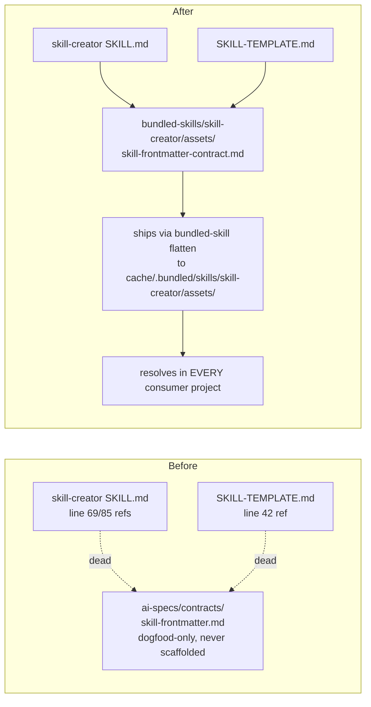

# Design: relocate `skill-frontmatter` contract alongside its only consumer

## Decision baseline

All open decisions from the proposal resolve to their recommended **Option A**
(pending final maintainer sign-off at the tasks gate, mirroring
`2026-07-24-relocate-bundled-commands`):

| ID | Decision | Accepted |
|----|----------|----------|
| D1 | Where the contract physically lives | **A** — `bundled-skills/skill-creator/assets/skill-frontmatter-contract.md`, riding the existing bundled-skill distribution |
| D2 | Spec vs. human-readable markdown | **A** — coexist; spec canonical, markdown relocated as agent-facing companion |
| D3 | This repo's dogfood copy | **A** — retire; delete file and empty `ai-specs/contracts/` |
| D4 | Doctor check for stale consumer copies | **A** — none; the path was never scaffolded, nothing to migrate |
| D5 | Spec GIVEN scenario path citation | **A** — update to the new concrete path |

This is a single-file relocation with three reference updates plus one spec
path citation (owned by the spec delta, not this design). No executable code
changes, no distribution machinery, no new project surface.

## Move: exact `git mv`

The canonical contract moves from the dogfood-only, never-scaffolded location to
the `skill-creator` skill's `assets/` directory so it physically ships with the
skill in every consumer project via `{cache}/.bundled/skills/skill-creator/assets/`.

```
git mv ai-specs/contracts/skill-frontmatter.md \
       bundled-skills/skill-creator/assets/skill-frontmatter-contract.md
```

- **Source:** `ai-specs/contracts/skill-frontmatter.md` (git-tracked; confirmed
  the only file under `ai-specs/contracts/`).
- **Destination:** `bundled-skills/skill-creator/assets/skill-frontmatter-contract.md`.
- **Rename intent:** the basename changes `skill-frontmatter.md` →
  `skill-frontmatter-contract.md` so the asset is self-describing when flattened
  into the shared cache next to `SKILL.md` and `SKILL-TEMPLATE.md` (avoids a bare
  `skill-frontmatter.md` in the skill's asset set).
- **Content:** unchanged. The document is already location-neutral in its body —
  its opening line ("human-owned source of truth for `SKILL.md` frontmatter")
  and its `lib/_internal/skill_contract.py` enforcement pointer carry over as-is.
- Using `git mv` (not delete-then-create) preserves rename history so blame and
  `git log --follow` continue to track the contract across the move.

## Reference updates — exact before/after

The old references were **already dead** even in this repo, which is the core
motivation and a useful verification anchor. Relative-link resolution from each
file's own directory:

- `SKILL.md` is at `bundled-skills/skill-creator/`; its `../../contracts/…`
  resolved to `<repo-root>/contracts/skill-frontmatter.md` — a path that does
  not exist. The real file lived at `ai-specs/contracts/…`.
- `SKILL-TEMPLATE.md` is at `bundled-skills/skill-creator/assets/`; its
  `../../contracts/…` resolved to `bundled-skills/contracts/skill-frontmatter.md`
  — also nonexistent.

New relative paths are computed from **each file's own location** to the new
asset at `bundled-skills/skill-creator/assets/skill-frontmatter-contract.md`.

### `bundled-skills/skill-creator/SKILL.md`

The file's directory is `bundled-skills/skill-creator/`; the asset is one level
down in `assets/`, so the correct relative path is
`assets/skill-frontmatter-contract.md`.

**Line 69** — Markdown link (relative link, both label and target):

- Before:
  ```
  Canonical reference: [`../../contracts/skill-frontmatter.md`](../../contracts/skill-frontmatter.md).
  ```
- After:
  ```
  Canonical reference: [`assets/skill-frontmatter-contract.md`](assets/skill-frontmatter-contract.md).
  ```

**Line 85** — checklist item, literal path (bare, not a link):

- Before:
  ```
  - [ ] Frontmatter matches `ai-specs/contracts/skill-frontmatter.md`
  ```
- After:
  ```
  - [ ] Frontmatter matches `assets/skill-frontmatter-contract.md`
  ```

Line 85 uses the same skill-local relative form as line 69 for consistency
(both now point at the shipped asset the reader can actually open from the
skill directory), replacing the old literal `ai-specs/…` project path that
never resolved in a consumer.

### `bundled-skills/skill-creator/assets/SKILL-TEMPLATE.md`

The file's directory is `bundled-skills/skill-creator/assets/` — the **same
directory** as the new asset — so the relative path collapses to the bare
basename `skill-frontmatter-contract.md`.

**Line 42** — Markdown link under "## Resources":

- Before:
  ```
  - **Contract**: [../../contracts/skill-frontmatter.md](../../contracts/skill-frontmatter.md)
  ```
- After:
  ```
  - **Contract**: [skill-frontmatter-contract.md](skill-frontmatter-contract.md)
  ```

**Known consideration (template portability):** `SKILL-TEMPLATE.md` is a
scaffolding template whose text is meant to be copied into a *new* skill's
`SKILL.md`. A same-directory `skill-frontmatter-contract.md` link is correct as
the template file physically sits (colocated in `assets/`), which is what D1
Option A and the success criteria require ("resolves to the colocated asset in
the same directory"). It is *not* guaranteed to resolve verbatim once a
contributor copies the template into a differently-located skill — but that was
equally true of the old `../../contracts/…` form (which resolved nowhere), and
fixing per-generated-skill link correctness is the skill author's
responsibility, out of scope here. The template's "Resources" section is
illustrative guidance, not a runtime-resolved reference. We keep the accepted
baseline: the concrete, verifiable relative path from the template's own
location.

## Directory removal

After the `git mv`, `ai-specs/contracts/skill-frontmatter.md` was the sole entry
under `ai-specs/contracts/`, so the directory is now empty.

- Git does not track empty directories, so the move alone removes
  `ai-specs/contracts/` from version control (no separate `git rm` needed).
- The empty directory may linger in the working tree; remove it explicitly to
  leave a clean tree:
  ```
  rmdir ai-specs/contracts
  ```
- No `.gitkeep`, no scaffolding, and no `init.sh`/sync/`templates/` reference
  ever created this path (proposal-verified: `grep -rn "contracts" lib/init.sh
  templates/` returns nothing), so nothing recreates it. D4 confirms no consumer
  migration or doctor check is warranted.

## No code changes: `lib/_internal/skill_contract.py`

Confirmed — the module needs **no changes**:

- It is a pure parser/normalizer/validator/renderer for skill *metadata* (the
  `SKILL.md` frontmatter itself), operating on text passed in by callers. It
  never reads, resolves, or hardcodes the human-readable contract *document*
  path.
- Verification: grep for `contracts/`, `skill-frontmatter.md`, and
  `ai-specs/contracts` in `skill_contract.py` returns **zero matches**. The only
  path-shaped symbols it touches are the caller-supplied `SKILL.md` `path`
  argument (used solely for error-message context) and its own module path in
  the shebang.
- The contract document is human/agent-facing prose; enforcement is code. The
  relocation moves the prose and its inbound references only; the enforcement
  engine is path-agnostic and untouched.

Same for the referenced tests — `tests/test_skill_contract.py` and
`tests/test_manifest_contract_docs.py` exercise parsing/validation behavior and
do not assert on the contract document path (proposal-verified by grep), so they
need no changes.

## Data flow (before → after)



The contract now travels with the skill through the existing bundled-skill
distribution — no new tier, no new precedence, no new doctor check, no new
project surface (aligned with `minimal-project-materialization`).

## Spec delta (owned by the spec phase, noted for completeness)

`openspec/changes/relocate-skill-frontmatter-contract/specs/skill-frontmatter-contract/spec.md`
carries the D5 change: the "Contract document describes required and generated
fields" scenario's `GIVEN` updates from `ai-specs/contracts/skill-frontmatter.md`
to `bundled-skills/skill-creator/assets/skill-frontmatter-contract.md`. Only the
path citation changes; the requirement text, other scenarios, and the
"generated skill files are derived output" scenario are unchanged. This design
does not edit the spec delta.

## Rollback

Revert the diff: `git mv` back to `ai-specs/contracts/skill-frontmatter.md`,
restore the three reference strings, remove the new asset. Recreate
`ai-specs/contracts/` implicitly via the reverse move. No data migration, no
cache/lock state. A consumer that already synced the new location keeps
resolving from `{cache}/.bundled/skills/skill-creator/assets/`; CLI-side rollback
does not disturb already-cached consumers until their next sync.

## Verification plan

- `bundled-skills/skill-creator/assets/skill-frontmatter-contract.md` exists with
  the relocated content; `ai-specs/contracts/` is gone.
- From `bundled-skills/skill-creator/`, `assets/skill-frontmatter-contract.md`
  resolves to an existing file (SKILL.md lines 69/85).
- From `bundled-skills/skill-creator/assets/`, `skill-frontmatter-contract.md`
  resolves to an existing file (SKILL-TEMPLATE.md line 42).
- `grep -rn "contracts/skill-frontmatter" bundled-skills/ lib/ docs/ AGENTS.md
  templates/` returns no stale references outside archived changes.
- No file under `openspec/changes/archive/` is modified.
- `./tests/validate.sh` passes.
