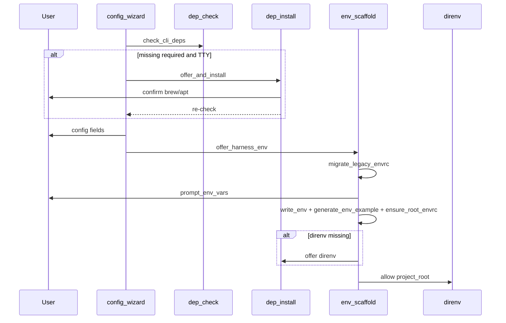
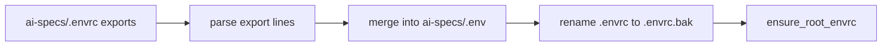

# Design: Deps opt-in install + envrc spoon-feed

## Context

Today `envrc-scaffold.write_envrc` writes `ai-specs/.envrc` while
`direnv_allow(project_root)` allows the **root** — a structural mismatch.
`dep_check.py` is explicitly guidance-only. This design fixes the env layout for
direnv + agents' process-env model, and adds an opt-in install path for missing
CLIs on interactive TTYs.

## Goals / Non-Goals

**Goals:**

- Correct direnv layout: root `.envrc` loads app `.env` + `ai-specs/.env`.
- Wizard writes harness secrets only to `ai-specs/.env`.
- Merge-safe root `.envrc` managed block (no clobber of custom direnv).
- Migrate `ai-specs/.envrc` → `ai-specs/.env` when encountered.
- TTY opt-in install via brew/apt for known binaries including `direnv`.
- Doctor WARNs for missing substrate / missing harness keys.
- Docs aligned with behavior.

**Non-Goals:**

- Silent auto-install.
- Secrets in agent MCP JSON.
- Editing application `.env` contents.
- Replacing direnv.
- `ai-specs env print|check` (follow-up).

---

## Part A — Env layout

### Decision A1: File roles

| Path | Git | Role |
|------|-----|------|
| `ai-specs/.env` | ignored | Harness MCP secrets/values (KEY=value) |
| `ai-specs/.env.example` | committed | Regenerable template: empty values + purpose/help comments |
| Project-root `.envrc` | ignored | direnv entry; managed block only loads dotenv files |
| Project-root `.env` | ignored | **User/app owned — never written by ai-specs** |
| `ai-specs/.envrc` | ignored | **Legacy**; migrate then stop writing |
| `ai-specs/.envrc.example` | committed | **Deprecated**; generate `.env.example` instead; optional one-release dual-write or rewrite header pointing to `.env.example` |

**Rationale:** direnv's `dotenv_if_exists` keeps secrets out of `.envrc` and separates
app vs harness. Root allow path matches where users and agents typically start.

### Decision A2: Managed block markers

Exact markers (stable contract):

```bash
# managed-by: ai-specs (do not remove block)
dotenv_if_exists .env
dotenv_if_exists ai-specs/.env
# end managed-by: ai-specs
```

`ensure_root_envrc(project_root) -> Path`:

1. If no root `.envrc`: create file with header comment + managed block + trailing newline.
2. If `.envrc` exists and contains both start and end markers: replace **only** the
   interior (inclusive of markers) with the canonical block (idempotent).
3. If `.envrc` exists without markers: append a blank line + managed block at EOF.
4. Never delete user content outside the markers.
5. Do not write secret values into `.envrc`.

### Decision A3: `ai-specs/.env` format

```
# ai-specs/.env — generated by ai-specs configure-recipes
# gitignored. Regenerate values via: ai-specs configure-recipes

TRELLO_API_KEY=...
TRELLO_TOKEN=...
CANONICAL_VAULT_PATH=...
```

- Use dotenv `KEY=value` (no `export`).
- Quote values that contain spaces or shell-special chars (same discipline as vault
  README paths).
- `write_env(project_root, var_values)`:
  - Merge with existing keys when file exists (update prompted keys; preserve
    unknown extra keys the user added).
  - Do not truncate unrelated keys.
- Secrets still collected via `questionary.password()` (`_is_secret_var`).

### Decision A4: Example template

`generate_env_example(project_root)`:

- Collect vars via existing `collect_env_vars` (MCP `$VAR` refs).
- Write `ai-specs/.env.example` with `VAR=` + `# purpose; help` comments from
  `ENV_VAR_HELP`.
- Backup existing example to `.env.example.bak` before overwrite (parity with
  current `.envrc.example` backup).
- Stop writing `.envrc.example` as primary; if present, leave it or rewrite a
  short deprecation stub pointing to `.env.example` (pick **stub rewrite** in
  implement phase for clarity).

### Decision A5: Migration from `ai-specs/.envrc`

`migrate_legacy_envrc(project_root) -> bool`:

1. If `ai-specs/.envrc` missing → no-op.
2. Parse `export VAR="value"` / `export VAR=value` lines (ignore comments/blank).
3. Merge into `ai-specs/.env` (existing `.env` wins on key conflict — do not
   overwrite non-empty existing values).
4. Rename `ai-specs/.envrc` → `ai-specs/.envrc.bak` (or `.migrated`).
5. Call `ensure_root_envrc`.
6. Return True if migration ran.

Call migration at the start of env offer paths (configure / init / recipe-add)
before prompt/write.

### Decision A6: Orchestration (`offer_harness_env`)

Replace `_offer_envrc` body with:

```
migrate_legacy_envrc(root)
vars = collect_env_vars(root)
if not vars: return
values = prompt_env_vars(root)  # may return None / {}
if values is None: return
if values: write_env(root, values)
else: ensure ai-specs/.env exists or skip write
generate_env_example(root)  # always safe regenerable
ensure_root_envrc(root)
# direnv substrate
if direnv missing: offer_install(direnv)  # Part B
direnv_allow(root)  # project root
soft-fail all errors (yellow warn; do not abort configure)
```

### Decision A7: Agents / IDE

- MCP materialize keeps `$VAR` / `${VAR}` refs — **no** secret inlining.
- Docs + doctor guidance: shell with direnv hook loads vars; IDE launched from Dock
  without direnv must get env from OS/IDE settings or a shell-started session.
- Out of MVP: `ai-specs env check` (presence-only, no secret dump).

### Decision A8: Gitignore

Root `.gitignore` already ignores `.env` and `.envrc`. Confirm project template /
init copies ignore `ai-specs/.env` (path `.env` under ai-specs may already match
`**` patterns depending on template). If init template lacks it, add
`ai-specs/.env` explicitly to the project's ignore guidance or template
`.gitignore` fragment. Prefer explicit `ai-specs/.env` in harness-managed ignore
list if one exists.

---

## Part B — Opt-in CLI install

### Decision B1: New module `dep_install.py`

```python
@dataclass
class InstallPlan:
    binary: str
    command: list[str]   # argv to run, or empty if guidance-only
    display: str         # human-visible command string
    guidance_url: str
    kind: str            # "brew" | "apt" | "guidance"

def resolve_install_plan(binary: str, *, install_url: str = "") -> InstallPlan
def offer_and_install(plans: list[InstallPlan], *, tty: bool) -> list[str]
    # returns list of binaries successfully installed (re-checked)
```

### Decision B2: Package map

Versioned dict in `dep_install.py` (extendable):

| binary | brew formula | apt package | notes |
|--------|--------------|-------------|-------|
| `gh` | `gh` | `gh` | |
| `glab` | `glab` | `glab` | |
| `jq` | `jq` | `jq` | |
| `direnv` | `direnv` | `direnv` | |
| `git` | `git` | `git` | usually present; still offerable |
| `bb` | — | — | guidance-only → `install_url` |
| `npx` | — | — | guidance-only → Node download URL; optional confirm text that Node is large |

Resolver:

1. If binary in brew map and `shutil.which("brew")` and platform is Darwin (or brew
   present on Linux): plan `brew install <formula>`.
2. Elif binary in apt map and `shutil.which("apt-get")` (Linux): plan
   `sudo apt-get install -y <pkg>` — **display full command**; user must confirm;
   never hide sudo.
3. Else: guidance-only plan (print `install_url`, no run).

### Decision B3: Prompt UX

On TTY, for each missing **required** dep (after `_render_dep_panel`):

1. Show plan.display (or URL for guidance-only).
2. `questionary.confirm(f"Install {binary} now?", default=False)`.
3. If yes and command non-empty: `subprocess.run(command, check=False)` with
   inherited stdio (user sees brew/apt output); timeout generous (e.g. 300s).
4. Re-run `check` for that binary; report success/fail.
5. If user declines or guidance-only: continue; existing “Configure anyway?” gate
   remains for config wizard when still missing.

Non-TTY: `offer_and_install` returns immediately without prompts.

Doctor **never** calls install (read-only).

### Decision B4: Where `direnv` is declared

**Global harness check** in doctor + env offer path (not every recipe.toml):

- Doctor: if any enabled recipe has MCP env refs → WARN when `direnv` missing
  (purpose: load harness env for agents/shell).
- Env offer: before `direnv allow`, if missing → offer install via Part B.

Optional catalog addition: not required on every recipe; avoids noise for projects
with zero MCP env vars.

### Decision B5: Interaction with `_dep_gate`

Updated flow:

```
results = check_cli_deps(recipe)
render panel
missing = required and not ok
if missing and tty:
    offer_and_install(resolve each)
    results = check_cli_deps(recipe)  # refresh
    missing = ...
if missing:
    confirm configure anyway? default False
```

### Decision B6: Security / safety

- Never run install without explicit confirm.
- Never `curl | sh`.
- Only argv from the static map (+ fixed apt/brew prefixes).
- No privilege escalation tricks; apt path shows `sudo` plainly.
- Failures are non-fatal to sync/configure (WARN path).

---

## Part C — Doctor checks

New check ids (suggested):

| id | severity | when |
|----|----------|------|
| `direnv` | WARN | MCP env vars required and `direnv` not on PATH |
| `envrc-managed` | WARN | MCP env vars required and root `.envrc` lacks managed markers |
| `harness-env` | WARN | Required MCP var missing or empty in `ai-specs/.env` (and not set in process env — optional; MVP: file only) |
| `recipe-dep` | WARN | unchanged for missing required CLIs |

Doctor remains read-only (no write, no install).

---

## Part D — Module reshape

Keep filename `envrc-scaffold.py` for import stability **or** rename to
`env_scaffold.py` with thin re-export aliases for one release. Prefer **rename to
`env_scaffold.py`** with compatibility wrappers in old module that forward and emit
no user-visible warning (tests updated to new name).

Public API target:

- `collect_env_vars`
- `prompt_env_vars`
- `write_env` / `generate_env_example`
- `ensure_root_envrc`
- `migrate_legacy_envrc`
- `direnv_allow`
- `offer_harness_env` (orchestration used by wizard/init/recipe-add)

---

## Sequences

### Configure-recipes (happy path)



### Migration



---

## Risks

| Risk | Mitigation |
|------|------------|
| Clobber custom `.envrc` | Marker-bounded replace/append only |
| Overwrite user keys in `ai-specs/.env` | Merge; preserve extras; don't wipe non-prompted keys |
| `sudo apt-get` surprise | Full command display + default No |
| brew installs Node for npx | guidance-only for npx |
| IDE still missing env | Document + doctor WARN; no secret-in-JSON |
| Docs drift again | Explicit doc tasks + CHANGELOG |

## Open follow-ups (not this change)

- `ai-specs env check` (presence-only).
- Windows / non-brew non-apt installers.
- Shell-hook detection (`direnv` installed but not hooked in shell).
