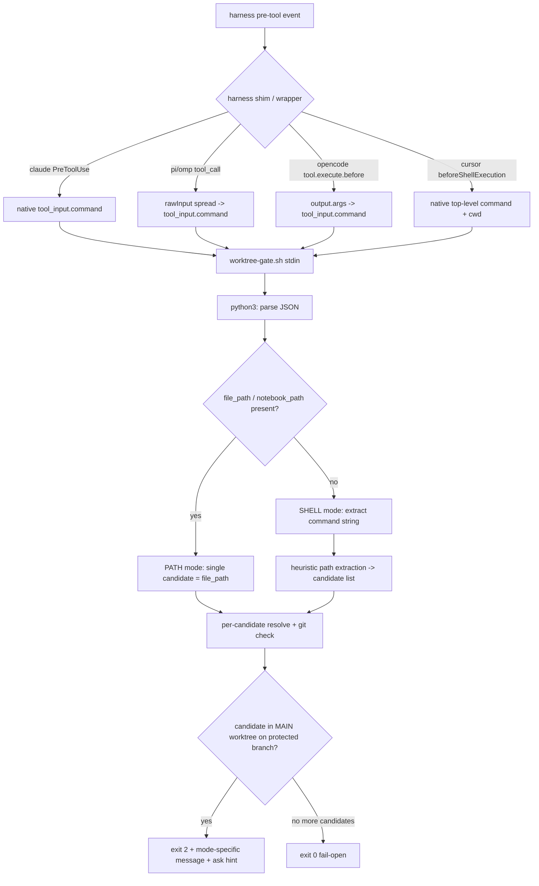

# Design: worktree-gate bash-bypass coverage

> Change slug: `worktree-gate-bash-coverage`
> Worktree: `.worktrees/worktree-gate-bash-coverage` @ `feat/worktree-gate-bash-coverage`
> Builds on `explore.md` + `proposal.md` in this directory. Locked approach:
> **hybrid A + C** (script command-heuristics + matcher/hook wiring + policy text);
> **B (post-hoc revert) rejected**; **dual `[[provides.hooks]]` sharing one script**;
> heuristics **best-effort, fail-open**.
> skill_resolution: `none` (sdd-design skill path not injected; used existing
> `worktree-gate.sh`, `hooks-render.py`, `recipe-materialize.py`, both test
> suites, and `docs/runtime-hooks.md` as the format/behaviour source of truth).

## Locked product decisions (from orchestrator, not relitigated here)

1. **Shell matcher aliases:** match case-insensitively against
   `Bash|Shell|Execute|Terminal` (mirrors the existing case-insensitive tool-name
   regex the pi/omp/opencode shims already use for `Edit`/`Write` variance).
2. **Cursor shell hook:** a **name-filtered** matcher (`Bash|Shell|Execute|Terminal`),
   never an empty/catch-all matcher.
3. **No new must-allow carve-outs** for protected-main shell writes beyond the
   existing `gate_mode` escape hatch (`always`/`ask`/`off`, `WORKTREE_GATE_MODE=off`).
   The shell-write gate stays symmetric with the path-write gate — no new bypass surface.
4. **Ask-mode messaging parity:** the shell-write block path reuses the **exact**
   `gate_mode=ask` messaging pattern (block reason + `re-run with WORKTREE_GATE_MODE=off`
   hint) as the existing path-write block.

## 1. Context and the exact hole

`worktree-gate.sh` today (`catalog/recipes/worktree-flow/hooks/worktree-gate.sh`):

- Reads normalized stdin JSON `{event, tool_name, tool_input, cwd}`.
- Extracts **only** `tool_input.file_path || tool_input.notebook_path`.
- Empty path → `exit 0` (fail-open).
- Otherwise: walk up to the nearest existing dir → `git rev-parse --is-inside-work-tree`
  → compare `--absolute-git-dir` vs `--path-format=absolute --git-common-dir`
  (linked worktree ⇒ `git_dir != common_dir` ⇒ **allow**) → else if
  `symbolic-ref --short HEAD` ∈ `$protected` ⇒ **block (exit 2)**, with a
  `.claude/settings*` / `.claude/hooks/*` allowlist and a `gate_mode=ask` bypass hint.
- Modes: sync-stamped `__WORKTREE_GATE_MODE__` + env `WORKTREE_GATE_MODE`
  (`always|ask|off`); `off` early-exits.

Shell is completely outside the MATCHER (`Edit|Write|MultiEdit|NotebookEdit`), so a
`bash(python3 <<'PY' … Path(…).write_text(…) PY)` fallback writes on protected main
and the gate never runs. Live-exploited this session. This change closes the
**in-process** shell-write hole with best-effort heuristics and reinforces policy.

## 2. Data flow after this change



## 3. `worktree-gate.sh` dual-input contract

### 3.1 Accepted stdin shapes (all must parse; anything else fail-open)

| Source | Shape reaching the script | Command field | cwd |
|--------|---------------------------|---------------|-----|
| **Existing path event** (claude/pi/omp/opencode file tools) | `{tool_name, tool_input:{file_path\|notebook_path}, cwd}` | — (path mode) | `cwd` |
| **claude Bash** | `{tool_name:"Bash", tool_input:{command}, cwd}` | `tool_input.command` | `cwd` |
| **pi/omp shell** (shim spreads `rawInput`) | `{tool_name, tool_input:{command, …}, cwd}` | `tool_input.command` | `cwd` |
| **opencode shell** (shim uses `output.args`) | `{tool_name, tool_input:{command, …}, cwd}` | `tool_input.command` | `cwd` |
| **Cursor `beforeShellExecution`** (wrapper pipes native stdin **unchanged**) | `{command, cwd, …}` — **no** `tool_name`/`tool_input` | top-level `command` | top-level `cwd` |

Command-field extraction precedence (first non-empty string wins):

```
tool_input.command  ->  tool_input.script  ->  tool_input.cmd  ->  command  ->  script
```

`tool_input.script` / `.cmd` and the top-level `command`/`script` cover Cursor's
native payload and any harness whose normalizer names the shell body differently.
`cwd` is read top-level in every shape (both the normalized event and Cursor put
`cwd` at top level), falling back to the script's own `$PWD` if absent.

### 3.2 Parsing order (extends, never changes, path-mode outcomes)

1. Resolve `gate_mode`; `off` → `exit 0` (unchanged).
2. `input="$(cat)"`; hand to one `python3` extractor (python3 is already a
   project prerequisite and already embedded in the script).
3. python3 parses JSON. **On any `json.load` exception → print nothing → `exit 0`**
   (unchanged fail-open).
4. If `file_path`/`notebook_path` non-empty → emit **PATH mode**, one candidate =
   that path. (Byte-for-byte the same set of candidates as today.)
5. Else read the command string via §3.1 precedence. **No command → emit nothing →
   `exit 0`** (preserves today's empty-path fail-open).
6. Run the §3.3 heuristics over the command → 0..N **candidate write paths**. If the
   heuristic set is empty → emit nothing → `exit 0`.
7. python3 prints a small protocol on stdout:
   ```
   <mode>\t<tool_name>        # line 1;  mode ∈ {path, shell}
   <candidate-path>           # line 2..N; one raw path per line (NUL-safe: newlines
                              #            in paths are out of scope, fail-open)
   ```
8. bash reads line 1 for `mode` + `tool_name`, then loops the candidate lines
   through the shared `resolve_and_check` (§3.4). The **first** candidate that
   resolves into the protected main worktree → block with the mode-appropriate
   message (§5). If no candidate blocks → `exit 0`.

Path mode therefore keeps the exact current semantics (single absolute candidate,
same git checks, same `.claude/settings*` allowlist, same message). Shell mode is
purely additive.

### 3.3 Heuristic path extraction (the high-risk core)

All extraction happens in the embedded `python3` block (bash regex is too brittle
for quoting/heredocs). Two independent passes run over the command string; their
candidate paths are unioned.

**Pass 1 — token/segment pass (quote-aware, needs a clean `shlex`).**

```python
try:
    tokens = shlex.split(cmd, posix=True)   # respects quotes; does NOT interpret operators
except ValueError:
    tokens = None                           # unbalanced quotes / heredoc → skip Pass 1
```

`shlex.split` keeps `>` inside quotes as part of a token (so `echo 'a > b'` →
`['echo', 'a > b']`, **no** standalone `>` token → no candidate — this is the
primary false-positive guard). When `tokens` is available, split it into
**segments** on the shell separators `|`, `||`, `&&`, `;` (these appear as their own
tokens because they are whitespace-delimited; glued forms stay inside a token and are
conservatively ignored). For each segment, find its **command word** = first token
after skipping `VAR=val` assignments and wrappers (`sudo env nice time nohup xargs
command`). Then per segment:

| Pattern | Match rule (per segment) | Path extraction | Worked example → candidate |
|---------|--------------------------|-----------------|-----------------------------|
| **Redirection `>` / `>>`** | a token equal to `>`/`>>` (target = next token), **or** a token matching `^\d*>>?[^&].*` (strip the `\d*>>?` prefix; remainder = target) | the target token, quotes already stripped by shlex | `echo hi > notes.md` → `notes.md`; `cmd >>build/log` → `build/log`; `x 2>err.log` → `err.log` |
| **`tee`** | command word `tee` **or** a token `tee` immediately after a `|` | every following non-flag token (not starting `-`) until end of segment | `make | tee -a out.log` → `out.log` |
| **`sed -i` / `perl -i`** | command word `sed`/`perl` **and** a token `== -i` or starting with `-i` (`-i`, `-i.bak`) | **last** non-flag token in the segment | `sed -i 's/a/b/' cfg.yaml` → `cfg.yaml`; `perl -i.bak -pe 's/x/y/' Makefile` → `Makefile` |
| **`cp` / `mv`** | command word `cp`/`mv` | **last** non-flag token in the segment (destination) | `cp /tmp/x.py src/x.py` → `src/x.py`; `mv a b` → `b` |

Only the **command word** position (or a wrapper-prefixed one) triggers `tee`/`sed`/
`perl`/`cp`/`mv`, so a path literally named `tee` as an argument does not fire.

**Pass 2 — interpreter-body regex pass (raw string, heredoc-safe).**

Runs on the **raw** `cmd` regardless of Pass 1 (heredocs deliberately break `shlex`).
High-precision, string-literal-only. If the target is a variable/expression, nothing
is captured → fail-open by design.

| Interpreter API | Regex (capture = path) | Worked example → candidate |
|-----------------|------------------------|-----------------------------|
| Python `open(path, mode)` write | `open\(\s*(["'])(?P<p>.+?)\1\s*,\s*(["'])[rbt+ ]*[wax][rbt+ ]*\3` (mode must contain `w`/`a`/`x`) | `python3 -c "open('gen.py','w').write(x)"` → `gen.py` |
| Python `Path(path).write_text/bytes` | `Path\(\s*(["'])(?P<p>.+?)\1\s*\)\s*\.write_(?:text\|bytes)\(` | heredoc `Path('src/a.py').write_text('x')` → `src/a.py` |
| Node fs writers | `fs\.(?:writeFileSync\|appendFileSync\|writeFile\|appendFile\|createWriteStream)\(\s*(["'])(?P<p>.+?)\1` | `node -e "fs.writeFileSync('dist/a.js',s)"` → `dist/a.js` |
| Ruby `File.write` / `File.open(...,'w')` | `File\.(?:write\|open)\(\s*(["'])(?P<p>.+?)\1(?:\s*,\s*(["'])[rbt+ ]*[wax][rbt+ ]*\4)?` (for `open`, require a write mode arg) | `ruby -e "File.write('x.txt',s)"` → `x.txt` |

The Python heredoc + `open('…','w')` / `write_text(` case is the **live exploit
class** and MUST be covered by a test (§6).

**Candidate scrubbing (both passes), before any git work:**

- Drop empty, `.`, `-` (stdin sentinel).
- Drop `/dev/null`, `/dev/stdout`, `/dev/stderr`, `/dev/fd/*`, and any token starting
  with `&` (fd duplication like `>&2`, `2>&1`).
- Deduplicate.

### 3.4 Resolution and the protected-main check (shared with path mode)

`resolve_and_check <candidate>` — one function, used by both modes so the git logic
never forks:

1. If `<candidate>` is absolute → `abs=<candidate>`; else `abs="$cwd/<candidate>"`
   (`cwd` from the event; path mode candidates are already absolute so this is a
   no-op there — existing tests unaffected).
2. `.claude/settings*` / `.claude/hooks/*` allowlist (same `case` as today) → allow.
3. Walk `dir=$(dirname "$abs")` up to the nearest **existing** directory (file may not
   exist yet on a write) — identical to today's loop. No existing dir → **fail-open
   for this candidate** (continue to next candidate).
4. `git -C "$dir" rev-parse --is-inside-work-tree` fails → **outside repo → fail-open**
   for this candidate.
5. `git_dir` vs `common_dir`: `git_dir != common_dir` → **linked worktree → allow**
   (candidate is safe).
6. `symbolic-ref --short HEAD` fails (detached) → **fail-open** for this candidate.
7. Branch ∈ `$protected` → **block (exit 2)** with the mode-specific message (§5).
   Branch not protected → allow this candidate.

Any `git` invocation error at any step is treated as fail-open **for that candidate**
(the loop tries the next candidate; if none blocks, the script `exit 0`s). This is
strictly the same philosophy as the current single-path script, generalized to a list.

### 3.5 Exhaustive fail-open matrix (task item 1)

| Situation | Outcome |
|-----------|---------|
| No command field **and** no path | `exit 0` |
| JSON parse error | `exit 0` |
| `gate_mode=off` (stamped or env) | `exit 0` (before parsing) |
| Command present but heuristics extract 0 candidates | `exit 0` |
| Unbalanced quotes / heredoc → `shlex` raises | Pass 1 skipped; **Pass 2 still runs**; if empty → `exit 0` |
| Candidate is `/dev/null`, fd-dup, empty, `.`, `-` | candidate dropped |
| Candidate path unresolvable (no existing ancestor dir) | fail-open **for that candidate**, try next |
| Candidate outside the repo | fail-open for that candidate |
| Candidate inside a **linked** worktree | allow (candidate safe) |
| Detached HEAD / any `git` error | fail-open for that candidate |
| Branch not in `$protected` | allow |
| Candidate resolves into MAIN worktree on protected branch | **exit 2 (block)** |

Only the last row blocks. A buggy or incomplete heuristic can only ever *fail to
block*; it can never wedge unrelated shell.

## 4. Dual `[[provides.hooks]]` distribution (recipe.toml + renderer)

### 4.1 recipe.toml — add a sibling shell hook (keep the file-write hook verbatim)

```toml
[[provides.hooks]]
id = "worktree-gate"
event = "pre-tool-use"
script = "hooks/worktree-gate.sh"
matcher = "Edit|Write|MultiEdit|NotebookEdit"
blocking = true
description = "Block writes to the main worktree on a protected branch"

[[provides.hooks]]
id = "worktree-gate-shell"
event = "pre-tool-use"
script = "hooks/worktree-gate.sh"          # SAME script — single decision brain
matcher = "Bash|Shell|Execute|Terminal"    # case-insensitive at runtime (shims + claude)
blocking = true
description = "Best-effort block of shell commands that write to the main worktree on a protected branch"
```

Version bump `worktree-flow` `1.2.4` → **`1.3.0`** (new observable gate behaviour).

**Why this needs no renderer change — verified against the actual code:**

- `materialize_hook_script` → `hook_script_rel_path(recipe_id, hook)` returns
  `ai-specs/recipes/<recipe>/hooks/<Path(hook.script).name>`. Both entries have
  `script = "hooks/worktree-gate.sh"`, so **both materialize to the identical path**
  `ai-specs/recipes/worktree-flow/hooks/worktree-gate.sh` (written twice, identical
  bytes — idempotent). One script file, two shims.
- The `sync` runtime-hook loop appends **one resolved entry per `[[provides.hooks]]`**,
  each carrying the same `script_path`, its own `id`, and the same `hook_env`
  (`WORKTREE_GATE_PROTECTED`). `gate_mode` is stamped into the shared script once.
- `hooks-render.render()` loops resolved hooks and dispatches **per hook**, so two
  entries produce two managed shims/records with distinct
  `_shim_basename` = `worktree-flow-worktree-gate` and
  `worktree-flow-worktree-gate-shell`, and distinct managed ids
  `ai-specs:hooks:worktree-flow:worktree-gate{,-shell}`.

### 4.2 Exact per-harness artifacts after `ai-specs sync`

| Harness | file-write hook (`worktree-gate`) | shell hook (`worktree-gate-shell`) |
|---------|-----------------------------------|-------------------------------------|
| **claude** | `.claude/settings.json` managed `PreToolUse` entry, `matcher:"Edit\|Write\|MultiEdit\|NotebookEdit"` | **second** managed `PreToolUse` entry, `matcher:"Bash\|Shell\|Execute\|Terminal"`, same `command` script path |
| **pi** | `.pi/extensions/worktree-flow-worktree-gate.ts` | `.pi/extensions/worktree-flow-worktree-gate-shell.ts`, `MATCHER="Bash\|Shell\|Execute\|Terminal"` (regex `^(?:${MATCHER})$` `"i"`) |
| **omp** | `.omp/extensions/worktree-flow-worktree-gate.ts` | `.omp/extensions/worktree-flow-worktree-gate-shell.ts`, same matcher |
| **opencode** | `.opencode/plugin/worktree-flow-worktree-gate.ts` | `.opencode/plugin/worktree-flow-worktree-gate-shell.ts`, same matcher |
| **cursor** | **skipped** (`_matcher_targets_file_writes` true → warn, no wrapper) — unchanged | `.cursor/hooks/worktree-flow-worktree-gate-shell.sh` wrapper + `.cursor/hooks.json` `beforeShellExecution` entry |

The pi/omp/opencode shims already: (a) match tool names **case-insensitively**
(so `bash`/`Bash`/`shell` all match `Bash|Shell|Execute|Terminal`), and (b) spread
`rawInput`/`output.args` into `tool_input`, so `tool_input.command` reaches the
script. For a `bash` call, `rawInput.file_path ?? rawInput.path ?? rawInput.notebook_path`
is `undefined` → `JSON.stringify` drops it → the script sees no path → shell mode.
**No shim template edit is required.**

`hooks-render.py`: **Unchanged** (default). The dual-hook shape is exactly what the
existing generic renderer already supports; the only reason `runtime-hook-distribution`
would take a delta is if we changed `_matcher_targets_file_writes` — we do not.

## 5. Cursor `beforeShellExecution` (task item 3)

Per `explore.md` and the code: `render_cursor` calls `_matcher_targets_file_writes`,
which returns true if the matcher shares **any** token with
`{Edit, Write, MultiEdit, NotebookEdit}`, and then **skips the whole hook**. A merged
`Edit|…|Bash` matcher is therefore still fully skipped on Cursor. The fix is the
**genuinely separate** `worktree-gate-shell` hook whose matcher is
`Bash|Shell|Execute|Terminal` (∩ file-write tokens = ∅), so `render_cursor` proceeds
and emits, exactly:

- `.cursor/hooks/worktree-flow-worktree-gate-shell.sh` — the generated wrapper that
  pipes native stdin to `$CURSOR_PROJECT_DIR/ai-specs/recipes/worktree-flow/hooks/worktree-gate.sh`,
  prefixes `WORKTREE_GATE_PROTECTED=…`, and maps `exit 2` →
  `{"permission":"deny","agent_message":<stderr>}`, else `{"permission":"allow"}`.
- `.cursor/hooks.json` under `beforeShellExecution`:
  ```json
  {
    "hooks": {
      "beforeShellExecution": [
        { "_ai_specs_managed": "ai-specs:hooks:worktree-flow:worktree-gate-shell",
          "command": "./.cursor/hooks/worktree-flow-worktree-gate-shell.sh" }
      ]
    }
  }
  ```

**Critical script requirement this imposes:** the Cursor wrapper does **not**
normalize — it pipes Cursor's native `beforeShellExecution` payload
(`{command, cwd, …}`, top-level, no `tool_name`/`tool_input`) straight to the script.
That is precisely why §3.1 command extraction must fall back to a **top-level
`command`** and top-level `cwd`. No wrapper change, no renderer change; the dual-shape
tolerance lives entirely in the one script, without weakening fail-open (a Cursor
payload with no recognizable write pattern → `exit 0` → `{"permission":"allow"}`).

The file-write hook stays skipped on Cursor (no pre-file-write API) — file writes on
Cursor remain ungated at the hook layer; only policy/SKILL covers them there.

## 6. Message / exit-code parity (task item 5)

Shell block reuses the path block's structure. Path mode message is unchanged.
Shell mode message (still `exit 2`, still on stderr):

```
worktree-gate: refusing shell command that writes '<candidate>' on protected branch
'<branch>' in the main worktree — using bash/shell to write here bypasses the
worktree gate. Create a dedicated worktree first (e.g. /worktree-new) and run there
— exploration ends at the first write.
```

Then, **byte-identical** to the path block's ask hint:

```
worktree-gate: to bypass for this invocation, re-run with WORKTREE_GATE_MODE=off
```

emitted only when `gate_mode=ask` (same `if [ "$gate_mode" = ask ]` guard, shared).
`gate_mode=off` disables both modes; `WORKTREE_GATE_PROTECTED` governs both. No new
bypass surface (product decision 3).

## 7. Anti-fallback policy text (task item 4)

### 7.1 `recipe.toml` `[provides.brief].workflow_rules` — append one rule

```
"A blocked or errored Edit/Write/MultiEdit/NotebookEdit on a protected branch is never grounds to retry the write through bash/shell/python/node/ruby, heredocs, or redirections. Whether the gate refused you or the tool failed for any unrelated reason, the correct response is the same: create a dedicated worktree (/worktree-new) and make the change there.",
```

### 7.2 `catalog/recipes/worktree-flow/skills/worktree-flow/SKILL.md` — add section

```markdown
## Never shell-write around the gate

The worktree gate blocks Edit/Write/MultiEdit/NotebookEdit on a protected branch
(main/development) in the main worktree, and best-effort blocks shell commands that
write there. If a structured write is blocked **or fails for any unrelated reason**
(MCP allowlist, missing file, transient tool error) while you are on a protected
branch in the main worktree, that is **not** a signal to reach for another I/O path.

- Do **not** retry the write via `bash`, `python3 -c` / heredocs, `node -e`,
  `ruby -e`, `tee`, `sed -i`, `cp`/`mv`, or `>`/`>>` redirection.
- The shell heuristics are best-effort and intentionally incomplete — a command that
  slips through is still a policy violation, not a green light.
- The correct move is always: create a dedicated worktree (`/worktree-new`) and make
  the change there. Exploration ends at the first write.
```

Policy applies on **every** harness regardless of hook fidelity.

## 8. Explicit per-harness coverage matrix (task item 7 — honest)

| Harness | Structured file-write gate | **Shell pre-exec write gate (new)** | Why the difference is structural |
|---------|----------------------------|-------------------------------------|----------------------------------|
| **claude** | ✅ `PreToolUse` | ✅ second `PreToolUse` (`Bash\|…`), `tool_input.command` | Native pre-tool event honors matcher + exit-2 |
| **omp** | ✅ in-process `tool_call` | ✅ in-process `tool_call` (case-insensitive matcher, `command` via `rawInput` spread) | Per-process extension model; child/subagent processes never load the parent's handlers |
| **pi** | ✅ in-process | ✅ in-process | Same per-process model as omp |
| **opencode** | ✅ primary agent | ✅ primary agent (`tool.execute.before`, `output.args.command`) | `tool.execute.before` does **not** fire for subagent (#5894) or MCP (#2319) calls — platform bug, not our code |
| **cursor** | ❌ (no pre-file-write API — file-write hook skipped) | ✅ separate Bash-only hook → `beforeShellExecution` (script reads native top-level `command`) | Cursor has **no** generic pre-tool / pre-file-write event; only `beforeShellExecution` exists pre-execution |

Residual gaps present on **all** harnesses (document, do not overclaim):

- Heuristic false negatives: `eval`/encoded payloads, multi-stage pipelines that hide
  the path, `dd`, `$EDITOR` sessions, variable/expression path targets in interpreter
  bodies. Fail-open by design.
- OpenCode subagent/MCP tool calls; pi/omp child-process tool calls — pre-existing
  process-boundary gaps; the pre-delegation brief rule remains the mitigation.
- Cursor file writes remain ungated at the hook layer (policy/SKILL only).

Policy/SKILL/brief reinforcement (§7) is the uniform layer that covers every harness
and every residual gap.

## 9. Test strategy (task item 6)

### 9.1 `tests/test_worktree_gate_hook.py` — new fixtures + cases

New helpers alongside the existing `_event`:

```python
def _shell_event(self, command, tool="Bash", cwd=None):
    return {"event": "pre-tool-use", "tool_name": tool,
            "tool_input": {"command": command}, "cwd": cwd or str(self.repo)}

def _cursor_shell_event(self, command, cwd=None):   # native Cursor shape, no tool_input
    return {"command": command, "cwd": cwd or str(self.repo)}
```

**Block cases (checkout `main`, expect exit 2 + `worktree-gate` in stderr), one per
heuristic:**

| Case | Command (targeting a path in `self.repo`) |
|------|--------------------------------------------|
| redirection `>` | `echo x > SRC` |
| redirection `>>` | `echo x >> SRC` |
| `tee` | `echo x | tee SRC` |
| `sed -i` | `sed -i 's/a/b/' SRC` |
| `perl -i` | `perl -i -pe 's/a/b/' SRC` |
| `cp` into tree | `cp /tmp/src.py SRC` |
| `mv` into tree | `mv /tmp/src.py SRC` |
| python `-c open w` | `python3 -c "open('SRC','w').write('x')"` |
| **python heredoc write_text (live exploit)** | `python3 <<'PY'\nfrom pathlib import Path\nPath('SRC').write_text('x')\nPY` |
| node writer | `node -e "require('fs').writeFileSync('SRC','x')"` |
| Cursor native shape | `_cursor_shell_event("echo x > SRC")` |

(`SRC` = an absolute path inside `self.repo`, or a relative path resolved against
`cwd=self.repo`; include at least one relative-path case to exercise the `cwd` join.)

**True-negative / fail-open cases (expect exit 0):**

| Case | Command |
|------|---------|
| read-only | `cat SRC` |
| status | `git status --porcelain` |
| listing | `ls -la` |
| grep read | `grep foo SRC` |
| quoted false `>` | `echo 'a > b'` (shlex keeps token → no candidate) |
| redirect to /dev/null | `echo x > /dev/null` |
| fd dup | `foo 2>&1` |
| ambiguous interpreter (variable path) | `python3 -c "open(dst,'w')"` (no literal → no candidate) |
| write **outside** repo | `echo x > /tmp/out.txt` |
| write inside **linked** worktree | `echo x > <linked-wt>/x.py` (reuse `git worktree add` from existing test) |
| no command field | `{"tool_name":"Bash","tool_input":{}}` |
| unbalanced quote, non-write | `echo "unterminated` (shlex raises, Pass 2 empty) |

**Mode cases (reuse `_stamped_gate`):**

- `gate_mode=off` + a block-shaped shell command → exit 0.
- `gate_mode=ask` + a block-shaped shell command → exit 2 **and** stderr contains
  `WORKTREE_GATE_MODE=off` (parity assertion, mirrors the existing path ask test).
- Non-protected branch + block-shaped shell command → exit 0.

All existing path-mode tests must remain **unchanged and green** (regression guard
that path semantics did not shift).

### 9.2 `tests/test_hooks_render.py` — dual-hook wiring

Add a `SHELL_GATE_HOOK` fixture mirroring the real recipe entry
(`id="worktree-gate-shell"`, `matcher="Bash|Shell|Execute|Terminal"`,
`script_path="ai-specs/recipes/worktree-flow/hooks/worktree-gate.sh"`):

- **cursor:** render `[FILEWRITE_HOOK, SHELL_GATE_HOOK]` → assert
  `worktree-flow-worktree-gate.sh` wrapper is **absent** (file-write skipped, warning
  present) **and** `worktree-flow-worktree-gate-shell.sh` wrapper **exists**, and
  `.cursor/hooks.json` contains a `beforeShellExecution` entry pointing at it.
- **claude:** render both → assert **two** managed `PreToolUse` entries, matchers
  `{"Edit|Write|MultiEdit|NotebookEdit", "Bash|Shell|Execute|Terminal"}`, distinct
  managed ids, both `command`s pointing at the **same** `…/worktree-gate.sh`.
- **pi/omp/opencode:** render `SHELL_GATE_HOOK` → assert the `-shell.ts` shim exists,
  contains the case-insensitive `new RegExp('^(?:${MATCHER})$', 'i')`, and
  `MATCHER` = `"Bash|Shell|Execute|Terminal"`.
- **shared-script assertion:** both hook records resolve to the identical
  `script_path` (guards against dual-hook drift).

### 9.3 Recipe / pipeline / catalog fixtures

- `tests/test_worktree_flow_recipe.py`: recipe now declares **two** `[[provides.hooks]]`,
  both `script = "hooks/worktree-gate.sh"`; `[provides.brief].workflow_rules` contains
  the anti-fallback rule; `version == "1.3.0"`.
- `tests/test_sync_pipeline.py`: after sync, one materialized
  `ai-specs/recipes/worktree-flow/hooks/worktree-gate.sh` and both managed shim ids
  present for the enabled harness(es).
- `tests/test_recipes_catalog.py`: only if the worktree-flow blurb text is asserted
  and changes (§10).

## 10. Docs to update (cleanup phase)

- `docs/runtime-hooks.md`: add the shell-gating pattern, the dual-hook Cursor
  rationale (`_matcher_targets_file_writes` skip → separate Bash-only hook), the
  Cursor native-payload note, and the residual heuristic/process gaps. Update the
  status table so cursor shows shell ✅ / file ⚠️.
- `catalog/recipes/worktree-flow/README.md`: shell coverage table (§8) + honest
  residual-gap list.
- `docs/recipes-catalog.md`: adjust the worktree-flow gate-scope blurb only if it
  currently implies file-tools-only or absolute coverage.

## 11. Spec deltas (created under this change)

- `openspec/changes/worktree-gate-bash-coverage/specs/worktree-flow/spec.md`
  (**Modified** `worktree-isolation`): the gate MUST best-effort block in-process
  shell commands whose extracted write target resolves into the protected main
  worktree, MUST fail-open on ambiguity, and MUST carry the anti-fallback
  brief/SKILL rule. Enumerate the fail-open matrix (§3.5) and per-harness reality
  (§8) as normative honesty.
- `runtime-hook-distribution`: **no delta** — renderer behaviour is unchanged; the
  dual-hook is already-supported schema. (Only add a delta if apply discovers a
  renderer change is unavoidable, which this design shows it is not.)

## 12. Decisions (ADR-style)

1. **Extraction lives in the embedded `python3`, not bash.** Quote/heredoc handling
   and the interpreter-body regexes are infeasible in portable bash; python3 is
   already a prerequisite and already embedded. Bash keeps only the git resolution
   loop it already owns.
2. **Unified candidate list + one `resolve_and_check`.** Path mode = a one-element
   list; shell mode = the heuristic list. The git/worktree/protected logic never
   forks, so path-mode behaviour is provably unchanged and shell mode inherits every
   fail-open guarantee for free.
3. **Dual `[[provides.hooks]]` over a renderer change.** Verified the generic renderer
   already emits correct per-hook artifacts and a Cursor wrapper for a non-file-write
   matcher; touching `_matcher_targets_file_writes` would add a
   `runtime-hook-distribution` spec delta and Cursor-skip regressions for zero extra
   benefit.
4. **Script tolerates Cursor's native shell payload directly.** Cheaper and lower-risk
   than teaching the Cursor wrapper to normalize; keeps one decision brain.
5. **No new bypass, message parity.** Symmetric with the path gate per product
   decisions 3 and 4; `gate_mode`/`WORKTREE_GATE_*` remain the only escape hatch.
6. **B (post-hoc revert) stays rejected** — too late for gate semantics and violates
   "never revert changes you did not make."

## 13. Rollout / rollback

- Ship: recipe `1.3.0` (sibling hook + brief rule), extended script, SKILL/docs/tests,
  spec delta. `ai-specs sync` materializes one script and both shims.
- Rollback: revert the second `[[provides.hooks]]`, brief rule, and script command
  heuristics (back to path-only); revert docs/spec/tests; `ai-specs sync` drops the
  `worktree-gate-shell` managed ids. Fail-open means a partial deploy never wedges
  editors; projects that never re-sync keep prior behaviour. No data migration.

## Artifact path

`openspec/changes/worktree-gate-bash-coverage/design.md`

### Path-extraction heuristic summary (highest-risk, most novel piece)

Extraction runs entirely in the script's embedded `python3` over the shell command
string, in two unioned passes. **Pass 1** is quote-aware and token-based:
`shlex.split(cmd)` (which respects quotes and, critically, keeps `>` *inside* quoted
tokens so `echo 'a > b'` yields no operator — the main false-positive guard), then the
token stream is segmented on `| || && ;` and each segment's command word is identified
after skipping `VAR=val`/`sudo`/`env`/`xargs` wrappers; per segment we pull the target
of `>`/`>>` (standalone `>`/`>>` token → next token, or `^\d*>>?` prefix stripped from
a glued token), every non-flag operand of `tee`, the last non-flag token of `sed -i`/
`perl -i` and of `cp`/`mv` (destination). If `shlex` raises on unbalanced quotes or a
heredoc, Pass 1 is skipped but **Pass 2** always runs on the raw string: high-precision
regexes capture only string-literal path arguments of write APIs —
`open('p','w'|'a'|'x')`, `Path('p').write_text/bytes(`, `fs.writeFileSync/appendFile…('p'`,
`File.write('p'` / `File.open('p','w')` — so a variable/expression target captures
nothing and fails open. Every candidate is scrubbed (`/dev/*`, fd-dups, empty/`.`/`-`
dropped), resolved against the event `cwd` when relative, then run through the exact
existing git check (nearest existing ancestor dir → inside-work-tree → linked-worktree
allow → protected-branch block). The heuristic can only ever *fail to block* on a miss;
it never blocks unless a concrete literal write target resolves into the protected main
worktree, so ambiguity is always a fail-open allow.
