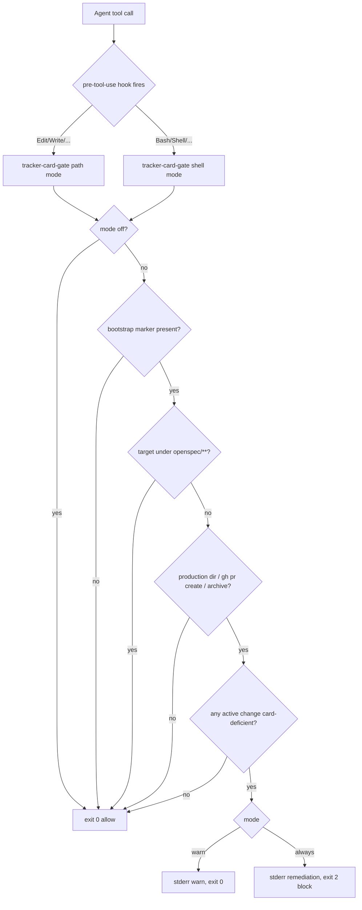

# Design: tracker-card-gate

## Context

A full SDD cycle (`compact-sync-output`, PR #166) shipped with **no Trello
card**. Tracker integration is deliberately soft: the recipe skill is
`auto_invoke: false`, sync hooks `link-trello-card` / `sync-card-state` /
`comment-verification` are deferred no-ops (`recipe-materialize.py:569-574`), the
skill carries an explicit skip hatch (`SKILL.md:128`) and a "never block" policy
(`SKILL.md:202`, archive Decision #7), and only 2 of 70 archives carry a
`trello.md`. No `[[provides.hooks]]` gate, no doctor check, and no schema require
a card.

This change makes **card-per-change a real contract** when
`trello-mcp-workflow` is enabled: canonical `## Tracker` link section + recipe
hardening + doctor WARN + a phased pre-tool-use hard gate
(`tracker-card-gate.sh`, plan-build-gate semantic model) that escalates
`off → warn → always`, plus first-class hermetic and live evals. It does **not**
intercept Trello MCP tool calls (OpenCode #2319/#5894, Cursor no pre-file-write
hook make that unreliable).

All decisions here are bound by the proposal's **Locked decisions** table
(8 rows), the **Canonical `## Tracker` section shape** block, and the
**Decision #7 overturn** table. This design turns those locks into concrete, file-level,
implementable detail. Everything is centered on `catalog/recipes/…`,
`lib/_internal/…`, and `tests/…`; scope does not expand beyond the proposal's
Affected Areas.

Grounding reads for this design:
- Gate precedents: `catalog/recipes/plan-build-flow/hooks/plan-build-gate.sh`,
  `catalog/recipes/worktree-flow/hooks/worktree-gate.sh` (dual-hook + fail-open).
- Distribution: `lib/_internal/recipe-materialize.py`
  (`materialize_hook_script`, `execute_hooks`/`bootstrap-board`, resolved-hook
  env), `lib/_internal/project-cache.py` (`cache_root`/`recipe_skills_root`),
  `lib/_internal/hooks-render.py`, `docs/runtime-hooks.md`.
- Doctor: `lib/_internal/doctor.py` (`Check`/`Severity`, `_load_manifest`,
  `_load_project_cache`).
- Evals: `tests/evals/eval_worktree_flow_live.py`,
  `tests/evals/run-live-worktree.sh`, `tests/evals/lib/harness.py`
  (`wire_runtime_hooks`, `load_scenario`, `live_enabled`), `#165` scenarios.

## Goals / Non-Goals

**Goals:**

1. Standardize the `## Tracker` link section (inside the change's `proposal.md`,
   fallback `tasks.md` for tasks-only changes) as the single card-link contract
   for **active** changes, with one tolerant parser and one validity predicate
   shared by doctor and gate — no new artifact file per change, and the global
   contract declared in `openspec/config.yaml` under `tracking:`.
2. Harden `trello-mcp-workflow`: `gate_mode` config, two `[[provides.hooks]]`
   entries (path + shell) reusing the existing renderer, `auto_invoke`
   triggers, `tracker.none` exemption replacing the broad skip hatch,
   per-phase `workflow_rules`, corrected bootstrap-marker path docs, narrowed
   Decision #7.
3. Ship `tracker-card-gate.sh`: portable pre-tool-use guard, exit `0` allow /
   `2` block / other fail-open, activated only when mode ≠ `off` and the
   bootstrap marker is present; blocks production writes and high-confidence
   `gh pr create` / archive shell actions when an active change is card-deficient;
   never blocks `openspec/changes/**`.
4. Extend `doctor.py` with a `Severity.WARN` check for active changes missing a
   valid `## Tracker` link section when recipe + marker are present.
5. Make `session-bootstrap` consult the tracker capability for new/ambiguous
   changes when a tracker capability is bound.
6. Ship hermetic tests (gate + doctor) as the TDD backbone and a live golden
   client mirroring #165.
7. Keep the dogfood repo at `gate_mode = "warn"` so this change and retro SDD
   do not self-deadlock.

**Non-Goals:**

1. Intercepting Trello MCP tool calls at the harness layer.
2. Introducing an `.openspec.yaml` / folder-schema `trello_card_id` field.
3. Migrating or failing the 68 archives lacking a card link (grandfather).
4. Making doctor FAIL-by-default or a project pre-commit hard-fail in v1.
5. Implementing the deferred sync hooks as real sync-time MCP callers.
6. An abstract multi-tracker product (Jira/Linear/GitHub Issues); v1 stays
   Trello-specific with swappable seams noted as future.
7. Auto-creating cards from the gate script (the gate only enforces artifact
   presence; agents/MCP create cards).
8. Closing platform hook gaps (Cursor no pre-file-write; OpenCode subagent/MCP;
   pi/omp child processes) — documented and mitigated by brief + evals only.

## Decisions

### 1. Canonical `## Tracker` link section: parse rules and validity predicate

**Decision.** The card link lives as a `## Tracker` section inside the change's
`proposal.md` (fallback: `tasks.md` for tasks-only changes). No separate
artifact file per change (keeps consumer token/friction low; the section is
part of the SDD artifacts the project already reads). Parsing is **tolerant**
and line-oriented. The parser extracts the section body (lines after an
`## Tracker` heading, until the next `## ` heading or EOF) and treats each
non-blank line as a `key: value` pair when, after stripping an optional leading
list bullet (`-` / `*` + spaces) and optional `**…**` bold around the key, it
matches:

```
^\s*(?:[-*]\s+)?\*{0,2}(?P<key>[A-Za-z_][A-Za-z0-9_]*)\*{0,2}\s*:\s*(?P<value>.*)$
```

- Keys are lowercased before matching. Recognized keys: `card_id`, `shortlink`,
  `url`, `list`, `pr`. Unknown keys, blank lines, headings (`# …`), and any
  non-matching line are ignored.
- The value is cleaned: surrounding backticks and whitespace stripped; a
  trailing ` #comment` (space + hash, outside backticks) removed; then trimmed.
- On duplicate keys the **first** occurrence wins.

**Required keys:** `card_id` (mandatory) and `url` (expected; its absence is a
doctor `INFO` nudge, never a block). Optional: `shortlink`, `list`, `pr`.

**Validity predicate (the single predicate doctor and gate share):**

> The change is **card-valid** iff its `proposal.md` (fallback `tasks.md`)
> contains a `## Tracker` section **and** parsing that section yields a
> non-empty `card_id` value.

`card_id` shape is **not** enforced for validity (tolerant per Locked
Decision #2: "non-empty `card_id`"). Doctor additionally emits an `INFO`-level
nudge when `card_id` does not match `^[0-9a-fA-F]{24}$` or when `url` is absent,
but neither downgrades validity and neither blocks.

**One canonical parser, two call sites.** A new module
`lib/_internal/trello_link.py` exports:

```python
def parse_tracker_section(artifact_paths: list[Path]) -> dict[str, str]  # {} if none
#   → first artifact containing a `## Tracker` section wins; parse that section
def is_valid_link(artifact_paths: list[Path]) -> bool                    # non-empty card_id
def card_id_looks_canonical(card_id: str) -> bool                        # 24-hex, for INFO nudge
```

`artifact_paths` = `[proposal.md, tasks.md]` (in that order) for an active
change. `doctor.py` imports this module (sibling-load pattern already used for
`brief_render_policy`, `dep_check`). The gate script (`tracker-card-gate.sh`)
runs from the **project** surface where CLI internals may be unimportable, so it
embeds a byte-for-byte equivalent tolerant parser in its `python3` heredoc. The
two implementations are locked to parity by tests
(`test_doctor_tracker_card.py` and `test_tracker_card_gate_hook.py` assert the
same fixtures resolve valid/invalid identically). The duplication is tiny (~20
lines) and intentional: the gate must stay self-contained and fail-open.

**Where documented.** The format and validity predicate are documented in
(a) the recipe skill `SKILL.md` under a new **"Card link section
(`## Tracker`)"** section, and (b) the recipe `README.md` under a new
**"Card-per-change contract"** section. Both show the canonical sample below.
The global contract (tracker, board_id, section name, required fields, gate
mode) is declared once in `openspec/config.yaml` under `tracking:`.

Canonical sample (same bold-key shape as the de-facto `trello.md` archive
samples, now a section inside `proposal.md`):

```markdown
## Tracker

- **card_id**: `6a622e6ad8dd4cefb8c09b81`
- **shortLink**: `5UIKk5jp`          # optional
- **url**: https://trello.com/c/5UIKk5jp/48-...
- **list**: Review                   # optional
- **pr**: https://github.com/.../pull/145   # optional
```

**Rationale.** The bold-key list form is what agents already write in the two
archived samples; a tolerant parser accepts that plus the plain `key: value`
form with zero migration. Non-empty `card_id` is the minimum that proves a real
card exists; keeping `url`/hex as INFO avoids brittle blocks on legitimate
tolerant input. Embedding the section in existing SDD artifacts (instead of a
new `trello.md` file) avoids one more file per change — lower token/friction
cost for consumers, which is the product tradeoff that drove this decision.

**Alternatives considered.** (a) YAML frontmatter — rejected: none of the
existing samples use it and it invites parser-strictness bugs. (b) A schema
field in `.openspec.yaml` — rejected by Locked Decision #2 (dual sources).
(c) Requiring 24-hex `card_id` for validity — rejected: too strict for a
tolerant contract; demoted to an INFO nudge.

### 2. `recipe.toml` changes (`catalog/recipes/trello-mcp-workflow/recipe.toml`)

**2a. `gate_mode` config field.**

```toml
[config.gate_mode]
required = false
type = "string"
default = "warn"
enum = ["off", "warn", "always"]
help_text = "Tracker card gate: off (disabled), warn (stderr warning, never blocks — default), or always (block production writes / PR-archive shell when an active change lacks the ## Tracker link section)."
```

Default `warn` (Locked Decision #5). The resolved value is **stamped** into the
materialized script at sync time (see 2c / Decision 4), mirroring
`worktree-flow`'s `gate_mode` (`docs/runtime-hooks.md:98-100`).

**2b. `[[provides.hooks]]` — dual hook (path + shell).** Two entries, one
script, distinct ids (the Cursor dual-hook lesson from `worktree-gate` /
`worktree-gate-shell`):

```toml
[[provides.hooks]]
id = "tracker-card-gate"
event = "pre-tool-use"
script = "hooks/tracker-card-gate.sh"
matcher = "Edit|Write|MultiEdit|NotebookEdit"
blocking = true
description = "Block production edits when an active change lacks the ## Tracker link section (mode=always); warn otherwise"

[[provides.hooks]]
id = "tracker-card-gate-shell"
event = "pre-tool-use"
script = "hooks/tracker-card-gate.sh"
matcher = "Bash|Shell|Execute|Terminal"
blocking = true
description = "Best-effort block gh pr create / change-archive shell actions when an active change lacks the ## Tracker link section; does not gate shell writes"
```

**Locked matcher set.** The `matcher` field matches **tool names**, not paths.
Path selection ("production" directories) is decided **inside** the script, not
by the matcher. Rationale for two ids: `hooks-render.py` skips the
`Edit|Write|MultiEdit|NotebookEdit` matcher on Cursor (no pre-file-write hook,
`docs/runtime-hooks.md:64-66`); putting both tool classes on one id would let
the file-write matcher swallow shell coverage on Cursor. A sibling shell id
registers as a genuine `beforeShellExecution` hook there
(`docs/runtime-hooks.md:122-141`). This is exactly the worktree precedent.

**2c. Version bump.** `version = "1.2.0"` → `version = "1.3.0"` (new
`[[provides.hooks]]` + config field; additive, no breaking config).

**2d. `provides.brief.workflow_rules` additions** (append to the existing
single rule; concise, link → state-sync → progress-comment per phase, plus
anti-bypass):

```toml
[provides.brief]
workflow_rules = [
    "Inspect the active Trello card before resuming work and keep card state in sync with actual progress.",
    "Before apply/production work on a structured change, create or link a Trello card and record it in the ## Tracker section of the change's proposal.md (or tasks.md) — card_id + url. openspec/** writes are never gated — write the link section there first.",
    "On SDD phase transitions, move the card and update its phase label; post a progress comment at milestones.",
    "If the tracker gate warns or blocks, create/link the card and write the ## Tracker section — never bypass via shell writes, and never claim 'Trello unavailable' when the real gap is a missing link section. A missing card is an availability failure only when the MCP/network is genuinely down.",
    "Only omit a card by writing openspec/changes/<slug>/tracker.none with a one-line reason; this is logged and rare.",
]
```

**Rationale.** These make the artifact-first contract and the availability-vs-
missing-artifact distinction explicit in the always-on brief, where agents
actually read rules.

### 3. Marker path resolution (the bootstrap-marker drift, explore F)

**Problem.** `bootstrap-board` writes the marker at
`recipe_skills_root(project_root, cli_home) / "trello-mcp-workflow" / "bootstrap-ready"`,
which resolves to
`<AI_SPECS_HOME>/cache/projects/<key>/.recipe/trello-mcp-workflow/bootstrap-ready`,
where `<key> = sha256(realpath(project_root))[:12] + "-" + sanitize(basename)`
and `<AI_SPECS_HOME>` defaults to the **CLI install dir**
(`project-cache.py:30-51`). It is **not** a project-local `.recipe/`, contrary
to current SKILL/README docs. Each worktree has a distinct realpath → distinct
`<key>`, so a worktree that was never synced has no marker (explore F: absent in
this worktree, present in the main project cache).

**Decision — the gate and doctor resolve the marker identically:**

- **Doctor** (runs inside the CLI as Python) calls the authoritative helper:
  `project_cache.recipe_skills_root(self.root) / "trello-mcp-workflow" / "bootstrap-ready"`.
- **Gate** (runs from the project surface, gitignored, portable) resolves it in
  its `python3` heredoc:
  1. `home` = `$AI_SPECS_HOME` if set, else the stamped `__TRACKER_CLI_HOME__`
     value (materialize-time `cli_home`).
  2. `repo_root` = git top-level of the event target/cwd, then `realpath`.
  3. `key` = `sha256(str(realpath(repo_root)))[:12] + "-" + sanitize(basename(realpath(repo_root)))`,
     using the **same** `_BASENAME_SAFE = [^A-Za-z0-9._-]+` sanitizer.
  4. Primary marker = `home/cache/projects/<key>/.recipe/trello-mcp-workflow/bootstrap-ready`.
  5. **Fallback** marker = `repo_root/.recipe/trello-mcp-workflow/bootstrap-ready`
     (legacy project-local location; also the trivial seam for hermetic tests).
  6. Marker is "present" if **either** exists.

**Stamping `__TRACKER_CLI_HOME__` is safe** because materialized hook scripts
under `ai-specs/recipes/*/hooks/*.sh` are **gitignored** (`ai-specs/.gitignore:7`
`recipes/**` — confirmed via `git check-ignore -v`) and are regenerated on every
`sync`. An absolute machine path never enters git and is always re-stamped per
machine.

**Activation predicate (Locked Decision #1):** the gate is active iff
`gate_mode ≠ off` **and** the marker is present. Recipe-enabled is implied by
the hook being wired at all (only enabled recipes materialize + wire hooks). A
never-synced worktree (no marker) → gate **inactive** → allow: this is the
correct fail-safe and matches explore F.

**Rationale.** Recomputing `<key>` at runtime from the runtime `repo_root` makes
each worktree resolve its own marker correctly (no stale absolute path baked in
across worktrees). Stamping only the stable CLI home — not the full marker path
— is the single machine-specific value, and it is confined to a gitignored,
re-stamped file. The project-local fallback both mitigates the historical
doc-vs-runtime drift and gives hermetic tests a zero-hash seam.

**Alternatives considered.** (a) Stamp the fully-resolved absolute marker path —
rejected: bakes in the main project's realpath hash, wrong in sibling
worktrees. (b) Recompute using only `$AI_SPECS_HOME` env with no stamp —
rejected: the env var is generally unset at agent runtime, so the dogfood case
(marker under the CLI cache) would never resolve and enforcement would silently
never fire. (c) Have the gate import `project-cache.py` from the CLI — rejected:
fragile from the project surface and defeats fail-open portability.

### 4. `tracker-card-gate.sh` contract and algorithm

**File:** `catalog/recipes/trello-mcp-workflow/hooks/tracker-card-gate.sh`.
Portable `#!/usr/bin/env bash`, `python3` for JSON parse (a project
prerequisite, same as the other gates).

**stdin / exit contract (identical convention to `plan-build-gate.sh` and
`worktree-gate.sh`):**

```
stdin  = JSON { "event", "tool_name", "tool_input": { file_path|notebook_path | command|script|cmd }, "cwd" }
         (also accepts Cursor native top-level { "command", "cwd" } for shell mode)
exit 0 → allow
exit 2 → block (stderr surfaced to the agent)
other/parse error → fail-open (allow)
```

**Mode resolution (mirrors `worktree-gate` `_resolve_gate_mode`):**
`TRACKER_CARD_GATE_MODE` env override beats the stamped
`__TRACKER_CARD_GATE_MODE__` value; invalid values warn to stderr and fall back
to the stamped value, then to `warn`. `mode = off` → `exit 0` immediately.

**Configuration (scope, not a switch):**
`TRACKER_CARD_GATE_PATHS` — space-separated production top-level dirs; default
`"lib catalog bin src"`; empty falls back to that default. (See 4d for why
`ai-specs` is excluded by default.)

**Algorithm:**

1. `input="$(cat)"`. Parse mode + tool + candidate(s) + cwd via a single
   `python3` heredoc (event JSON passed as `argv[1]`, heredoc-fed to avoid the
   single-quote bug documented in `worktree-gate.sh:50-54`).
   - If `tool_input.file_path`/`notebook_path` present → **path mode**, one
     candidate.
   - Else if a command string present (`tool_input.command|script|cmd` or
     Cursor top-level `command`) → **shell mode**, extract high-confidence
     action tokens (4c).
   - Else → `exit 0`.
2. Resolve `repo_root` = `git -C <dir> rev-parse --show-toplevel` walking up to
   the nearest existing dir; not a git repo → `exit 0`.
3. **Activation:** resolve the bootstrap marker (Decision 3). Marker absent →
   `exit 0` (gate inactive). `mode = off` already returned at step 0.
4. **Path mode:** compute repo-relative path (realpath both sides, same as
   `plan-build-gate.sh:67-72`). Then:
   - Target outside repo (`..` / `../*`) → `exit 0`.
   - Under `openspec/changes/**` → `exit 0` (**never** blocked; agents must
     write the `## Tracker` link section and planning files). Also allow gitignored agent config
     (`.claude/settings*.json`, `.claude/hooks/*`) as the other gates do.
   - First path segment not in `TRACKER_CARD_GATE_PATHS` → `exit 0`
     (non-production: tests, docs, etc.).
   - Production edit → evaluate the **deficient-change predicate** (4b).
5. **Shell mode:** for each detected action token, evaluate the shell predicate
   (4c).
6. Deficiency found → **warn vs always** (4e).

**4a. Active change enumeration.** Active changes are the direct children of
`<repo_root>/openspec/changes/*/` **excluding** `archive/` (the glob
`openspec/changes/*/` matches direct children only, so `archive/<slug>/` is
naturally excluded — same technique as `plan-build-gate.sh:88-95`). A directory
is an active change iff it contains at least one of `proposal.md`, `tasks.md`,
`spec.md`, or `design.md` (avoids treating stray dirs as changes).

**4b. Deficient-change predicate (shared with doctor).**

> An active change `<slug>` is **card-deficient** iff it has **no** valid
> `## Tracker` link section in `proposal.md`/`tasks.md` (Decision 1) **and** no
> `openspec/changes/<slug>/tracker.none` exemption file.

Path-mode block rule: block a production write iff **at least one active change
is card-deficient**. If there are **no** active changes at all → allow (no
change to card; this is card-per-change, not card-per-edit, and avoids blocking
ad-hoc hotfixes with no SDD change in flight). If every active change has a card
or exemption → allow.

**Rationale.** A production edit cannot be mapped to a specific change slug
(production files live outside change folders), so — exactly like
`plan-build-gate` keying off "an active plan exists" — the gate keys off "every
active change carries a card." The `tracker.none` file provides per-change
exemption so a legitimately card-less change never blocks the others.

**4c. Shell-mode detection (high-confidence only).** Tokenize each `&&`/`||`/
`;`/`|`-separated segment with `shlex` (reuse the segment/`command_word` helpers
from `worktree-gate.sh:84-112`, stripping `env`/`sudo`/`nice`/… wrappers and
`VAR=val` prefixes). Two triggers:

1. **PR create:** a segment whose command word is `gh` and whose remaining
   non-flag args begin with `pr` then `create` (order preserved). Block rule:
   block iff **any** active change is card-deficient (a PR must not ship a
   card-less change).
2. **Change archive:** either
   - a segment invoking a known archive command — command word `openspec` with
     `archive` as the first non-flag arg, or `ai-specs` … `archive`; or
   - `git mv` / `mv` whose destination path contains `openspec/changes/archive/`.
   Block rule: resolve the archived `<slug>` from the source path when present
   (`openspec/changes/<slug>` → `<slug>`); block iff that specific change is
   card-deficient. If the slug cannot be resolved, fall back to the any-deficient
   rule.

Anything not matching these two shapes → allow (fail-open). No attempt to catch
every possible archive/PR spelling; precision over recall, `warn` first.

**4d. Production directory set.** Default `lib catalog bin src`. This covers the
CLI-repo layout (`lib`, `catalog`, `bin`) and generic app layout (`src`).
`ai-specs/` is **excluded by default**: it holds recipe overrides/config and
generated surface, and gating routine config edits invites friction and
self-block. It can be added per project via `TRACKER_CARD_GATE_PATHS`. This
resolves the proposal's `ai-specs?` uncertainty to "excluded by default,
opt-in" (flagged in §"Proposal notes").

**4e. warn vs always.**
- `mode = warn`: on deficiency, print a one-line stderr warning and `exit 0`
  (dogfood default; never wedges editors).
- `mode = always`: on deficiency, print remediation to stderr and `exit 2`.
  Remediation text names the deficient slug(s) and the exact fix. For one deficient
  change it includes the exact exemption path, e.g.:
  `tracker-card-gate: refusing to Write 'lib/foo.py' — active change(s) 'tracker-card-gate' have no ## Tracker link section in their proposal.md. Create/link Trello cards and write the ## Tracker section (card_id + url), or add openspec/changes/tracker-card-gate/tracker.none with a reason. Writing under openspec/** is never blocked.` For multiple deficient changes it lists slugs with comma separators and directs the agent to add a `tracker.none` exemption in each deficient change directory.

**Do not call Trello MCP from the gate.** Presence of the `## Tracker` link
section is the proof (proposal Approach §5).

**4f. `tracker.none` exemption file.** `openspec/changes/<slug>/tracker.none`
(any content; a one-line reason is the documented convention). Presence exempts
that change from the deficiency predicate in both gate and doctor. When the gate
observes the file it is honored silently (the *logging* of exemption use is the
agent's responsibility per the brief rule; the gate stays side-effect-free to
preserve fail-open and idempotence).

### 5. `materialize_hook_script` extension (`recipe-materialize.py`)

Two minimal, additive changes (precedent: the `execute_hooks` signature
extension in archive `2025-04-30-trello-mcp-workflow-recipe` Decision #8):

**5a. Generalize gate-mode stamping.** Replace the single hardcoded constant
with a token→default map so both gates are stamped from their own
`merged_cfg["gate_mode"]`:

```python
GATE_MODE_PLACEHOLDERS = {
    "__WORKTREE_GATE_MODE__": "always",
    "__TRACKER_CARD_GATE_MODE__": "warn",
}
```

In `materialize_hook_script`, loop the map: for each token present in `content`,
replace with `str(merged_cfg.get("gate_mode", default))` (each recipe's config
schema already supplies its own default, so this is exact per recipe).

**5b. Stamp the CLI home.** Add `cli_home: Path | None = None` to
`materialize_hook_script` and, when `__TRACKER_CLI_HOME__` is present, replace it
with `str(Path(cli_home).resolve())` (empty string if `cli_home is None`). Pass
`cli_home=cli_home` from the single call site (`materialize_recipes:887`, where
`cli_home` is already in scope from line 718).

No other call sites change; `worktree-gate.sh` (no `__TRACKER_CLI_HOME__`
token) is unaffected. `chmod 0o755` and the resolved-hook env collection
(lines 892-905) are unchanged; `gate_mode` is lowercase so it is **not**
auto-exported as env (correct — it is stamped, matching worktree).

### 6. `doctor.py` extension

**New check** `_check_tracker_card_link`, registered in `run()` after
`_check_recipe_cli_deps()` (tracker-adjacent) and before
`_check_harness_env_layout()`. Follows the `Check`/`Severity` dataclass pattern
exactly.

```python
def _check_tracker_card_link(self) -> None:
    data = self._load_manifest()
    recipes = data.get("recipes", {}) or {}
    tr = recipes.get("trello-mcp-workflow") or {}
    if not isinstance(tr, dict) or tr.get("enabled") is not True:
        return                      # recipe disabled → silent (Locked Decision #1)

    pc = self._load_project_cache()
    marker = None
    if pc is not None:
        marker = (pc.recipe_skills_root(self.root)
                  / "trello-mcp-workflow" / "bootstrap-ready")
    local_marker = self.root / ".recipe" / "trello-mcp-workflow" / "bootstrap-ready"
    if not ((marker and marker.is_file()) or local_marker.is_file()):
        return                      # not bootstrapped → silent

    link = self._load_trello_link()  # sibling-load lib/_internal/trello_link.py
    changes_dir = self.root / "openspec" / "changes"
    deficient = []
    for change in sorted(p for p in changes_dir.glob("*") if p.is_dir()):
        if change.name == "archive":
            continue
        if not any((change / f).is_file()
                   for f in ("proposal.md", "tasks.md", "spec.md", "design.md")):
            continue
        if (change / "tracker.none").is_file():
            continue
        if not (link and link.is_valid_link([change / "proposal.md", change / "tasks.md"])):
            deficient.append(change.name)

    if deficient:
        sample = ", ".join(deficient[:5])
        more = f" (+{len(deficient) - 5})" if len(deficient) > 5 else ""
        self.checks.append(Check(
            Severity.WARN, "tracker-card",
            f"{len(deficient)} active change(s) missing a valid ## Tracker link section: {sample}{more}",
            guidance="create/link a Trello card and write the ## Tracker section of the change's proposal.md (card_id + url), or add tracker.none",
        ))
    else:
        self.checks.append(Check(
            Severity.OK, "tracker-card",
            "all active changes carry a valid ## Tracker link section (or tracker.none)",
        ))
```

`_load_trello_link()` uses the same `importlib.util.spec_from_file_location`
sibling-load pattern as `_load_project_cache` / `_brief_render_disabled`.
`Severity.WARN` never changes the doctor exit code (only `ERROR` does,
`run():153`), satisfying "WARN only, no FAIL in v1." An `INFO` nudge for a
non-canonical `card_id` / missing `url` may be appended per deficient-but-present
file; kept optional to avoid noise.

### 7. `session-bootstrap` SKILL.md change

**File:** `catalog/recipes/session-context/skills/session-bootstrap/SKILL.md`.
Change step **2c** from optional to mandatory-when-bound (Locked Decision #6),
keeping capability-agnostic wording:

- Current: *"c. **Cross-check the tracker capability only if needed:** memory
  has no recent entry …"*
- New: *"c. **Consult the tracker capability** — when a tracker capability is
  bound in the manifest, this is **mandatory** for new or ambiguous changes:
  resolve/confirm the active card before proceeding, and ensure a new structured
  change has a linked card recorded in the `## Tracker` section of its
  proposal.md (or tasks.md). When no tracker capability is bound, cross-check
  only if memory is missing/stale."*

The `description` frontmatter and the Memory-First Rule stay intact (memory
still consulted first; tracker consultation is no longer optional in the
new/ambiguous path when bound). No other step changes.

### 8. Skill / README / docs changes

**8a. `catalog/recipes/trello-mcp-workflow/skills/trello-mcp-workflow/SKILL.md`.**
- Frontmatter `auto_invoke: false` → an `auto_invoke:` list with triggers:
  `"New structured change or feature request"`,
  `"Active change is missing a linked Trello card"`,
  `"Resuming work on a change with a stale or unknown card"`.
- Add a **"Card link section (`## Tracker`)"** section documenting the format,
  the validity predicate, and that agents MUST write it into the change's
  proposal.md (fallback tasks.md) after creating/linking a card (Decision 1).
- `trello-card-linking` steps: replace the vague
  `trello_card_id`-field language (`SKILL.md:116`, `:129`) with "record the card
  in the `## Tracker` section of the change's proposal.md (or tasks.md)."
- **Remove the skip hatch** (`SKILL.md:128` "Allow the agent to skip card
  creation …") and replace with the narrow `tracker.none` exemption: "Only omit
  a card by writing `openspec/changes/<slug>/tracker.none` with a one-line
  reason; log the exemption. This is rare."
- **Narrow Decision #7** in the Graceful Degradation section (`SKILL.md:198-203`):
  keep "MCP/network availability failures degrade (warn + continue, never
  block)"; add "a **missing link artifact** is not an availability failure — do
  not claim 'Trello unavailable' to skip it; create/link the card and write the
  `## Tracker` section."
- Fix the bootstrap-marker path text (`SKILL.md:21,84`): the runtime marker
  lives at
  `<AI_SPECS_HOME>/cache/projects/<hash>-<name>/.recipe/trello-mcp-workflow/bootstrap-ready`,
  not a project-local `.recipe/` (Decision 3). Note the project-local path is a
  legacy fallback.

**8b. `catalog/recipes/trello-mcp-workflow/README.md`.** Add:
- **"Card-per-change contract"** — the `## Tracker` section format/predicate
  and the `tracker.none` exemption.
- **"Gate modes"** — `off | warn | always`, config via
  `[recipes.trello-mcp-workflow.config] gate_mode`, env one-shot override
  `TRACKER_CARD_GATE_MODE`, production-dir override `TRACKER_CARD_GATE_PATHS`,
  and that the gate never blocks `openspec/**` and fails open.
- **"Residual platform gaps"** — Cursor no pre-file-write, OpenCode
  subagent/MCP, pi/omp child processes; and that Trello MCP is explicitly **not**
  intercepted (presence of the `## Tracker` link section is the proof).

**8c. `catalog/recipes/trello-mcp-workflow/commands/trello-workflow.md`.** Phase
map references the `## Tracker` link section where it previously implied a
card-metadata field.

**8d. `docs/runtime-hooks.md`.** Add `tracker-card-gate` / `tracker-card-gate-shell`
to the dual-hook coverage table (next to worktree), note the `gate_mode` stamp
and `TRACKER_CARD_GATE_MODE` override alongside the existing worktree row, and
state the shell matcher detects `gh pr create` / archive actions (not file
writes). `docs/recipes-catalog.md`: bump the recipe's version/description note.

### 9. Evals

**9a. Hermetic — `tests/test_tracker_card_gate_hook.py`** (mirrors
`test_worktree_gate_hook.py`: temp git repo in `setUp`, `_stamped_gate(mode)`
replacing `__TRACKER_CARD_GATE_MODE__` and `__TRACKER_CLI_HOME__`, `_run(event,
env)` invoking `bash GATE` with JSON on stdin, `_event`/`_shell_event`
builders). The bootstrap marker seam uses the **project-local fallback**:
`_bootstrap(repo)` writes `repo/.recipe/trello-mcp-workflow/bootstrap-ready`.
Exact cases from explore's eval design:

| Test | Setup | Expect |
|------|-------|--------|
| `missing_card_blocks_prod_write` | mode=always, marker, active change w/o `## Tracker` section; `Edit lib/foo.py` | exit 2; stderr mentions tracker/card + slug |
| `with_card_allows_prod_write` | mode=always, marker, `## Tracker` section with `card_id`; `Edit lib/foo.py` | exit 0 |
| `openspec_paths_never_blocked` | mode=always, marker, no card; `Write openspec/changes/x/proposal.md` | exit 0 |
| `recipe_disabled_or_mode_off_allows` | mode=off (and marker-absent variant) | exit 0 |
| `shell_gh_pr_create_blocked_without_card` | mode=always, marker, deficient change; Bash `gh pr create` | exit 2 |

Plus contract coverage matching the other gate suites:
`tracker_none_allows_prod_write`, `warn_mode_allows_with_stderr` (exit 0 +
non-empty stderr), `no_active_change_allows`, `non_production_path_allows`
(`Edit tests/x.py`), `malformed_stdin_fail_open`, `marker_absent_fail_open`,
`shell_gh_pr_create_allowed_when_carded`, `archive_command_blocked_for_deficient_slug`,
and `parser_parity` (a matrix of `## Tracker` section fixtures in proposal.md —
bold-key form, plain `key: value` form, backticked values, empty `card_id`,
missing section — asserting gate validity equals `trello_link.is_valid_link`).

**9b. Hermetic — `tests/test_doctor_tracker_card.py`.** Instantiate `Doctor` on
a temp project with a manifest enabling `trello-mcp-workflow` and a bootstrap
marker; assert:
- active change without a `## Tracker` section → a `tracker-card` `WARN` check,
  exit code unchanged (0);
- active change with a valid `## Tracker` section → `OK`;
- `tracker.none` present → `OK` (exempted);
- recipe disabled → **no** `tracker-card` check emitted (silent);
- marker absent → no check emitted;
- archived change without a `## Tracker` section → ignored (grandfather).

**9c. Optional harness-smoke.** Add a `scenario.toml` load assertion so
`eval_harness_smoke` recognizes the trello client (cheap, CI-safe).

**9d. Live golden — mirrors #165.** New files modeled 1:1 on the worktree
precedent:
- `tests/evals/run-live-trello.sh` — copy of `run-live-worktree.sh` with
  `client=trello-mcp-workflow` and `python3 -m unittest
  tests.evals.eval_trello_mcp_workflow_live -v`; same `EVALS_LIVE=1`,
  `EVALS_PREFER`, `EVALS_TRIALS`, `EVALS_TIMEOUT_SEC`, `EVALS_MAX_TURNS`,
  `EVALS_RUNTIMES`, `EVALS_SCENARIOS` env surface.
- `tests/evals/eval_trello_mcp_workflow_live.py` — `RECIPE_ID =
  "trello-mcp-workflow"`, `@unittest.skipUnless(live_enabled() and
  _selected_runtimes())`, `_run_scenario` shaped like the worktree one:
  `load_scenario`, `materialize_project` (extra
  `[recipes.trello-mcp-workflow.config]\nboard_id="…"\ngate_mode="always"`),
  `seed_project_files`, `setup_runtime_skills`/`_commands`, git baseline, then
  `run_prompt`, then the same assertion battery (`required_path_globs`,
  `required_content.contains_any`, `forbidden_path_globs`, `forbidden_phrases`).
  Gate scenarios call `wire_runtime_hooks(root, runtime)` before `run_prompt`
  (flagged per-scenario via a `wire_hooks = true` meta key) so the real gate
  fires; notes-only scenarios skip wiring. N-of-M via `EVALS_TRIALS` /
  `_n_of_m`.
- `tests/evals/scenarios/trello-mcp-workflow/` scenarios (notes-file
  assertions; MCP not required except the last), matching the proposal:
  - `ac_new_change_writes_tracker_section` — required: change proposal.md
    contains a `## Tracker` section with `card_id`; notes mention create/link.
  - `ac_missing_card_gate_no_bash_skip` — `wire_hooks = true`; notes say
    create/link first; `forbidden_phrases` reject `python3 -c`, `cat >`, `tee `,
    `sed -i`, `heredoc` (reuse the worktree gate-plan phrase set); fixture seeds
    a card-less active change.
  - `ac_phase_transition_state_sync_plan` — notes include move/list/label/
    comment from the phase map.
  - `ac_retro_change_without_card_triggers_link` — fixture seeds an active
    change without a `## Tracker` section; agent links (writes the section)
    before claiming done.
  - `ac_mcp_live_card_link` (optional, expensive, MCP required) — tool evidence
    `trello_add_card_to_list` / `trello_add_comment`; board isolation; disposable
    list + cleanup.

CI runs hermetic (9a/9b) + optional smoke (9c) via `validate.sh`/`run.sh`; live
(9d) stays manual/nightly, MCP-live opt-in.

### 10. Dogfood config (`ai-specs/ai-specs.toml`)

Add `gate_mode = "warn"` under `[recipes.trello-mcp-workflow.config]`
(currently only `board_id`, lines 66-67):

```toml
[recipes.trello-mcp-workflow.config]
board_id = "69ec097f13e2d38ecd89a557"
gate_mode = "warn"
```

**What a re-sync regenerates.** `ai-specs sync` re-runs `materialize_recipes`:
it re-materializes `tracker-card-gate.sh` into
`ai-specs/recipes/trello-mcp-workflow/hooks/` (gitignored), stamping
`__TRACKER_CARD_GATE_MODE__` → `warn` and `__TRACKER_CLI_HOME__` → the CLI home;
re-runs `bootstrap-board` (rewrites the cache marker); and re-wires the two
`[[provides.hooks]]` ids into each enabled harness's native pre-tool-use channel
via `hooks-render.py` (managed, idempotent — a no-op second sync produces no
diff, `docs/runtime-hooks.md:105-107`). No hand-editing of generated shims.
Default `warn` guarantees planning this change (and retro SDD) never self-blocks.

## Data flow



Doctor runs the same deficiency predicate offline (no exit-code impact, WARN
only). Both read one parser (`trello_link.py` / its inline twin).

## Migration / Rollback

**Migration (apply order, TDD):**
1. Add `lib/_internal/trello_link.py`.
2. Write hermetic tests `test_tracker_card_gate_hook.py` +
   `test_doctor_tracker_card.py` (RED).
3. Add `tracker-card-gate.sh`; extend `materialize_hook_script`
   (`GATE_MODE_PLACEHOLDERS`, `__TRACKER_CLI_HOME__`, `cli_home` param); add the
   `recipe.toml` `gate_mode` config + two `[[provides.hooks]]` + version bump +
   `workflow_rules`; add `doctor._check_tracker_card_link` (GREEN).
4. Skill/README/command/session-bootstrap/doc edits + delta specs.
5. Dogfood `ai-specs.toml` `gate_mode = "warn"`; run `ai-specs sync`.
6. Live eval files (9d) — manual/nightly, not required for CI green.
7. `./tests/validate.sh`.

**Rollback:**
1. Revert the `recipe.toml` hook entries + `gate_mode` config, skill/brief/spec
   deltas, and `doctor` check.
2. Remove `tracker-card-gate.sh`, `trello_link.py`, and the eval files (or leave
   tests disabled mid-migrate).
3. `ai-specs sync` so generated shims drop the managed hook ids.
4. No data migration; existing `trello.md` files / `## Tracker` sections remain
   harmless docs.
5. Partial deploy is safe: `warn` + fail-open never wedge editors; projects that
   never re-sync keep the old soft behavior.

## Risks / Trade-offs

- **[Risk] Bootstrap-marker path drift breaks activation** (docs said
  project-local `.recipe/`; runtime writes the CLI cache).
  **→ Mitigation:** gate and doctor resolve the marker exactly as
  `recipe_skills_root` writes it (Decision 3), stamping the stable CLI home into
  the gitignored script and recomputing the per-worktree cache key at runtime;
  a project-local fallback covers legacy layouts and hermetic tests. Marker
  absent → fail-safe allow.

- **[Risk] Shell matcher false positives/negatives** for `gh pr create` /
  archive.
  **→ Mitigation:** only two high-precision, shlex-tokenized shapes; everything
  else fails open; `warn` is the dogfood default; the path gate is the primary
  surface. Precision over recall by design.

- **[Risk] Fail-open must be absolute** — a buggy guard must never wedge
  editing.
  **→ Mitigation:** every parse/lookup/`git`/`python3` failure and every
  ambiguous heuristic `exit 0`; contract-locked by
  `malformed_stdin_fail_open` / `marker_absent_fail_open` tests, matching the
  other two gates.

- **[Risk] Dogfood self-block** on this change / retro SDD / archives.
  **→ Mitigation:** dogfood ships `warn` (Locked Decision #5); `openspec/**`
  never blocked; `tracker.none` per-change escape; archives grandfathered
  (excluded from active enumeration); "no active change → allow."

- **[Risk] Platform hook gaps → false security** (Cursor, OpenCode
  subagent/MCP, pi/omp children).
  **→ Mitigation:** dual-hook distribution (shell coverage on Cursor), explicit
  gaps documented in README + `docs/runtime-hooks.md`, and brief anti-bypass
  rules + live evals as the behavioral net. The gate is honestly file/shell
  enforcement, not MCP interception.

- **[Risk] Agents treat `warn` as ignorable** → the compact-sync-class gap
  persists.
  **→ Mitigation:** doctor WARN visibility + evals + brief anti-bypass; a
  documented path to `always` after the warn dogfood proves the contract.

- **[Trade-off] Parser duplication** (module + inline gate twin).
  **→ Accepted:** the gate must be self-contained and fail-open from the project
  surface; a `parser_parity` test matrix locks the two against drift.

## Proposal notes (flagged for review, no rework required)

- **`ai-specs?` production-dir uncertainty resolved** to *excluded from the
  default set* (`lib catalog bin src`), opt-in via `TRACKER_CARD_GATE_PATHS`.
  Rationale: `ai-specs/` is config/generated surface, not feature code; gating
  it risks routine-edit friction and dogfood self-block. If product wants
  `ai-specs/` gated by default, that is a one-token change to the default set —
  raising here rather than silently deciding.
- **Shell-gate scope** locked to two shapes only (`gh pr create`, change
  archive). The proposal said "e.g. `gh pr create` / archive helpers (design
  locks list)"; this design locks exactly those two. Broader shell coverage is
  intentionally out (fail-open, precision-first) and can be added later without
  a contract change.
- **`tracker.none` logging** is an agent/brief responsibility, not a gate
  side-effect (keeps the gate idempotent and fail-open). The proposal says
  "logged when used"; the logging surface is the agent per the brief rule, not
  the script.

## Open Questions

None blocking. Everything above is implementable from this document without
re-deriving decisions. The only product-visible choice surfaced for
confirmation (not blocking) is whether `ai-specs/` should join the default
production-dir set; default here is "no."
