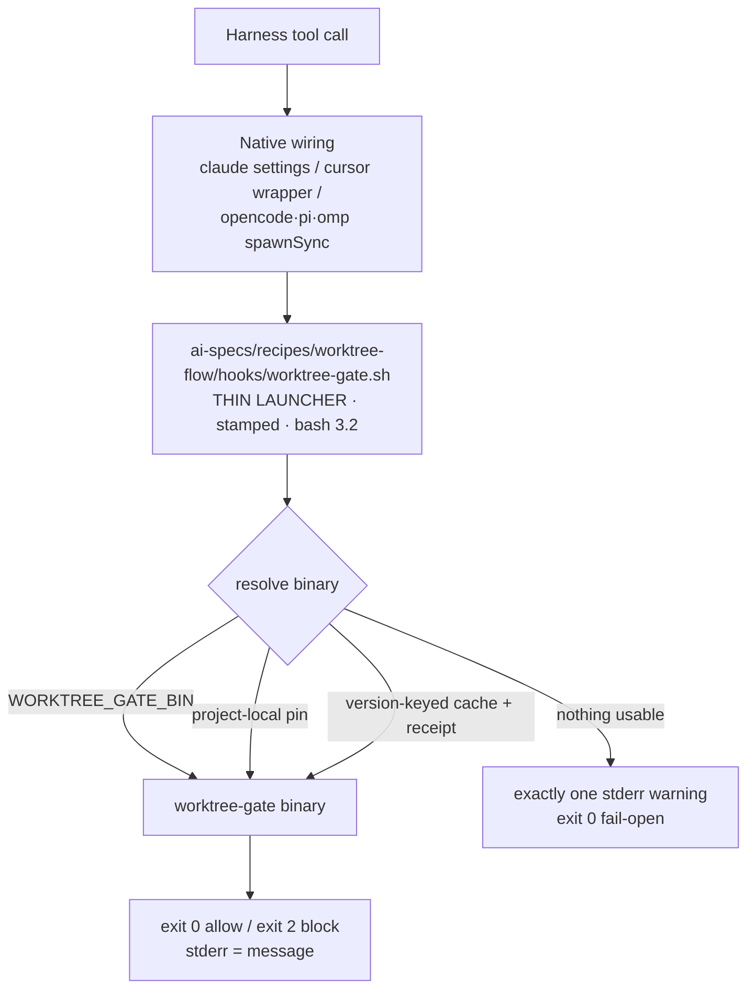
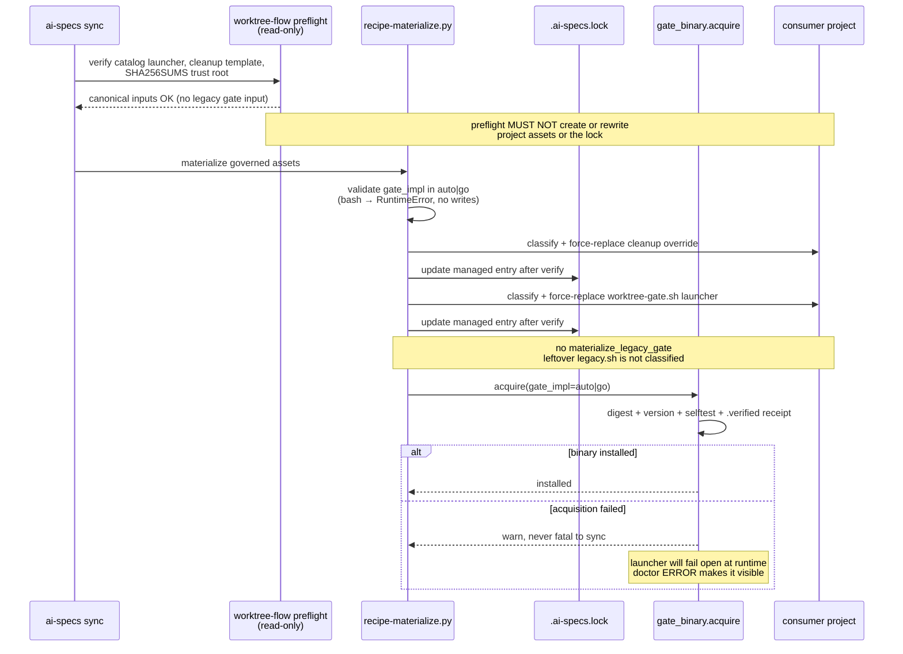
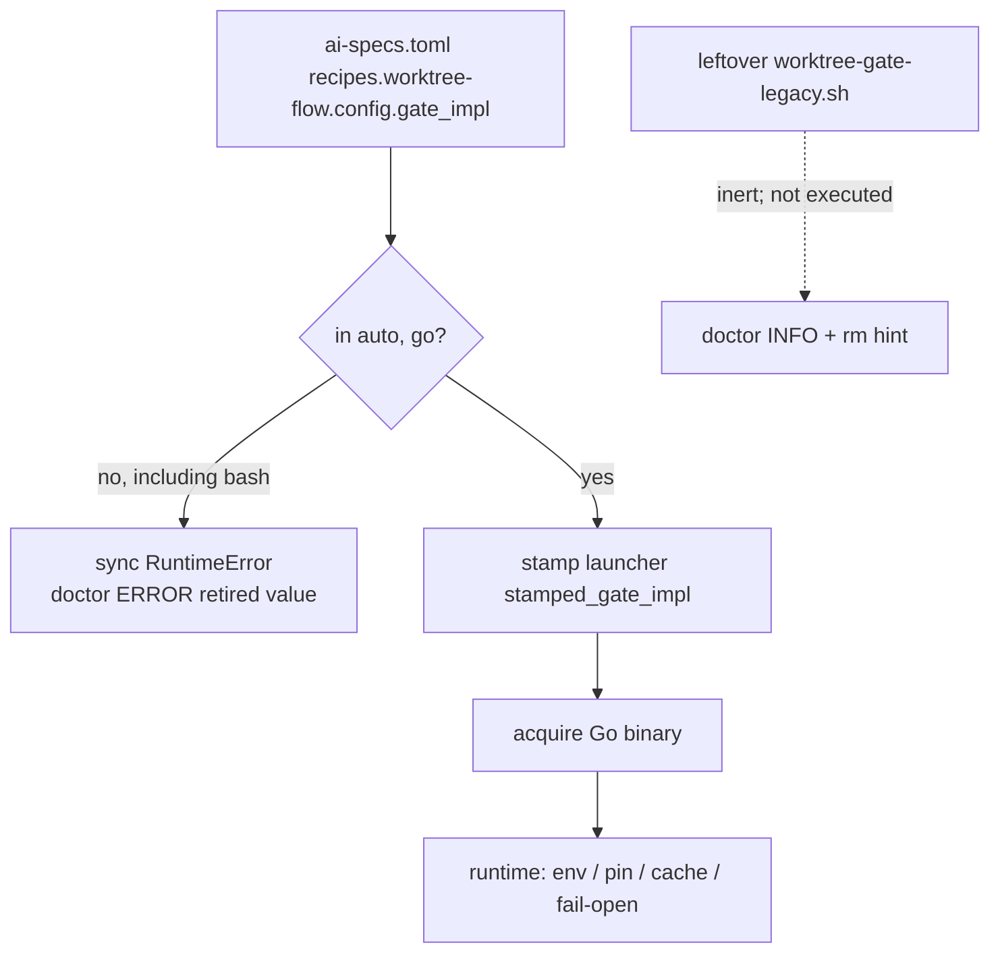

# Design: retire the Bash worktree gate

- **Change slug**: `worktree-gate-bash-retire`
- **Depth**: Full
- **Baseline**: `development` @ `313c6d2`
- **Predecessor**: `worktree-gate-go` (Go gate is the default; `gate_impl=bash` was the one-minor-release rollback lever)
- **Format reference**: `openspec/changes/worktree-gate-go/design.md` (still unarchived in this worktree; not under `openspec/changes/archive/`)

## Locked decisions (from proposal + spec + pinned review, not relitigated here)

1. **`gate_impl` enum reduces to `auto | go`.** The key is not retired. `bash` is rejected at validation with an actionable error naming the removed value and the valid pair.
2. **No destructive auto-deletion** of already-materialized `worktree-gate-legacy.sh` copies in consumer projects. They become inert once the launcher loses fallback #4. Doctor reports presence at **INFO** with a manual removal hint.
3. **Strict scope guard.** No project-local launcher slimming beyond the existing governed force-refresh of `worktree-gate.sh`. No runtime extension template changes. No tracker-card-gate work. `hooks-render.py` stays untouched: every harness still points at the same `script_path`.
4. **Entry criterion is met for this change.** The spec records that v0.22.0 shipped `gate_impl = "auto"` with no field regression. This design does not re-open that gate.
5. **Strict TDD** for apply/verify (`./tests/run.sh` focused, `./tests/validate.sh` full). Behavior-changing work is red-green: `gate_impl=bash` rejected, fail-open warning emitted, legacy materialization gone, then catalog deletion and suite retarget.

## 1. Architecture

The Go binary remains the only gate implementation. This change removes the rollback seam that `worktree-gate-go` introduced; it does not change gate *policy*.

Everything above the launcher is unchanged. The only behavioral deletion inside the launcher is fallback #4 (`exec bash worktree-gate-legacy.sh`). Fail-open was already the floor (previous step 5); removing step 4 does not weaken it — it removes the path that *avoided* fail-open when no binary resolved.

### 1.1 What is deleted vs what stays

| Surface | Action |
|---------|--------|
| `catalog/recipes/worktree-flow/hooks/worktree-gate-legacy.sh` | Delete from the catalog. Stop shipping a frozen Bash reference. |
| `materialize_legacy_gate` + `LEGACY_HOOK_REL` + call site in `recipe-materialize.py` (~L684, ~L1227) | Delete. Ordinary sync MUST NOT write a legacy gate into the project. |
| `GATE_IMPL_VALUES` / `recipe.toml` `[config.gate_impl].enum` | Reduce to `("auto", "go")`. Reject `"bash"` with the same `RuntimeError` shape used today for `"rust"`. |
| Launcher fallback #4 (`worktree-gate.sh` ~L175–183) | Delete. Resolution order becomes env → project-local → version-keyed cache → fail-open. |
| `gate_binary.acquire(gate_impl=="bash")` early return (~L408) | Delete the Bash skip branch. After validation, `auto` and `go` are the only callers; both acquire. |
| Doctor INFO `"gate_impl=bash … rollback lever"` (~L826–831) | Remove. Replace with retired-value ERROR (config/stamp) and leftover-file INFO (inert copy). |
| Consumer-project `ai-specs/recipes/worktree-flow/hooks/worktree-gate-legacy.sh` already on disk | **Leave in place.** Do not classify, refresh, or delete. |
| `hooks-render.py`, generated adapter templates, tracker-card-gate | Untouched. |
| Go package under `catalog/recipes/worktree-flow/gate/` | Untouched except tests that currently skip Go because a Bash reference is missing. |

### 1.2 Why keep `auto | go` instead of retiring the key

After Bash is gone, `auto` and `go` share the same runtime floor: acquire the verified binary, else fail open with one warning. The remaining distinction is **intent and messaging**, not a second implementation:

- `auto` is the shipped default (“use the Go gate when the CLI can provide it”).
- `go` is an explicit pin already present in consumer manifests from the rollback window.

Retiring the key would force a second breaking change on every project that set `gate_impl = "go"`, without removing any code path this change needs to delete. Enum reduction satisfies the exit criterion (`bash` no longer exists) and keeps a named knob if a future implementation appears. Noted for PR review: reviewers should not treat “auto vs go are now aliases at the fail-open floor” as a defect.

### 1.3 Why leftover copies are inert, and why doctor is INFO

`materialize_legacy_gate` copies catalog bytes without lock-backed provenance (no `set_gate_baseline`). Pre-0.22.0 and 0.22.x rollback copies therefore have **no digest the CLI can trust**. Auto-deleting them would be a byte-provenance guess: a user-edited file, a partial copy, or an unrelated same-name file could be destroyed.

Once fallback #4 is gone, the launcher never `exec`s that path. Presence is hygiene, not enforcement. Doctor therefore:

| Observation | Severity | Guidance |
|-------------|----------|----------|
| Manifest or stamped `gate_impl = "bash"` | **ERROR** | Value is retired. Set `auto` or `go`, then `ai-specs sync`. Read-only: doctor does not rewrite the manifest or lock. |
| Leftover `hooks/worktree-gate-legacy.sh` on disk | **INFO** | Inert. Manual removal: `rm ai-specs/recipes/worktree-flow/hooks/worktree-gate-legacy.sh`. Do not classify this file as a governed stale asset (that would imply force-replace, which this change must not do). |
| `gate_impl=auto` or `go` and no verified binary | **ERROR** | Gate is failing open. Was WARN for `auto` (“falling back to Bash”); that fallback no longer exists, so `auto` joins `go` at ERROR. Recovery: `ai-specs sync` or `ai-specs sync --refresh-gates`. |

INFO (not WARN) for the leftover file: WARN would imply a correctness defect. The file cannot run. Operators who want a clean tree get a hint; operators who ignore it are not failing doctor.

## 2. Sync materialization after retirement

Governed worktree-flow assets shrink from three conceptual targets (cleanup override, launcher, legacy gate) to **two**: the cleanup override and the generated launcher. The version-keyed Go cache remains a separate acquisition concern, not a materialized hook.

Invariants:

- **Fail closed on governed replacement** (launcher, cleanup): backup, atomic write, verify, then lock update. Unchanged from the modified “Forced Latest-Canonical Refresh” requirement; the legacy file is simply no longer a governed asset.
- **Fail closed on cache acceptance**: missing/stale/unknown cache bytes are not executed. Unchanged from “Current Gate Asset and Release Freshness”. The retired Bash fallback MUST NOT be used to bless an unverified cache file — there is no Bash fallback to misuse.
- **Sync is not fatal on acquisition failure.** A missing binary degrades to runtime fail-open. That is the existing D13 contract from `worktree-gate-go`; this change keeps it and removes the Bash degradation path that used to hide it for `auto`.
- **Renderer unchanged.** `script_path` remains `ai-specs/recipes/worktree-flow/hooks/worktree-gate.sh`. Ordinary sync force-replaces that governed launcher with catalog bytes that lack fallback #4. That is existing freshness policy, not a new project-local slimming path.

## 3. Launcher fail-open without legacy fallback

Current order (`worktree-gate.sh` header, design §5 of the predecessor):

1. `$WORKTREE_GATE_BIN` if executable
2. Project-local `<recipe_root>/bin/worktree-gate` (from `BASH_SOURCE[0]`, never `$PWD`)
3. Version-keyed cache `<stamped_version>/<os>-<arch>/worktree-gate` (reject cache executable without a current `.verified` receipt — existing bounded pre-exec check)
4. **Legacy Bash** — `stamped_gate_impl=bash`, or `auto` with no binary
5. One stderr warning, `exit 0`

Post-retire order:

1. `$WORKTREE_GATE_BIN` if executable
2. Project-local pin
3. Version-keyed cache with receipt
4. Exactly one stderr warning naming the unresolved binary and the recovery action (`ai-specs sync` / `ai-specs sync --refresh-gates` / `ai-specs doctor`), then `exit 0`

Constraints the launcher must still honour:

- **One warning per invocation**, not one per failed resolution step.
- **No digest hashing on the hot path** unless `WORKTREE_GATE_VERIFY=1`.
- **Sentinel** `stamped_gate_scope="` stays so freshness classification still upgrades existing launchers instead of freezing them.
- **`bash -n` clean.** bash 3.2 only.
- **`stamped_gate_impl` remains.** It still stamps `auto` or `go` for doctor/version diagnostics. The launcher MUST NOT branch on it to select an implementation. Invalid leftover `"bash"` in an old launcher is overwritten on the next ordinary sync (governed force-replace). Until that sync, a stale launcher that still contains fallback #4 is a **pre-refresh** consumer; this CLI version stops *emitting* that fallback. Design does not add a runtime killer-switch inside old bytes.

`auto` vs `go` at the launcher: neither selects Bash. Both fail open when steps 1–3 miss. Doctor severity for the missing-binary case is ERROR for both (see §1.3).

## 4. Parity corpus becomes the Go spec

The corpus under `tests/fixtures/worktree-gate-corpus/` stays the executable specification of gate behavior. The Bash-reference *half of the runner* goes away. The pinned `expect` values stay.

### 4.1 Tokenizer pin (do not lose the redirection regression)

`tests/test_worktree_gate_tokenizer.py` today has two oracles:

1. **python3 `shlex.split(cmd, posix=True)`** — this is the Go tokenizer contract from predecessor D9, *not* the Bash gate script. **Keep it.**
2. Comments and any execution of `worktree-gate-legacy.sh:129-133` — drop the legacy-script framing. The Go `--tokenize` diagnostic remains the implementation under test.

The corpus currently pins `cmd 2>&1` as a single token `2>&1`. It does **not** yet pin `mv a b 2>&1`. Apply MUST add that case to `tests/fixtures/worktree-gate-tokenizer-corpus.json` with the python3 shlex answer as the expected tokens. That is the spec scenario “Tokenizer behavior is pinned by the Go-only corpus”. The retired Bash tokenizer MUST NOT be re-introduced as an expected result if it ever diverged from shlex (the historical `2>&1` → `['2>','&','1']` class of bugs).

Go half: **no longer skip** because a Bash reference is missing. Skip only when the Go binary itself is absent (`dist/worktree-gate-*` / cache), and skip loudly.

### 4.2 Suites to retarget (not rewrite policy)

| Suite | Today | After |
|-------|-------|-------|
| `tests/test_worktree_gate_parity.py` | Hermetic Bash fixtures; Go half skipped until binary | Drive the Go binary only against corpus `expect`. Delete `LEGACY` / `materialize_legacy`. Skip loudly if no binary — never skip *because* legacy.sh is gone. |
| `tests/test_worktree_gate_hook.py` | Default SUT is `LEGACY_GATE` | Default SUT is the Go binary (or stamped launcher exec’ing it). Scrub comments may keep historical line citations in prose, not as an executable oracle. |
| `tests/test_worktree_gate_harness_phase4.py` | Asserts `auto` materializes/falls back to legacy | Asserts `auto` does **not** write legacy.sh; missing binary → one fail-open warning, no Bash exec. |
| `tests/test_worktree_gate_dist_config.py` | `gate_impl=bash` stamps and copies legacy; rollback rehearsal | `bash` rejected at sync; `auto`/`go` stamp; no `LEGACY_HOOK_REL` write. Invalid values still name `auto \| go` only. |
| `tests/test_gate_binary_dist.py` | `test_gate_impl_bash_skips_acquisition` | Delete Bash skip. Offline `auto` and `go` both degrade without installing; no legacy fallback claim. |
| `tests/test_doctor_worktree_gate.py` | INFO rollback lever for bash | ERROR retired-value; INFO leftover file; ERROR fail-open for `auto` without binary. |
| `tests/test_worktree_root_propagation.py` | Expected materialized path includes legacy.sh | Drop that path. |
| `tests/test_worktree_gate_metrics.py` | Go git-call count **strictly less than Bash** | Drop the Bash comparison. Keep Go-only assertions: memoization (shim count ceiling / `module_records` once), one implementation process, no hashing on the hot path. Do not keep a frozen Bash copy solely to compare. |
| `.github/workflows/release-worktree-gate.yml` `parity` job | Python-only, “Bash reference vs pinned expectations” | **Must build a host-native Go binary first** (ubuntu-latest → `linux/amd64` via the same `scripts/build-gate.sh` flags), then run `python3 -m unittest tests/test_worktree_gate_parity.py`. Keep the job independent of the matrix `build` job so a checksum failure cannot skip behavioral proof. Rename the job. |

### 4.3 TDD sequence for apply (task-mapping hint)

Red before production edits, per requirement:

1. **Reject `bash`.** Extend dist-config / merge_config tests so `gate_impl = "bash"` raises with `auto | go` in the message. Then shrink `GATE_IMPL_VALUES` and `recipe.toml` enum.
2. **No legacy materialization.** Assert ordinary sync does not create `LEGACY_HOOK_REL` even when a leftover file is absent. Then delete `materialize_legacy_gate` and the catalog file.
3. **Fail-open warning.** Assert launcher with no env / no project-local / no cache prints exactly one warning and exits 0, and never execs a same-directory `worktree-gate-legacy.sh` even if that file is planted. Then delete fallback #4.
4. **Doctor.** Assert no “rollback lever” text; leftover file is INFO; stamped bash is ERROR. Then change `doctor.py`.
5. **Parity/hook/tokenizer retarget** including the `mv a b 2>&1` pin, then delete remaining `LEGACY_GATE` test helpers.
6. **Docs** (`docs/runtime-hooks.md`, `docs/recipes-catalog.md`, `ai-specs/recipes/worktree-flow/README.md` / catalog recipe README, CHANGELOG). Last, not first.

## 5. Data flow: config, stamp, doctor

Leftover `worktree-gate-legacy.sh` is not on the runtime resolution path. `gate_impl` continues to have **no environment override** (predecessor: impl is stamped-only). This change does not add `WORKTREE_GATE_IMPL`.

## 6. Docs contract

Readers looking up `gate_impl` or the resolution chain MUST see only `auto | go`. Remove:

- “kept for one minor release as the rollback path”
- Resolution step 4 (frozen Bash reference)
- Tables that list `bash` as a valid value
- README “Rollback levers: set `gate_impl = "bash"`”

Replacement rollback story (honest, smaller):

| Lever | Action |
|-------|--------|
| Per invocation | `WORKTREE_GATE_MODE=off` or `WORKTREE_GATE_BIN=<path>` |
| Per install | `rm -rf $AI_SPECS_HOME/cache/bin/worktree-gate` then `ai-specs sync` (re-acquire) |
| Full revert | install the previous CLI and `ai-specs sync` |

There is no in-tree Bash implementation to roll back to. Fail-open plus doctor ERROR is the safety valve when the binary cannot be resolved.

## 7. Decisions (ADR-style)

| # | Decision | Alternatives rejected | Rationale |
|---|----------|----------------------|-----------|
| D1 | Keep `gate_impl` key; enum `auto \| go` | Retire the key; keep `bash` | Exit criterion is “bash no longer exists”, not “no config knob”. Retiring the key breaks explicit `go` pins for no runtime gain. |
| D2 | Leave leftover consumer `worktree-gate-legacy.sh` in place | `rm` on sync; force-replace as governed stale | Copies lack lock provenance; deletion is unsafe. After fallback #4 removal the file cannot run. |
| D3 | Doctor leftover file at INFO | WARN or ERROR | Presence is not a correctness failure. ERROR is reserved for retired `bash` config and fail-open (missing binary). |
| D4 | Doctor stamped/config `bash` at ERROR | Keep INFO “rollback lever” | The value is invalid. Sync rejects it. Doctor stays read-only and names “set auto\|go then sync”. |
| D5 | `auto` without binary is doctor ERROR | Keep WARN “falling back to Bash” | There is no Bash fallback. Fail-open must be as visible as `gate_impl=go`. |
| D6 | Collapse launcher steps 4 and 5 into one fail-open floor | Block when unresolved; keep a stub bash | Preserves predecessor D13: a wedged editor is worse than a temporarily open gate. One warning keeps the “exactly one” spec. |
| D7 | Do not touch `hooks-render.py` or adapter templates | Point `script_path` at the binary | Same as predecessor D1/D2: one materialized POSIX path, multi-arch binary behind the launcher. |
| D8 | Parity `expect` stays; Bash runner goes | Keep dual-run forever; delete the corpus | Corpus is the spec. Dual-run would require shipping the file we are deleting. |
| D9 | Tokenizer oracle remains python3 shlex, plus an explicit `mv a b 2>&1` pin | Re-pin against deleted legacy.sh pass1 | shlex was the original pass1 contract. The spec forbids resurrecting Bash tokenizer bugs as expected results. |
| D10 | Release `parity` job builds `linux/amd64` then runs unittest | Keep Python-only job; depend on matrix artifacts | After this change the Python-only job cannot pass. Independent build avoids coupling behavior proof to checksum. |
| D11 | Metrics drop Bash comparison | Keep a vendored Bash copy for git-count | A hidden second implementation would violate “single gate implementation”. Go memoization is already unit-tested. |
| D12 | No project-local launcher slimming; no tracker-card-gate; no extension template edits | Drive-by cleanup | Strict scope. Launcher catalog bytes change only via existing governed refresh. |

## 8. File-change map

### Production

- `catalog/recipes/worktree-flow/hooks/worktree-gate-legacy.sh` — delete
- `catalog/recipes/worktree-flow/hooks/worktree-gate.sh` — remove fallback #4; update header resolution list; keep sentinels and fail-open
- `catalog/recipes/worktree-flow/recipe.toml` — `enum = ["auto", "go"]`; rewrite `help_text`
- `lib/_internal/recipe-materialize.py` — `GATE_IMPL_VALUES`; delete `materialize_legacy_gate` / `LEGACY_HOOK_REL` / call site; error string `auto | go`
- `lib/_internal/gate_binary.py` — remove Bash skip; comments no longer promise auto→bash degradation
- `lib/_internal/doctor.py` — severity table in `_check_worktree_gate`; leftover-file INFO; no rollback-lever INFO
- Docs: `docs/runtime-hooks.md`, `docs/recipes-catalog.md`, recipe README, CHANGELOG (user-facing behavior)

### Tests / CI (see §4.2)

- Parity, tokenizer (+ `mv a b 2>&1`), hook, harness phase4, dist-config, gate_binary_dist, doctor, root-propagation, metrics
- `.github/workflows/release-worktree-gate.yml` parity job

### Out of scope (must not appear in tasks)

- `lib/_internal/hooks-render.py` and generated `.opencode` / `.pi` / `.omp` / Cursor wrapper templates
- `catalog/recipes/trello-mcp-workflow/**` (tracker-card-gate)
- Go gate policy (`decide.go`, extraction, topology)
- Automatic deletion of consumer leftover files
- Windows

## 9. Task-mapping hints (design does not write `tasks.md`)

Map 1:1 onto the spec delta. Tasks phase should group by infrastructure → implementation → testing → docs, hierarchical numbering, one-session slices, README/docs task included.

| Spec requirement | Design hooks | Suggested apply slices |
|------------------|--------------|------------------------|
| **MODIFIED: Forced Latest-Canonical Refresh** | Legacy is not a governed asset. Preflight inputs = cleanup template + launcher + trust root. Leftover legacy.sh is not classified. | Drop any freshness classification / backup / replace of `LEGACY_HOOK_REL`. Confirm cleanup + launcher scenarios unchanged. |
| **MODIFIED: Current Gate Asset and Release Freshness** | No Bash fallback to bless unverified cache. Doctor freshness targets exclude legacy. `auto` missing binary → ERROR. | Update doctor missing-binary branch; acquire comments; release checksum job unchanged (still SHA256SUMS). |
| **ADDED: Single Gate Implementation Without Bash Rollback** | Enum, catalog delete, no materialize, doctor retired-value, docs. | TDD items 1, 2, 4, 6 in §4.3. |
| **ADDED: Launcher Fail-Open Without Legacy Fallback** | Resolution 1–3 then one warning. Planted leftover file must not be exec’d. | TDD item 3. Keep env/pin/cache precedence tests. |
| **ADDED: Parity Corpus Asserts the Go Gate as the Only Implementation** | Go-only runners; tokenizer `mv a b 2>&1`; release parity job builds Go first. | TDD item 5 + CI job. |

Tracker: before apply/production, the change folder needs `## Tracker` (card_id + url) per project workflow. Design does not create the card.

## 10. Risks

| Risk | Mitigation |
|------|------------|
| Consumer still on an **un-synced** launcher that contains fallback #4 | Ordinary sync force-replaces the governed launcher. Doctor ERROR on stamped `bash`. Document `rm <launcher> && ai-specs sync` only for the existing user-modified path, not as a new slimming feature. |
| Operator expects `gate_impl=bash` to keep working after upgrade | Sync fails closed with an actionable error. Changelog + doctor ERROR. |
| Leftover legacy.sh mistaken for a live gate | Doctor INFO. Docs: resolution chain has no Bash step. |
| Release `parity` job goes red (Python-only) | D10: build host binary in that job. |
| Tokenizer regression `mv a b 2>&1` dropped while deleting legacy comments | Explicit corpus entry; spec scenario. |
| Accidental tracker-card-gate / renderer edits | D7/D12 and §8 out-of-scope list. |

## 11. Rollback of *this* change

This change *is* the removal of the previous rollback lever. Rolling *this* CLI version back means installing the prior release (the one that still ships `worktree-gate-legacy.sh`) and running `ai-specs sync`. Forward-only recovery is re-acquire the Go binary. There is no in-repo Bash safety net after merge.

## Artifact path

`openspec/changes/worktree-gate-bash-retire/design.md`
