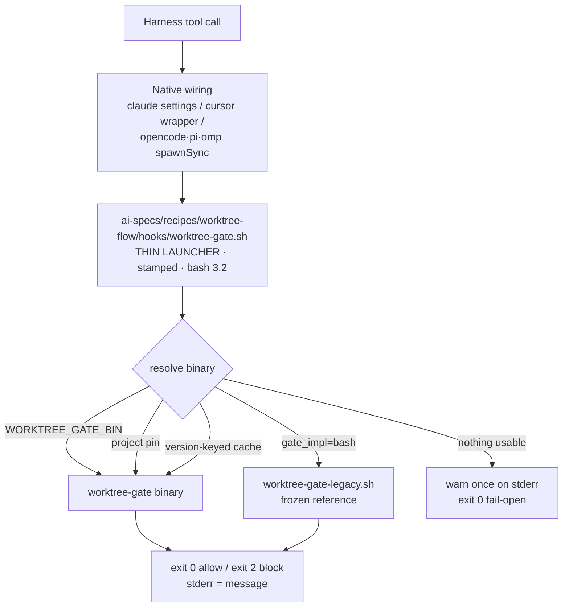
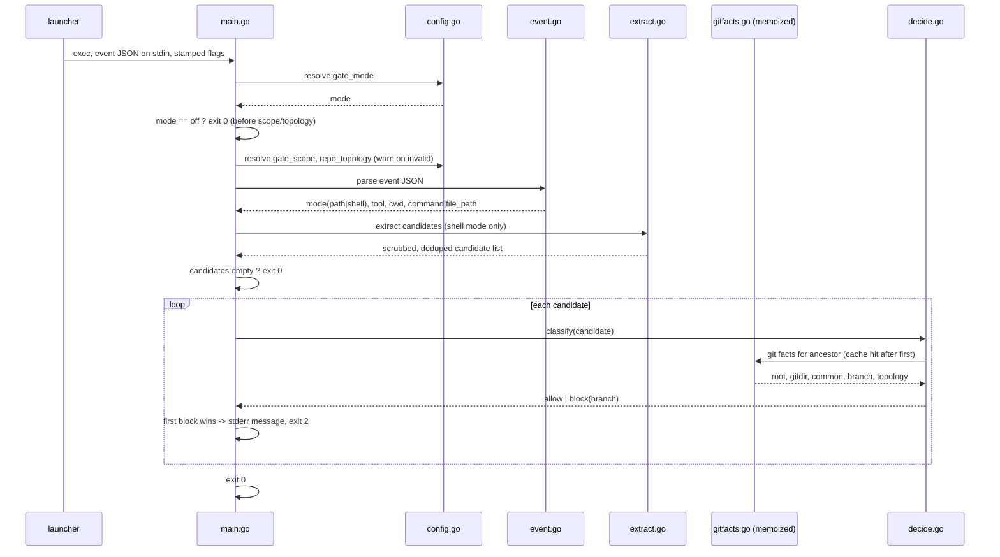
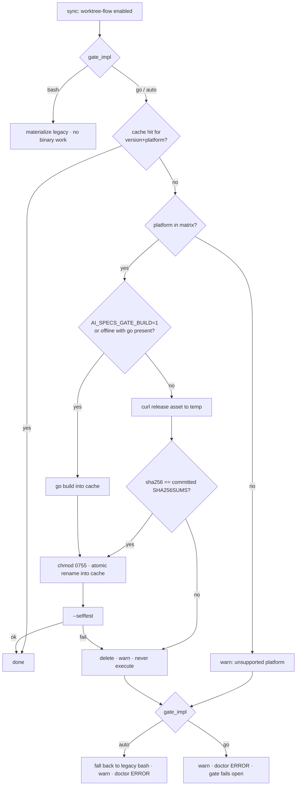

# Design: autocontained Go worktree gate

- **Change slug**: `worktree-gate-go`
- **Depth**: Full
- **Baseline**: `development` @ `e080483`
- **Reference implementation**: `catalog/recipes/worktree-flow/hooks/worktree-gate.sh`
  (541 lines) — frozen as the parity oracle, not deleted by this change

## Locked decisions (from proposal, not relitigated here)

1. Language is Go; stdlib only; **zero third-party modules**.
2. Distribution is **Option D**: fetch a checksum-verified release asset by default,
   opt-in local build, `gate_impl` as the rollback lever.
3. Trust root is the **repository**: expected digests are committed; the network supplies
   only bytes.
4. The materialized hook path never changes, so `hooks-render.py` is untouched.
5. This change alters **no gate policy**. Any behavior difference from the Bash reference
   is a defect, not an improvement.
6. Windows is out of scope for v1.

## 1. Architecture



Everything above the launcher is unchanged. Everything below it is new. The launcher is the
single seam, and it is deliberately the only new shell code in the change.

### 1.1 Go package layout

```
catalog/recipes/worktree-flow/gate/
  go.mod                 module ai-specs.dev/worktree-gate   (go 1.22, no require block)
  main.go                flag parsing, stdin read, exit-code contract
  config.go              gate_mode / gate_scope / repo_topology resolution + warnings
  event.go               event JSON → mode + tool_name + command string + cwd
  tokenize.go            POSIX shlex-equivalent tokenizer
  extract.go             pass1 (shell operators) + pass2 (interpreter writers)
  pathutil.go            realpath-equivalent, inside(), existingAncestor()
  gitfacts.go            git invocation + per-root memoization
  topology.go            module_records / classify
  decide.go              the allow/block decision
  message.go             verbatim block and warning strings
  *_test.go              unit tests per file
```

Rationale for one file per concern: the parity corpus exercises the whole binary, but the
high-risk pieces (tokenizer, extraction regexes, path helpers) need direct unit tests with
table-driven cases. A single `main.go` would make that impossible.

### 1.2 Why shell out to `git`

The Python resolver derives every fact from `git` subprocesses (`worktree-gate.sh:375-382`).
Using a Go Git library would change semantics in exactly the places that matter —
`--path-format=absolute` availability, `submodule status` prefix characters, linked-worktree
`--git-common-dir` resolution — and would add a dependency. **Decision: shell out to `git`,
same arguments, same order, same empty-string-on-error conflation.** The only change is
memoization.

## 2. CLI contract of the binary

```
worktree-gate [flags]   # event JSON on stdin
  --gate-mode      always|ask|off      stamped value (env WORKTREE_GATE_MODE wins)
  --gate-scope     auto|superrepo|subrepo   stamped value (env WORKTREE_GATE_SCOPE wins)
  --repo-topology  auto|standalone|monorepo-apps|monorepo-submodules
                                       stamped value; NO env override by design
  --protected      "main development"  default; env WORKTREE_GATE_PROTECTED wins
  --version                            print version, exit 0
  --selftest                           self-check (regex compile, git presence), exit 0/1
  --explain                            emit a JSON diagnostic on stdout, still exit 0/2
```

- **stdout is empty** for normal operation. Only `--version`, `--selftest` and `--explain`
  write to stdout. This matters because the Cursor wrapper captures stdout of the hook
  (`hooks-render.py:179`) and embeds it in the deny payload.
- Unknown flags MUST NOT abort: a usage error prints a warning to stderr and exits `0`. A
  gate that refuses to run because of a launcher-flag mismatch after a partial upgrade
  would wedge every edit.
- `--explain` output shape (test/doctor interface only, not a user contract):

```json
{"mode":"shell","tool":"Bash","cwd":"/abs","gate_mode":"always","gate_scope":"auto",
 "repo_topology":"auto","candidates":["/abs/a","/abs/b"],
 "decision":"block","branch":"main","reason":"protected-main-worktree"}
```

## 3. Data flow inside the binary



Two structural differences from the Bash version, both invisible at the boundary:

1. **One process** instead of `N+2`.
2. **Memoized Git facts.** `gitfacts.go` caches by resolved ancestor directory and by
   repository root, so `module_records` runs at most once per probed directory per
   invocation instead of once per candidate per ancestor. For a four-candidate event in a
   two-submodule superrepo this collapses roughly 40+ `git` calls into fewer than 10.
   `[INFERENCE]` — counted from the loop structure at `worktree-gate.sh:412-477`, to be
   measured in Phase 2.

## 4. The three high-risk ports

### 4.1 Tokenizer — replacing `shlex.split(cmd, posix=True)`

`pass1` (`worktree-gate.sh:129-133`) depends on POSIX shlex semantics **including its
failure mode**: `ValueError` on unbalanced quotes returns `[]`, which means "no candidates"
which means fail-open.

`tokenize.go` implements a POSIX-mode state machine:

| State | Behavior |
|-------|----------|
| whitespace | token boundary; runs of whitespace collapse |
| bare word | accumulate until whitespace or quote |
| `'` single-quoted | accumulate literally until the closing `'`; no escapes |
| `"` double-quoted | accumulate until closing `"`; `\` escapes `"` `\` `$` `` ` `` and newline |
| `\` outside quotes | escape the next character literally |
| `#` at token start | comment: discard to end of line (matches `shlex` with `commenters` default) |
| EOF while quoted or after a trailing `\` | **error → return empty slice** |

The API is `Split(s string) ([]string, bool)` where the bool is "clean parse". Callers treat
`false` exactly as Python treats `ValueError`: empty candidate list, fail open.

Verification is differential, not by inspection: a generated corpus is fed to both
`shlex.split` (via `python3`) and `Split`, asserting token-for-token equality and matching
error verdicts. Corpus includes nested quotes, `$'…'`, embedded newlines, trailing
backslash, `>>` glued forms, and every command already present in
`tests/test_worktree_gate_hook.py`.

### 4.2 Interpreter-write regexes — RE2 has no backreferences

Five patterns in `pass2` (`worktree-gate.sh:201-233`) use `\1` (one also `\3`) to require
that the closing quote matches the opening quote. **Go's `regexp` will not compile them.**

The tempting fix — replace `\1` with `["']` — is wrong: it accepts `open("path', 'w')` and
changes the captured span. **Decision: match with independent delimiter groups and enforce
pairing in Go.**

| Family | Python (reference) | Go port |
|--------|--------------------|---------|
| Python `open(p, mode)` | `open\(\s*(["'])(?P<p>.+?)\1\s*,\s*(["'])(?P<mode>[^"']*)\3` | `open\(\s*(["'])(.+?)(["'])\s*,\s*(["'])([^"']*)(["'])` + require `g1==g3` **and** `g4==g6`, then mode contains `w`, `a` or `x` |
| Python `Path().write_text/bytes` | `Path\(\s*(["'])(?P<p>.+?)\1\s*\)\s*\.write_(?:text\|bytes)\(` | same shape, require `g1==g3` |
| Node writers | `(?:fs\.)?(writeFileSync\|…)\(\s*(["'])(?P<p>.+?)\1` | same shape, require delimiters equal |
| Ruby `File.write` | `File\.write\(\s*(["'])(?P<p>.+?)\1` | same shape, require delimiters equal |
| Ruby `File.open(p, mode)` | `File\.open\(\s*(["'])(?P<p>.+?)\1\s*,\s*(["'])(?P<mode>[^"']*)\3` | two paired checks, as with Python `open` |

Non-greedy `.+?` and named groups `(?P<…>)` are both RE2-supported and stay as-is. The
mismatched-delimiter case is a **negative test** per family, and each family also gets a
positive test, because a silently non-firing regex is a gate hole that no aggregate test
would catch.

### 4.3 Path semantics — `realpath` is not `EvalSymlinks`

Three distinct helpers, each mirroring a Python behavior the resolver depends on:

**`RealPath(p string) string`** — Python `os.path.realpath` never fails on a nonexistent
tail; `filepath.EvalSymlinks` returns an error. The resolver calls `realpath` on write
targets that **do not exist yet** (`worktree-gate.sh:480`) and on submodule paths
(`:430`, `:443`). Implementation: absolutize, walk from the root resolving each existing
component through `EvalSymlinks`, then append the unresolved remainder lexically. Never
returns an error; on any failure it returns the lexically-cleaned absolute path. This is
what makes macOS fixtures work, where `/tmp` → `/private/tmp` and `/var` → `/private/var`.

**`Inside(path, root string) bool`** — mirrors `inside()` (`:384-388`) including its
`ValueError → False`: returns `false` if either side is not absolute; otherwise compares
cleaned paths component-wise so `/repo-evil` is **not** inside `/repo`. A
`strings.HasPrefix` port would be a real security bug.

**`ExistingAncestor(p string) string`** — mirrors `:390-398`: absolutize, walk up until a
component exists, return it if it is a directory else its parent, and return `""` when the
walk reaches the filesystem root without finding anything. Python's `os.path.exists`
returns `False` for a broken symlink; Go's `os.Stat` errors on one, which yields the same
verdict — recorded here so the equivalence is deliberate rather than accidental.

## 5. Compatibility launcher

`catalog/recipes/worktree-flow/hooks/worktree-gate.sh`, ~90 lines, bash 3.2 only (no
`mapfile`, no associative arrays, no `${v,,}`):

```bash
#!/usr/bin/env bash
# worktree-gate.sh — thin launcher for the autocontained Go worktree gate.
stamped_gate_mode="__WORKTREE_GATE_MODE__"
stamped_gate_scope="__WORKTREE_GATE_SCOPE__"      # sentinel: sync staleness probe
stamped_repo_topology="__WORKTREE_REPO_TOPOLOGY__"
stamped_gate_impl="__WORKTREE_GATE_IMPL__"
stamped_gate_version="__WORKTREE_GATE_VERSION__"
```

Then, in order:

1. **Platform detection.** `uname -s` → `Darwin`→`darwin`, `Linux`→`linux`, anything else →
   empty (no binary target). `uname -m` → `arm64|aarch64`→`arm64`,
   `x86_64|amd64`→`amd64`, else empty. Under a Rosetta-translated shell on Apple Silicon
   `uname -m` reports `x86_64`, which selects `darwin-amd64` — correct, merely slower.
2. **Resolution order** (first hit wins):
   1. `$WORKTREE_GATE_BIN` if executable — the debugging and pinning escape hatch.
   2. `<project>/ai-specs/recipes/worktree-flow/bin/worktree-gate` — an optional
      project-local pin for air-gapped repos.
   3. `${AI_SPECS_HOME:-$HOME/.ai-specs}/cache/bin/worktree-gate/<stamped_version>/<os>-<arch>/worktree-gate`.
   4. Legacy Bash implementation — **only** when `stamped_gate_impl` is `bash`, or it is
      `auto` and no binary resolved.
   5. Nothing usable → one line to stderr naming the missing path and the `ai-specs doctor`
      remedy, then `exit 0`.
3. **Handoff**: `exec "$bin" --gate-mode "$m" --gate-scope "$s" --repo-topology "$t"`.
   `exec` replaces the shell, so stdin flows untouched and the exit code needs no
   translation. For the legacy path it is `exec bash "$legacy"`, whose stamped values are
   already inside that file.

Three constraints the launcher must honour, each with a test:

- **The sentinel.** `recipe-materialize.py:494-508` treats a materialized
  `worktree-gate.sh` lacking the literal `stamped_gate_scope="` as stale and **preserves
  the old bytes**. The launcher keeps that exact token, so existing projects upgrade
  instead of silently freezing on the Bash gate.
- **No digest hashing on the hot path.** Verification happens at acquisition. Hashing ~3 MB
  on every tool call would eat the performance win. `WORKTREE_GATE_VERIFY=1` opts into
  per-invocation verification for paranoid or forensic use.
- **`bash -n` clean**, because `./tests/validate.sh` runs it.

## 6. Distribution, verification and cache

### 6.1 Cache layout

Following `project-cache.py:4,31,49-57`:

```
$AI_SPECS_HOME/cache/bin/worktree-gate/<cli-version>/<goos>-<goarch>/worktree-gate
```

Version-keyed, so an `ai-specs upgrade` naturally acquires a new binary and an older CLI
keeps working against its own. Pruning is a documented `rm -rf`; `doctor` reports total
size.

### 6.2 Acquisition (`lib/_internal/gate_binary.py`)



Invariants:

- **Digest before execution, always.** A mismatched asset is deleted and never run. The
  expected digest comes from `catalog/recipes/worktree-flow/bin/SHA256SUMS`, which is
  committed — so compromising the release host is not sufficient to ship a bad gate.
- **Atomic install.** Download to a temp file in the same directory, verify, `chmod 0755`,
  then `os.replace` into place. A partial download can never be executed.
- **Never fatal to `sync`.** Acquisition failure warns and degrades; `ai-specs sync` must
  not fail because a network was unavailable.
- **Offline determinism.** With no network and no cache, `gate_impl=auto` degrades to the
  legacy Bash implementation and says so. The gate never becomes silently open when a
  usable implementation exists.
- **macOS quarantine.** `curl`-downloaded files are not quarantined by LaunchServices, so
  no `xattr` dance is expected; `--selftest` after install catches it regardless.
  `[INFERENCE]` — based on quarantine being applied by LaunchServices-aware downloaders,
  not measured here.

### 6.3 Build matrix and reproducibility

`scripts/build-gate.sh`:

```sh
CGO_ENABLED=0 GOOS=$os GOARCH=$arch \
  go build -trimpath -buildvcs=false \
    -ldflags "-s -w -X main.version=$VERSION" \
    -o "dist/worktree-gate-$os-$arch" ./catalog/recipes/worktree-flow/gate
```

| GOOS | GOARCH | Tier | Note |
|------|--------|------|------|
| darwin | arm64 | supported | ad-hoc signature verified on real Apple Silicon as a release gate |
| darwin | amd64 | supported | Intel + Rosetta-translated shells |
| linux | amd64 | supported | `CGO_ENABLED=0` → glibc/musl agnostic |
| linux | arm64 | supported | ARM servers/containers |
| windows | amd64 | not built | v1 non-goal |
| others | — | not built | fall back to `gate_impl=bash` or a local build |

`-trimpath` + `-buildvcs=false` + no VCS stamping means the same source and toolchain
produce the same bytes, so a reviewer can regenerate and compare the committed digests.

### 6.4 `gate_impl` config

```toml
[config.gate_impl]
required = false
type = "string"
default = "auto"
enum = ["auto", "go", "bash"]
help_text = "Worktree gate implementation: auto (Go binary when available, else bash), go (require the Go binary), or bash (frozen legacy implementation)."
```

Validated at sync exactly like `gate_scope` (`recipe-materialize.py:477-480`): an invalid
value is a hard `RuntimeError` at sync time, never a silent fallback at runtime. Stamped into
the launcher as `__WORKTREE_GATE_IMPL__`.

### 6.5 Doctor check

One `Check` named `worktree-gate` (matching the kebab-case convention of `cli-version` at
`doctor.py:232`) reporting: resolved implementation, binary path and version, digest state,
whether a fallback is silently in effect, and cache size.

| Condition | Severity |
|-----------|----------|
| Go binary resolved, version matches stamp, `--selftest` passes | OK |
| `gate_impl=bash` explicitly configured | INFO |
| `gate_impl=auto` but falling back to bash | WARN |
| `gate_impl=go` and no usable binary (gate is failing open) | ERROR |
| Digest mismatch recorded at last acquisition | ERROR |
| Binary version does not match the stamped version | WARN |

The ERROR case matters most: a fail-open gate is invisible by construction, so `doctor` is
the only place a user can discover it.

## 7. Runtime coverage across harnesses

No renderer changes. The claim is verified, not assumed.

| Harness | Mechanism | Why the launcher is transparent |
|---------|-----------|--------------------------------|
| claude | `$CLAUDE_PROJECT_DIR/<script_path>`, exit code (`hooks-render.py:142-149`) | same path, same exit codes |
| cursor | generated wrapper, exit `2` → `{"permission":"deny"}` with **stdout** as the message (`:173-186`) | binary keeps stdout empty; the message is on stderr, and the wrapper's existing behavior is unchanged from the Bash gate, which also wrote to stderr |
| opencode | `spawnSync(SCRIPT, {input, env})`, `status===2` → `throw` (`:250-257`) | `SCRIPT` is executed directly with no shell; the launcher has a shebang and mode 0755 |
| pi | `spawnSync(SCRIPT, …)` → `{block:true}` | same |
| omp | `spawnSync(SCRIPT, …)` → `{block:true}` | same |

Phase 4 adds a test asserting `hooks-render.py` output is byte-identical to the pre-change
output for all five harnesses, plus a live smoke on at least one harness: a real blocked
write on a protected branch and a real allowed write inside a linked worktree.

Note carried forward, not changed: Cursor has no pre-file-write hook (`:161-167`), and
opencode's `tool.execute.before` does not fire for subagent or MCP calls (`:226-227`). Those
are pre-existing coverage gaps documented in `docs/runtime-hooks.md`; this change neither
fixes nor worsens them.

## 8. Test strategy

### 8.1 Parity corpus — `tests/fixtures/worktree-gate-corpus/`

JSON entries, each `{name, event, env, stamped, fixture, expect:{exit, stderr, candidates}}`,
covering:

- Every scenario already in `tests/test_worktree_gate_hook.py` (757 lines).
- The full enum matrix: valid/invalid `WORKTREE_GATE_MODE`, valid/invalid stamped mode,
  valid/invalid `WORKTREE_GATE_SCOPE`, valid/invalid stamped scope, valid/invalid stamped
  topology, `off` short-circuiting **before** scope/topology warnings.
- **Negative**: `WORKTREE_REPO_TOPOLOGY` set in env has no effect (topology is stamped-only,
  `worktree-gate.sh:67-72`).
- Every scrub rule: `.`, `-`, `&2`, `/dev/null`, `/dev/stdout`, `/dev/stderr`, `/dev/fd/3`.
- Every wrapper prefix: `sudo`, `env`, `nice`, `time`, `nohup`, `xargs`, `command`,
  `VAR=value`.
- Command-source precedence: `tool_input.command` / `.script` / `.cmd` / top-level
  `command` / top-level `script`.
- Internal URIs: all twelve schemes allowed in path mode; traversal-masked and
  absolute-masked variants blocked; shell mode never allowlisted; unknown schemes gated.
- `.claude/settings*.json` and `.claude/hooks/*` exceptions, raw and absolutized.
- Topology: standalone, monorepo-apps, initialized submodule (subrepo), superrepo with
  `openspec/changes` exception, ambiguous/nested submodules → unproven.
- Linked worktree allowance (`git_dir != git_common_dir`).
- Fail-open set: malformed JSON, JSON array at top level, missing fields, unbalanced quotes,
  target outside any repo, nonexistent ancestor.

### 8.2 Differential runner — `tests/test_worktree_gate_parity.py`

For each corpus entry: build the Git fixture, run the **frozen Bash reference** and the
**Go binary**, assert identical `(exit_code, stderr, candidates via --explain)`. Also assert
each result matches the corpus `expect`, so a bug present in **both** implementations cannot
pass as parity.

Skips loudly when no Go binary is available, and the Bash-vs-`expect` half still runs — so
the corpus keeps guarding the reference on machines without Go.

### 8.3 Tokenizer differential — `tests/test_worktree_gate_tokenizer.py`

Generated corpus → `python3 -c 'shlex.split'` vs `worktree-gate --explain` token output;
assert token-for-token equality and that `ValueError` maps to an empty list.

### 8.4 Go unit tests

Table-driven, per package file: tokenizer states; one positive and one negative case per
interpreter-write regex family; `RealPath` on symlinked and nonexistent paths; `Inside` on
sibling-prefix directories; `ExistingAncestor` on deep nonexistent trees; `gitfacts`
memoization (call count assertion); `decide` truth table over
`owner × scope × central-path`.

### 8.5 Distribution tests — `tests/test_gate_binary_dist.py`

`uname` mapping including Rosetta; cache path construction; digest match → install; digest
mismatch → delete + no execute; partial download → temp file never installed; offline +
`gate_impl=auto` → legacy fallback + WARN; offline + `gate_impl=go` → ERROR + fail-open;
`gate_impl=bash` → legacy answers the corpus (**the rollback rehearsal**); pre-Go
materialized gate is **upgraded**, not skipped by the sentinel guard; invalid `gate_impl` →
sync raises.

### 8.6 Runner integration

`./tests/run.sh` gains a `go test ./catalog/recipes/worktree-flow/gate/...` step guarded by
`command -v go`, skipping loudly otherwise. `./tests/validate.sh` gains `gofmt -l` (when Go
is present) and keeps `bash -n` over the launcher.

## 9. Migration phases

| Phase | Deliverable | Gate to exit |
|-------|-------------|--------------|
| 0 | Go module skeleton (`--version`, `--selftest` only), `scripts/build-gate.sh`, CI matrix, `SHA256SUMS` placeholder. No wiring. | `validate.sh` green; four targets build; **zero behavior change** |
| 1 | Freeze reference as `hooks/worktree-gate-legacy.sh`; corpus; differential runner; tokenizer differential. | runner is **RED** on the Go side and **GREEN** on Bash-vs-`expect` |
| 2 | Full Go implementation: config, event, tokenize, extract, pathutil, gitfacts, topology, decide, message. | whole corpus GREEN both sides; Go unit tests green; latency measured |
| 3 | Launcher; `__WORKTREE_GATE_IMPL__` / `__WORKTREE_GATE_VERSION__` stamping; `gate_binary.py`; `gate_impl` config; doctor check. | fresh `ai-specs sync` in a scratch project yields a working Go gate; offline, mismatch and rollback paths tested |
| 4 | Five-harness verification; `docs/runtime-hooks.md`; recipe `README.md`; `CHANGELOG.md`; `VERSION`; recipe version bump; cutover to `gate_impl=auto`. | render output byte-identical; live smoke blocked-then-allowed; full `validate.sh` green |

Legacy retirement is **not** in this change. `gate_impl=bash` is the rollback lever for one
minor release; removal is the follow-up change `worktree-gate-bash-retire`, whose entry
criterion is one release with the Go path as default and no field regression.

## 10. Decisions (ADR-style)

| # | Decision | Alternatives rejected | Rationale |
|---|----------|----------------------|-----------|
| D1 | Keep the materialized filename `worktree-gate.sh` for the launcher | new name `worktree-gate` / point `script_path` at the binary | preserves `script_path` for all five renderers → zero re-render churn, and a per-arch binary cannot be a single materialized path |
| D2 | Thin bash launcher instead of wiring the binary directly | direct binary reference | one materialized path cannot be multi-arch; the launcher is also where the stamped values and the staleness sentinel live |
| D3 | `exec` the binary | capture and re-emit | stdin passes untouched, exit code needs no translation, one less process |
| D4 | Fetch + verify + cache (Option C/D) | commit binaries (A), build at install (B) | `git clone` is the install channel; binaries in git cost every user ~15-25 MB per release forever, and B makes Go a hard prerequisite |
| D5 | Digests committed in the repo | fetch digests alongside assets | the trust root must be the same channel as the CLI source, otherwise verification is theatre |
| D6 | Verify at acquisition, not per invocation | hash on every call | hashing ~3 MB per tool call defeats the performance rationale; `WORKTREE_GATE_VERIFY=1` covers the paranoid case |
| D7 | Shell out to `git` | go-git / libgit2 | identical facts, zero dependencies, no divergence on `--path-format`, submodule status or common-dir semantics |
| D8 | Zero third-party Go modules | vendor `shlex`, use `mvdan.cc/sh` | a real shell parser would *change* extraction behavior; third-party shlex ports differ from Python's; parity is the whole point |
| D9 | Port `shlex` in-tree with a differential corpus | trust a library | the failure mode (`ValueError` → fail-open) is part of the contract and must be reproduced exactly |
| D10 | Replace regex backreferences with Go-side delimiter equality | `["']` on both sides | `["']` silently accepts mismatched quotes and changes the captured span — a real behavior change |
| D11 | Custom `RealPath` instead of `EvalSymlinks` | use `EvalSymlinks` directly | it errors on nonexistent tails, and the resolver canonicalizes write targets that do not exist yet |
| D12 | `Inside` compares components | `strings.HasPrefix` | `HasPrefix` matches `/repo-evil` against `/repo` — a security bug |
| D13 | Missing binary → warn + fail open | block, or hard-fail sync | consistent with the existing fail-open contract; a wedged editor is worse than a temporarily open gate, and `doctor` ERROR makes it discoverable |
| D14 | `gate_impl` enum validated at sync | validate at runtime | matches `gate_scope` handling (`recipe-materialize.py:477-480`); config errors belong at sync time |
| D15 | Windows out of scope for v1 | build `windows/amd64` | launcher and Cursor wrapper are POSIX shell; shipping an unreachable binary is dishonest |
| D16 | Keep legacy Bash for one release | delete immediately | for a safety-critical component with a network-acquired artifact, the rollback lever must exist before the cutover, and it is exercised by a test |
| D17 | `repo_topology` stays env-override-free | add `WORKTREE_REPO_TOPOLOGY` | current code has no such override (`:67-72`); adding one is a behavior change disguised as a port, and a negative test pins it |

## 11. Performance budget

Normative in the spec delta, measured in Phase 2 and recorded in the verify report:

- **Exactly one** process spawn per gate invocation (the `exec`ed binary), replacing `N+2`
  Python startups.
- Git facts memoized per resolved ancestor and per repository root; `module_records` runs at
  most once per probed directory per invocation.
- No digest hashing on the invocation path unless `WORKTREE_GATE_VERIFY=1`.
- A four-candidate shell event in a two-submodule superrepo must issue strictly fewer `git`
  subprocesses than the Bash implementation, asserted by counting invocations via a `git`
  shim on `PATH` in the test.

## 12. Rollback

| Lever | Action | Blast radius |
|-------|--------|--------------|
| Per invocation | `WORKTREE_GATE_MODE=off`, or `WORKTREE_GATE_BIN=<path>` | one call |
| Per project | `gate_impl = "bash"` + `ai-specs sync` | one project, no network, no binary |
| Per install | `rm -rf $AI_SPECS_HOME/cache/bin/worktree-gate` | forces re-acquisition |
| Full revert | revert commits + `ai-specs sync`; if the sentinel preserves a stale copy, `rm ai-specs/recipes/worktree-flow/hooks/worktree-gate.sh && ai-specs sync` | whole CLI |

Because the materialized filename never changes, a downgraded CLI re-materializes the Bash
gate over the launcher with no manual cleanup. The `gate_impl=bash` lever is rehearsed as a
test (§8.5), not merely documented.

## 13. Spec deltas created by this change

`openspec/changes/worktree-gate-go/specs/worktree-flow/spec.md` — ADDED requirements for:

1. Gate implementation parity contract (the Go binary is the implementation of record).
2. Portable launcher indirection and `script_path` stability.
3. Binary acquisition, verification and cache layout.
4. `gate_impl` configuration.
5. Multi-arch build matrix and reproducibility.
6. Doctor surfacing of gate implementation health.
7. Invocation performance budget.

No existing requirement is modified or removed: gate *policy* is unchanged by construction.

## Artifact path

`openspec/changes/worktree-gate-go/design.md`


## 9. Corpus fixture hermeticity correction

The parity corpus MUST describe fixture intent rather than hard-code synthetic
filesystem paths such as `/repo`. The differential runner MUST materialize each
fixture in a temporary real Git repository, configure its branch/worktree state,
and substitute event paths relative to that fixture before invoking either
implementation. Cases that require an external directory, linked worktree,
protected branch, or malformed input MUST declare that intent in fixture
metadata. A corpus case MUST NOT pass merely because a nonexistent path causes
the gate to fail open.

The first corpus revision created during Phase 1 used illustrative absolute
paths. Those entries are planning data only and MUST be migrated to hermetic
fixture metadata before the parity runner is considered complete.
***