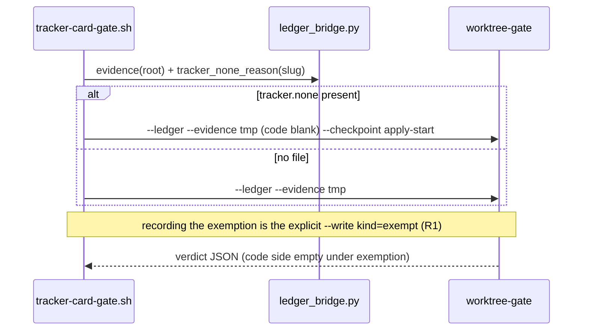

# Design: Bound Trello recipe becomes a real ledger adapter

One `--write` JSON flag on the existing `--ledger` dispatcher records
`open|link|close|exempt` under the store lock. Hosts pass locally built
`--evidence`. No provider API write, no second binary, no Python grader.

Proposal L1–L7 and foundation D1–D19 / A1–A11 stay closed. This file
closes DW1–DW5. Spec delta:
`openspec/changes/trello-ledger-integration/specs/tracker-ledger/spec.md`.

## Quick path

1. Agent issues `--write kind=open` then `kind=link` (never auto from parse).
2. A host that sees `tracker.none` builds blank evidence; recording the exemption is the explicit human/agent `--write kind=exempt`.
3. `tracker-card-gate.sh` and `premerge_guardian.py` pass `--evidence` from
   `lib/_internal/ledger_bridge.py`.
4. Trust root (`SHA256SUMS` + `dist/worktree-gate-current`) regenerates in the
   same Go work unit. Delivery strategy stays `ask-on-risk` (not chosen here).

## Technical approach

Reuse the `--decide` vehicle: parse → validate → locked RMW → re-grade →
print JSON. `Grade` stays pure. Python stays acquisition/JSON (A8/D5).
`remote` stays unwired (L3). `work-start` stays in `plan-build-flow` (L5).

## Decisions (DW1–DW5)

| ID | Options | Tradeoff | Decision |
|---|---|---|---|
| DW1 | Agent-only exempt write vs host-on-file vs both | Host-auto-record turns an agent-writable file into durable state without an explicit human write (R1); agent-only needs an agent path at every checkpoint and may miss the file at unhosted `work-start` | **Human/agent write only; host is evidence-only.** The file is the human act and is presentation/evidence-only. Recording the exemption is the explicit `--write kind=exempt` (agent or human); no host auto-records it (R1). Hosts, at apply-start / pr-review / pre-merge / archive-close, treat an existing `openspec/changes/<slug>/tracker.none` as blank evidence (`code=""`) and never create, modify, or delete the file. `work-start` is not patched (L5); later hosts or an agent write cover it. |
| DW2 | `--write` vs `--track`; fields; required `reason` | `--track` collides with the capability name | **`--write JSON`**, sibling of `--decide`. Schema below. `reason` required for `exempt`. Mutually exclusive with `--decide` (both set → exit 2, no persist). |
| DW3 | Per-checkpoint lock budget vs one budget | Hot path is apply-start; writes are rare | **One budget for every checkpoint and caller:** 5× `LOCK_EX\|LOCK_NB` with 20ms sleep (100ms cap). Grade-path timeout fails open; write/`--decide` timeout fails closed. |
| DW4 | Silent no-op vs new decision kind vs JSON sidecar | `decisionKinds` is closed; silent no-op hides retries | **No new kind.** Idempotent success (exit 0) with stdout `write: {kind, applied, reason}`. `applied=false` reasons: `already-open`, `unchanged`, `already-closed`. Failed writes emit no JSON (stderr + exit 2), matching `--decide`. |
| DW5 | Hook-local python vs `lib/_internal/` module | Two hosts must share parser + cold-cache guardian | **One module** `lib/_internal/ledger_bridge.py`. Guardian/doctor sibling-import. Shell host uses stamped `__TRACKER_LIB_INTERNAL__` (same materialize path as `__TRACKER_CLI_HOME__`). Missing bridge → skip `--evidence` (fail open). |

### Locked follow-ons

| Topic | Choice |
|---|---|
| Exempt with no primary | Same locked `OpenIfAbsent` as `open`, then set `Item.Exemption`. That is an explicit write, not parse-auto-open (L2). |
| Exempt reason | Supplied by the caller of the explicit `--write kind=exempt` (conventionally the first non-empty line of `tracker.none`). Repeat with the same text is `applied=false` / `unchanged`. A different text overwrites (`applied=true`). |
| Revoke exemption | File removal does not clear the store (spec). `--decide kind=adjudicate` **clears `Item.Exemption`** so a human can re-enter evidence. No `unexempt` kind. |
| Open / link / close issuer | Agent only. Hosts never open, link, or close because a `## Tracker` section parses. |
| Git evidence vs `Conflict()` | `Evidence.Conflict` equality-compares every non-empty side to `local` (`item.ItemID`). Branch names and PR URLs would always conflict. **Non-empty sides this slice are native ids only.** `git` = `card_id` when `pr:` is present, else empty. `remote` always empty. |
| `change-ambiguous` | Writer refuses unless payload `change` is a non-empty slug (then that slug is `StoredSlug`). |
| Same-second id | Keep `NewItemID`. Writer uses `uniqueItemID`: if the id exists on any row, suffix `\x1fN` on the stamp input until unique. Do not change unlocked `OpenItem` (tests stay deterministic). |

## Data flow

```text
## Tracker / tracker.none / git facts
        │ ledger_bridge.py (acquisition only)
        ▼
   evidence.json {local:"", remote:"", code, git}
        │
host ──► [--evidence only] ──► worktree-gate --ledger --write/--decide/--evidence
                                      │
                                      ├─ bounded flock on state.json.lock
                                      ├─ OpenIfAbsent / Link / Close / Exempt
                                      ├─ Grade (pure)
                                      └─ stdout verdict [+ write sidecar]
```

### Sequence: explicit open + link (agent)

```mermaid
sequenceDiagram
    participant Agent
    participant Gate as worktree-gate --ledger
    participant Lock as state.json.lock
    participant Store as state.json
    Agent->>Gate: --write kind=open --checkpoint apply-start
    Gate->>Lock: LOCK_NB retry ×5
    Lock-->>Gate: held
    Gate->>Store: OpenIfAbsent
    Store-->>Gate: created or already-open
    Gate->>Gate: Grade
    Gate-->>Agent: verdict + write.applied
    Agent->>Gate: --write kind=link item_id url native_type state provider
    Gate->>Store: set core fields; append link iff changed
    Gate-->>Agent: verdict + write sidecar
```

### Sequence: tracker.none at apply-start (host)



### Sequence: lock postures

```mermaid
sequenceDiagram
    participant Grade as grade / PersistConflict
    participant Write as --write / --decide
    participant Lock as flock LOCK_NB
    Grade->>Lock: try 100ms
    alt timeout
        Grade-->>Grade: stderr; continue; exit 0
    else held
        Grade->>Grade: snapshot conflict; unlock
    end
    Write->>Lock: try 100ms
    alt timeout
        Write-->>Write: stderr; no mutate; exit 2
    else held
        Write->>Write: RMW; re-grade; exit 0 or 2
    end
```

## Write flag and payload

```text
worktree-gate --ledger
  --checkpoint ... --ledger-mode ... --project-root PATH
  [--witness PATH] [--store PATH] [--evidence PATH]
  [--decide JSON | --write JSON]
```

`--write` is added next to `--decide` in `main.go` / `ledgerOptions`. Unknown
flags still fail open (existing). After a successful parse, write validation
failures fail closed (L6).

```json
{
  "kind": "open|link|close|exempt",
  "item_id": "",
  "url": "",
  "native_type": "",
  "state": "",
  "provider": {},
  "reason": "",
  "change": ""
}
```

| Field | Rule |
|---|---|
| `kind` | Required; exact enum above (lowercase). |
| `item_id` | Required for `link` (native id written to `Item.ItemID`). Ignored for `open`/`close`. |
| `url` `native_type` `state` | Optional for `link`; copied to core fields. |
| `provider` | Opaque `json.RawMessage`; default `{}`; predicate never reads it. |
| `reason` | Required non-empty for `exempt` after trim. Stored as `Item.Exemption`. Not a new `decisionKinds` entry. |
| `change` | Explicit slug; required when `Identity.Collision == change-ambiguous`. |

`open`/`link`/`close` append `DecisionOpen|Link|Close` on the item when
`applied=true`. `exempt` does not add a sixth kind.

Stdout addition (success, including idempotent no-ops):

```json
"write": {"kind": "open", "applied": false, "reason": "already-open"}
```

Existing verdict keys stay unchanged. `write` is omitted when `--write` was
not used.

### Lifecycle under the lock

1. Refuse if identity unavailable or (collision set and `change` empty).
2. `open`: if `Primary` exists → `already-open`. Else append via `uniqueItemID`
   + `DecisionOpen`.
3. `link`: require a single open primary; if core fields + canonical provider
   bytes equal the payload → `unchanged`; else set fields and append `link`.
4. `close`: if a single open primary → `CloseItem`. If no open primary but a
   closed row for the key exists → `already-closed`. If no row → fail closed.
5. `exempt`: `OpenIfAbsent`, set `Exemption`, skip a new kind.
6. Save atomically (`state.json.tmp.*` + rename). Any error → byte-identical
   store + exit 2.
7. Re-grade and print.

`runLedger` order: write or decide (not both) → reload store → evidence
(fail open) → `Grade` → `PersistConflict` (timeout = stderr, continue) →
marshal. Write/`--decide` failure: stderr `worktree-gate: ledger --write failed:`
(or `--decide`) and exit 2 with **no** stdout JSON.

## Bounded lock

Replace unbounded `syscall.Flock(LOCK_EX)` in `withStoreLock`. Kernel still
releases on close (crash-safe).

```go
const lockAttempts = 5
const lockBackoff  = 20 * time.Millisecond // ErrLockTimeout after ~100ms
```

Callers: `AppendDecisionToPrimary`, `PersistDecision`, `PersistConflict`,
new `ApplyWrite`. Same parameters at every checkpoint (DW3).

## Evidence bridge and cold cache

`lib/_internal/ledger_bridge.py` (new):

| Function | Behavior |
|---|---|
| `recipe_id(root)` | Read witness `recipe_id`; on missing/unreadable return `trello-mcp-workflow`. |
| `tracker_none_reason(root, slug)` | `None` if file absent/unreadable; else first non-empty line or `tracker.none`. |
| `evidence_payload(root, slug)` | `{local:"", remote:"", code, git}`. `code` = `parse_tracker_section` `card_id` unless `tracker.none` (then `code=""`). `git` = that same `card_id` iff `pr:` is set, else `""`. No `gh`, MCP, or network. Malformed/missing artifact → empty sides (fail open). |

`trello_link.py` stays the only parser (A8). The bridge never grades.

Cold cache: guardian/doctor load via `Path(__file__).with_name(...)` — the
same pattern as `gate_binary.py`. No project-cache or `AI_SPECS_HOME` content
required. Shell host: stamp `__TRACKER_LIB_INTERNAL__` to that directory at
materialize; tests replace the placeholder; empty stamp skips evidence.

`work-start` (`plan-build-gate.sh`) is untouched: no `--evidence`, no exempt
write (L5).

## Host / provider lookup

Replace the three `recipes.get("trello-mcp-workflow")` sites with
`bridge.recipe_id(root)` then `recipes[id].config` for `ledger_mode` /
`gate_mode`. Fallback literal preserves today's behavior when the witness is
absent. `TRACKER_LEDGER_MODE` still wins.

Doctor: keep rendering Go `doctor` JSON. Add one INFO when the witness is
bound and `plan-build-flow` is not enabled: `work-start is unhosted`. Doctor
still issues no writes.

Fix the stale `tracker-card-gate.sh` header (`archive` is not a shell kind
here). Do not edit `catalog/recipes/plan-build-flow/**`.

## Observability

| Signal | Where |
|---|---|
| Write/decide persist failure | stderr, exit 2, no JSON |
| Idempotent write | stdout `write.applied=false` |
| Grade lock timeout / bad evidence | stderr, empty evidence or skipped conflict snapshot, exit 0 |
| Unhosted work-start | doctor INFO |
| 3-of-4 evidence | docs: `remote` unwired; git side is a native id or empty |

## File changes

| File | Action | Description |
|---|---|---|
| `catalog/recipes/worktree-flow/gate/main.go` | Modify | `--write` flag into `runLedger` |
| `catalog/recipes/worktree-flow/gate/ledger_cmd.go` | Modify | Parse/validate write; sidecar JSON; lock-timeout mapping; `ledgerSelftest` write invariants |
| `catalog/recipes/worktree-flow/gate/ledger/store.go` | Modify | Bounded `withStoreLock`; `OpenIfAbsent`; `uniqueItemID`; `ApplyWrite` (or equivalent) |
| `catalog/recipes/worktree-flow/gate/ledger/decide.go` | Modify | Adjudicate clears `Item.Exemption`; lock timeout is fail-closed |
| `catalog/recipes/worktree-flow/gate/ledger/write_test.go` | Create | Idempotency, same-second id, link, close-after-close, collision, `-race -count=3`, no tmp residue |
| `lib/_internal/ledger_bridge.py` | Create | Evidence + witness recipe id + `tracker.none` reason |
| `lib/_internal/recipe-materialize.py` | Modify | Stamp `__TRACKER_LIB_INTERNAL__` |
| `catalog/recipes/trello-mcp-workflow/hooks/tracker-card-gate.sh` | Modify | `--evidence`; blank evidence under `tracker.none`; witness recipe id; header comment |
| `lib/_internal/premerge_guardian.py` | Modify | Evidence + blank evidence under `tracker.none`; `recipe_id` lookup; cold-home tests stay green |
| `lib/_internal/doctor.py` | Modify | Witness recipe id; unhosted `work-start` INFO |
| `tests/test_ledger_evidence.py` | Create | Bridge acquisition, exemption mapping, fail-open |
| `tests/fixtures/tracker-ledger-corpus/26-*.json`… | Create | Pins listed in Tests |
| `tests/test_tracker_ledger_parity.py` | Modify | `DESIGN_ROWS` for each new fixture |
| `tests/test_tracker_card_gate_hook.py`, `test_premerge_guardian.py`, `test_ledger_mode_config.py`, `test_doctor_tracker_card.py` | Modify | `--evidence` argv, lookup, failure posture |
| `catalog/recipes/worktree-flow/bin/SHA256SUMS`, `dist/worktree-gate-current` | Modify | Same four-arch trust root, never split from the Go unit |
| `docs/capabilities.md`, `docs/runtime-hooks.md`, recipe README + skill, `CHANGELOG.md` | Modify | Writer, 3-sided evidence, exemption, checkpoint-owner map |

Unchanged on purpose: `go.mod`, `## Tracker` schema, `plan-build-flow/**`,
exit-code contract, this project's `warn` dogfood, archives, provider MCP.

## Interfaces / contracts

```go
type WriteRequest struct {
    Kind       string          `json:"kind"`
    ItemID     string          `json:"item_id"`
    URL        string          `json:"url"`
    NativeType string          `json:"native_type"`
    State      string          `json:"state"`
    Provider   json.RawMessage `json:"provider"`
    Reason     string          `json:"reason"`
    Change     string          `json:"change"`
}
func (r WriteRequest) Normalize() WriteRequest
func (r WriteRequest) Validate(checkpoint string) error
var ErrLockTimeout = errors.New("ledger: store lock timeout")
```

Python: `evidence_payload(root: Path, slug: str | None) -> dict[str, str]`
returns the four-key object `loadLedgerEvidence` already decodes.

## Testing strategy

Strict TDD (`openspec/config.yaml`). RED before each production edit.

| Layer | What | Approach |
|---|---|---|
| Unit (Go) | Open-if-absent, unique id, link/close idempotency, collision refuse, lock timeout postures, adjudicate clears exemption | `write_test.go` + extend `decide_test.go`; `-race -count=3` |
| Unit (Py) | Bridge sides, `tracker.none`, malformed fail-open, `recipe_id` fallback, cold `AI_SPECS_HOME` | `test_ledger_evidence.py`; extend guardian/doctor/mode tests |
| Corpus | New rows + `DESIGN_ROWS` 1:1 | Drive `dist/worktree-gate-current`; residue still `{witness.json,state.json,state.json.lock}` |
| Host | `--evidence` and `--write` actually on argv; lookup; write exit 2 honored | Stub binary in hook tests; extend `STUB_BINARY` to log `--write`/`--evidence` |
| Selftest | Write-request validate + open-if-absent invariant, offline | `ledgerSelftest()` |
| Trust | Four-arch digests match rebuilt binary | `scripts/build-gate.sh` then `scripts/verify-gate-sums.sh` in the Go unit |

New corpus pins (names illustrative; keep numeric prefix unique):
open-then-allow, code-vs-ledger conflict, `tracker.none` exemption, idempotent
re-open, link mismatch, same-second id, `change-ambiguous` refuse, write-failure.

## Threat matrix

This change adds a write flag and hook/guardian subprocess arguments (routing,
shell, process, PR-adjacent). Applicable rows require RED tests unchanged into
tasks.

| Boundary | Adversarial cases | Applicability | Design response | Planned RED tests |
|---|---|---|---|---|
| Documentation-like paths | `requirements.txt`, executable Markdown | **N/A** — no executable-file classification change | — | — |
| Git repository selection | `git -C`, relative vs absolute `--project-root` | **Applicable** | Writes use the same owner `--project-root` as grades (A2). Collision slug cannot be guessed. | Write with empty cwd vs `--project-root`; `change-ambiguous` without `change` exits 2 |
| Commit state | staged / `commit -a` | **N/A** — no commit automation | — | — |
| Push state | tracking branch / refspec | **N/A** — no push automation | — | — |
| PR commands | `--head`, env prefix, composed `gh` | **Applicable** | Hook still only detects `gh pr create`. Ledger argv gains `--evidence` / optional `--write`; `gh` is never composed or rewritten. | Stub log contains `--evidence`; production `gh pr create` command text unchanged |

Safe behavior: missing bridge/binary/evidence → fail open (exit 0). Write
validation, lock timeout, or IO → fail closed (exit 2, store unchanged).
`--write` JSON is one argv element, not `eval`'d.

## Migration / rollout

No store schema bump (`v: 1`). No historical rewrite. Default remains `warn`.

Review units (dependency order; delivery **not** chosen — `ask-on-risk`, 1200-line
budget, trust root never splits from Go):

1. Writer + lock + `write_test.go` + SHA256SUMS/`dist`
2. Bridge + host `--evidence` / blank-evidence under `tracker.none` + corpus
3. Witness `recipe_id` lookup + docs + stale header

Rollback (proposal, unchanged): revert PR and regenerate digests so a stale
trust root cannot fail-open a mixed binary. Stopping `--evidence` restores
today's allow-if-item. Leftover `Item.Exemption` stays inert until adjudicated;
delete `tracker.none` and `--decide` rather than hand-editing `state.json`.

## Open questions

None. DW1–DW5 are closed above. PR shape / exception remains a delivery-gate
question, not a design question.

## Tracker

- **card_id**: `6aa703fdcf61a90ec702d58b`
- **url**: https://trello.com/c/ie4mQykZ/127-feature-trello-ledger-integration-make-bound-tracker-a-real-ledger-adapter
