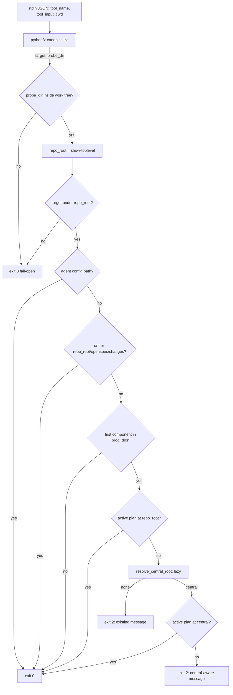

# Design: Centralized planning artifacts across submodule worktrees

Implements exactly the verified spec delta in
`specs/plan-build-flow/spec.md`. One file carries the behavior change:
`catalog/recipes/plan-build-flow/hooks/plan-build-gate.sh`. Everything else is
documentation, brief wording, and tests.

No new configuration is introduced. No `[sdd]` section, no `artifact_root`
selector, no decision matrix, no per-subrepository store, no changes to
worktree creation/cleanup or topology detection.

## 1. Verified problem statement

Measured against the current hook with a real superproject + initialized
submodule + linked worktree fixture (`git -C apps/api worktree add
<super>/.worktrees/apps-api-demo`):

| Event | Current hook | Required |
|---|---:|---:|
| Production write in submodule linked worktree, central `openspec/changes/demo/tasks.md` present | **exit 2** (bug) | exit 0 |
| Production write in submodule primary checkout, same central plan | **exit 2** (bug) | exit 0 |
| Write to `<super>/openspec/changes/other/tasks.md` from the submodule worktree | exit 0 | exit 0 |
| `<super>/src/app.py` with no active central plan | exit 2 | exit 2 |

Two findings shape the design:

1. **Only the active-plan lookup is broken.** The hook derives its repository
   root from the *target path*, not from `cwd`. A write addressed at
   `<super>/openspec/changes/**` therefore already resolves `repo_root = <super>`
   and already exits 0. The gap is exclusively: a target inside the submodule
   worktree resolves `repo_root = <worktree>`, where no `openspec/changes/`
   exists. A central artifact target instead resolves to the superproject and is
   covered by the reachable nearest-root allowance; there is no separate central
   branch in the gate.
2. **`git rev-parse --show-superproject-working-tree` is empty from a linked
   submodule worktree** (verified, git 2.50.1), but
   **`git rev-parse --git-common-dir` returns `<super>/.git/modules/<name>`** —
   the authoritative, forge-free fact that names the owning superproject. This
   is the primary discovery signal; the superproject probe is retained only as a
   corroborating secondary layer, satisfying the spec's "MUST NOT rely solely
   on" clause.

## 2. Architecture decisions

| Decision | Chosen | Rejected alternative | Why |
|---|---|---|---|
| Discovery signal | `--git-common-dir` → split at `/modules/` → verify registration + initialization | `--show-superproject-working-tree` alone | The probe is empty from linked worktrees (verified); the common-dir path *structurally embeds* the owning superproject, so similar submodule names cannot cross repositories. |
| Anti-false-positive proof | Structural containment (`gcd` is inside `<cand>/.git/modules/`) + `.gitmodules` name→path registration + `submodule status` initialized | String/name matching, path-prefix heuristics | The gitdir lives inside exactly one superproject's `.git`; two repos with identically named submodules resolve to their own parents (verified with a same-name control fixture). |
| Root selection | Candidate list, **central first then nearest**, satisfied by either | Central replaces nearest | Spec permits observing a subrepo-local folder ("MAY continue to observe … safe nearest-root fallback"). Union is *monotonic*: no event that is allowed today can become blocked, which removes the rollout risk of existing subrepo-local plans. |
| When to resolve | **Lazily**, only after the nearest-root production gate is about to block | Resolve on every event | Allow paths (the vast majority) stay at today's cost or cheaper; the extra ~140 ms is paid only immediately before a human-visible block. Measured in §7. |
| Path canonicalization | One `python3` call for target + probe dir; git-derived paths used as-is (git canonicalizes symlinks, verified) | `realpath` per path | Drops one interpreter spawn versus today; all comparisons stay canonical-to-canonical. |
| Boundary test | `case "$path/" in "$root"/*)` with the root **quoted** | `${path#$root}` string prefix, python `relpath` | Quoted `case` patterns are literal (glob-safe for `[`/`*` in real paths) and the trailing `/` makes the test component-aware, so `openspec/changes-archive` is correctly outside `openspec/changes`. Zero subprocesses. |
| Discovery failure | **Fail-safe**: central drops out of the candidate list, nearest-root gate still decides | Fail-open allow | Spec: "inability to discover the central root MUST NOT grant production-write access". |
| Nested submodules | Out of scope; deterministic fallback | Recursive resolution | `<super>/.git/modules/outer/modules/inner` yields an unregistered name at the first split → rejected → nearest-root behavior. Matches the existing `worktree-flow` non-goal. |
| Layout naming | Not required for the match | Require `<worktrees_dir>/<subrepo>-<slug>` | `worktrees_dir` is `worktree-flow` configuration the hook must not read; a verified gitlink relationship is a strictly stronger fact than a directory name. Containment under the superproject is recorded for the diagnostic only. |
| Topology source | Git facts only (`.gitmodules`, `submodule status`, gitdir shape) | Read `repo_topology` from the manifest | The distributed hook has no manifest contract, and the spec forbids new configuration reads. Deviation is harmless because the union is additive-only (§6.3). |

## 3. Data flow



### Gate decision order (normative)

1. Parse stdin. Malformed JSON, absent `file_path`/`notebook_path`, or an
   unusable target → exit 0.
2. `target` = canonical absolute path of the event target (§4.1).
3. `probe_dir` = nearest **existing** ancestor directory of `target`, canonical.
   None → exit 0.
4. `git -C "$probe_dir" rev-parse --is-inside-work-tree` fails → exit 0.
   `repo_root` = `--show-toplevel`; empty → exit 0.
5. `target` not under `repo_root` → exit 0 (unrelated out-of-repository path,
   unchanged).
6. `rel` = `${target#"$repo_root"/}`. Agent-config allowance
   (`.claude/settings*.json`, `.claude/hooks/*`) → exit 0.
7. **Artifact allowance (nearest):** `is_under "$repo_root/openspec/changes"
   "$target"` → exit 0. Placed *before* the production check so the allowance is
   unconditional even when `PLAN_BUILD_GATE_PATHS` is scoped to include
   `openspec` (spec: "SHALL allow edits under the resolved artifact root's
   `openspec/changes/**` path … unconditionally").
8. First component of `rel` not in `prod_dirs` → exit 0.
9. Active plan under `repo_root` → exit 0.
10. **Resolve central root (lazy, §4.4).** None → exit 2 with today's message,
    byte-identical for standalone repositories.
11. Active plan under `central_root` → exit 0.
12. exit 2 with a central-aware diagnostic naming
    `<central_root>/openspec/changes/<slug>/tasks.md` and the owning submodule
    path (spec: "its diagnostic MUST identify the central planning location").

## 4. Helpers and algorithms

### 4.1 Normalization (single `python3` spawn)

Replaces both existing python calls. Emits `tool_name \t target \t probe_dir`;
exit 0 (allow) on any failure.

```python
target = os.path.realpath(os.path.join(d.get("cwd") or os.getcwd(), fp))
probe = os.path.dirname(target)
while probe and not os.path.isdir(probe) and probe != os.path.dirname(probe):
    probe = os.path.dirname(probe)
if not os.path.isdir(probe):
    sys.exit(0)
print(tool_name + "\t" + target + "\t" + os.path.realpath(probe))
```

- `realpath` is non-strict: a not-yet-created `tasks.md` keeps its intended name
  while every existing ancestor symlink is resolved. Verified: deeply
  non-existent central paths (`openspec/changes/brand-new/specs/a/spec.md`)
  retain the central location.
- The final component *is* resolved when it exists as a symlink, so a symlinked
  escape is evaluated at its destination (§5.2).
- The `probe != dirname(probe)` guard terminates at `/` and on relative
  degenerate input.
- Git-derived paths need no further canonicalization: verified that
  `--show-toplevel` and `--git-common-dir` return symlink-resolved paths even
  when invoked through a symlinked access path.

### 4.2 `is_under root path`

```bash
is_under() { case "$2/" in "$1"/*) return 0 ;; esac; [ "$1" = "$2" ]; }
```

Repository-boundary-aware, no subprocess. The quoted `"$1"` makes the pattern
literal (paths containing `[`, `*`, `?` are safe); the appended `/` forces a
component boundary. Verified: `openspec/changes/demo/tasks.md` is under
`openspec/changes`; `openspec/changes-archive/demo/tasks.md` is not; the root
itself compares equal.

### 4.3 `has_active_plan root`

```bash
has_active_plan() { local f; shopt -s nullglob; for f in "$1"/openspec/changes/*/tasks.md; do return 0; done; return 1; }
```

Unchanged semantics: the single-level glob naturally excludes
`openspec/changes/archive/<slug>/tasks.md`. Parameterizing the existing inline
loop by root is the whole change.

### 4.4 `resolve_central_root` — sets `central_root`, `central_sub`

Returns non-zero when no superproject can be *proven*. Never mutates the
repository; only `rev-parse`, `config -f .gitmodules`, `submodule status`, and
filesystem tests are used.

```bash
gcd="$(git -C "$probe_dir" rev-parse --git-common-dir 2>/dev/null)" || return 1
gcd="$(cd "$probe_dir" 2>/dev/null && cd "$gcd" 2>/dev/null && pwd -P)" || return 1
```

`cd` + `pwd -P` canonicalizes and accepts git's relative output, so no
`--path-format=absolute` (git ≥ 2.31) dependency is introduced.

**Candidate C1 — absorbed submodule gitdir (all modern layouts, verified on a
real 11-submodule project):**

```
gcd = <super>/.git/modules/<name>            # primary checkout
gcd = <super>/.git/modules/<name>            # linked worktree (common dir)
pre  = ${gcd%%/modules/*}                    # <super>/.git
name = ${gcd#*/modules/}                     # submodule NAME (may differ from path)
require ${pre##*/} = ".git"
cand = ${pre%/.git}
rel_sub = path registered for <name> in <cand>/.gitmodules
```

**Candidate C2 — corroborating superproject probe (legacy non-absorbed gitdirs,
where `gcd` has no `/modules/` segment):**

```
sup = git -C "$probe_dir" rev-parse --show-superproject-working-tree
require non-empty AND repo_root under sup
rel_sub = ${repo_root#"$sup"/}   # must be a registered submodule path
cand = sup
```

**Acceptance predicate (`_accept cand rel_sub`), all conditions required:**

| Check | Purpose |
|---|---|
| `cand != repo_root` | never redirect a repository to itself |
| `-d "$cand/.git"` | candidate is a real superproject checkout, not a gitdir |
| `-f "$cand/.gitmodules"` | candidate declares submodules |
| `rel_sub` registered in `<cand>/.gitmodules` | spec: match must be *registered* |
| `-e "$cand/$rel_sub/.git"` | cheap initialization pre-filter (no spawn) |
| `git -C "$cand" submodule status -- "$rel_sub"` first char ∉ {`-`, empty} | spec: match must be *initialized* (authoritative) |

`.gitmodules` is read with one call and literal key comparison, which is
name-safe (dots, slashes):

```bash
git -C "$cand" config -f "$cand/.gitmodules" --get-regexp '^submodule\..*\.path$'
# accept the line whose key == "submodule.$name.path"
```

**Verified resolver behavior across layouts:**

| Layout | Result |
|---|---|
| Submodule linked worktree under `<super>/.worktrees/` | `central = <super>` |
| Submodule primary checkout `<super>/apps/api` | `central = <super>` |
| Submodule name ≠ path (`api-core` → `apps/api`) | `central = <super>`, `central_sub = apps/api` |
| Identically named submodule in another superproject | resolves to its own parent, never the other |
| Access path through a symlinked `<super>` | `central = <super>` (canonical) |
| Superproject itself, unrelated standalone repo | no central |
| Plain (non-submodule) linked worktree | no central |
| Deinitialized submodule with a leftover worktree | no central → gate blocks (fail-safe) |
| Legacy non-absorbed gitdir, `git submodule init` run | `central = <super>` via C2 |
| Legacy non-absorbed gitdir, never initialized | no central (fail-safe) |
| Nested submodule (`.git/modules/outer/modules/inner`) | no central (documented limitation) |

## 5. Boundary handling

### 5.1 Non-existent destinations

Normalization never requires the target to exist; the probe walk finds the
nearest existing ancestor for git queries only. A write to
`<super>/openspec/changes/demo/tasks.md` where `tasks.md`, `demo/`, or even
`changes/` do not yet exist still normalizes inside the central artifact
boundary and is allowed (verified).

### 5.2 Symlink boundaries

Because `target` is realpath-resolved *before* repository discovery, the entire
decision — repository root, `rel`, production classification, allowances — is
made about the **resolved destination**:

- `<super>/openspec/changes/demo/escape → <super>/src`, write to
  `.../escape/evil.py`: resolves to `<super>/src/evil.py`, the nearest-root
  artifact allowance does not apply, the ordinary production decision blocks it
  (exit 2) and allows it once an active plan exists. Both verified.
- A symlink resolving outside every repository falls through step 5 and retains
  the existing outside-repository handling (exit 0), never reinterpreted as a
  nearest-root artifact write.
- `openspec/changes-archive/**` is outside `openspec/changes` by component
  comparison. Discrimination is observable: with
  `PLAN_BUILD_GATE_PATHS=openspec`, `openspec/changes/d/tasks.md` → 0 while
  `openspec/changes-archive/d/tasks.md` → 2.

### 5.3 Why no separate central allowance branch exists

A target under `<central>/openspec/changes/**` is physically inside the
superproject, so repository discovery yields `repo_root = <central>` and the
nearest-root artifact allowance in step 7 permits it before production
classification. The resolver is reached only after a production target under
the submodule worktree has no nearest-root plan; its candidate predicate also
requires `cand != repo_root`. Therefore a `repo_root = central_root` branch
cannot be reached and is not part of the supported decision flow.

## 6. Compatibility

### 6.1 Standalone repositories

Steps 1–9 are the current algorithm with the same git calls and the same
`rel`-based logic. `resolve_central_root` is unreachable unless step 9 fails,
and returns "none" for a standalone repository, so the existing stderr message
is emitted byte-for-byte. Behavior changes only in two intended ways:

- One fewer `python3` spawn (faster, §7).
- The `openspec/changes/**` allowance now precedes the production check, so a
  `PLAN_BUILD_GATE_PATHS` override that includes `openspec` no longer blocks
  plan writes. This is spec-mandated ("unconditionally") and covered by a test.

### 6.2 Monotonicity

Every new code path can only *add* an exit 0. No previously allowed event
becomes blocked, so existing subrepository-local plans keep working and nothing
needs migration. This is the mitigation for the proposal's "existing local
subrepo plans become ambiguous" risk.

### 6.3 Explicit `repo_topology = "standalone"` with vendored submodules

The hook resolves from git facts and cannot read the manifest. In a project that
declares `standalone` while vendoring initialized submodules, the gate may
consult the superproject plan in addition to the local one. Because the
candidate list is a union, the only possible effect is an additional allow —
never a new block and never a wider write scope. Documented in the recipe README
rather than papered over with new configuration.

## 7. Cost budget (measured, 15 runs per case, macOS/arm64, git 2.50.1)

| Path | Current | Designed |
|---|---:|---:|
| Allow: non-production write | 117 ms | **87 ms** |
| Allow: production write with a local active plan | 122 ms | **91 ms** |
| Allow: artifact write | 117 ms | **85 ms** |
| Central resolution (submodule worktree production write) | 113 ms | **228 ms** |

Allow paths get cheaper (one fewer interpreter spawn). The +115 ms is confined
to events where the nearest root has no active plan — i.e. immediately before a
block or a central-plan allow. Spawn budget: 1 `python3` + 2 `git` on every
path; +1 `git` (common-dir) +1 `git` (gitmodules) +1 `git` (submodule status)
+0–1 `git` (superproject probe, C2 only) on the resolution path. A cross-process
cache was rejected: invalidation complexity in an enforcement hook is not worth
~100 ms on a pre-block path.

## 8. Affected files

| File | Change | Detail |
|---|---|---|
| `catalog/recipes/plan-build-flow/hooks/plan-build-gate.sh` | Modify | §3 decision order; §4 helpers; two diagnostics; header comment documents central resolution and the fail-safe boundary. Must remain free of the terms asserted by `test_recipe_surface_excludes_session_controls_and_removed_contract` (`bud`+`get`, `forecast`). |
| `catalog/recipes/plan-build-flow/README.md` | Modify | Extend **`## Delivery contracts`** with the cross-repository resolution contract (this is the only README section exempted from the `openspec` vocabulary guard by `_without_delivery_contracts_section`, so path literals belong here); add a term-free pointer sentence to `## Worktree coexistence`; bump the `version` snippet. |
| `catalog/recipes/plan-build-flow/skills/plan-build-flow/SKILL.md` | Modify | In §7.1 and §9: one canonical change folder lives in the superproject; code worktrees per subrepository may have a different repository root; never duplicate plans per subrepository. |
| `catalog/recipes/plan-build-flow/recipe.toml` | Modify | Bump `version` `1.3.0` → `1.4.0`. Optionally one `workflow_rules` entry stating that the canonical change folder is the superproject's — **must not contain** `sdd`, `openspec`, `spec-driven`, `/plan`, `/build`, `/archive` (enforced by `test_brief_and_readme_vocabulary_clean`). No new `[config.*]` table. |
| `openspec/specs/plan-build-flow/spec.md` | Modify | Promote the five ADDED requirements and the MODIFIED hook requirement from the change delta. |
| `docs/recipes-catalog.md` | Modify | `plan-build-flow` section: version bump and one line on topology-derived central planning root. Must not gain `gentle-`* terms. |
| `tests/test_plan_build_gate_hook.py` | Modify | New submodule fixture + scenario tests (§9). |
| `tests/test_plan_build_flow_recipe.py` | Modify | Update the pinned `1.3.0` assertions in `test_version_and_catalog_documentation_use_current_contract`; add wording guards for the new contract text. |
| `ai-specs/recipes/plan-build-flow/**` | Derived | Regenerated by sync; never hand-edited. |

Untouched: `openspec/config.yaml`, all `worktree-flow` files, `lib/_internal/util.py`
(the hook must stay self-contained in consumer repositories — no Python helper
dependency), `templates/`, cleanup and topology detection.

## 9. Test plan

Extend `tests/test_plan_build_gate_hook.py` with a fixture class that builds
superproject + submodule + linked worktree:

```python
def _make_super_with_submodule(self):
    # git init sub (with src/), commit
    # git init super
    # git -c protocol.file.allow=always submodule add --name <name> ../sub apps/api
    # commit; git -C apps/api worktree add <super>/.worktrees/apps-api-demo -b feat main
```
`protocol.file.allow=always` is required for local-path `submodule add` on
current git. Existing `_git`, `_event`, `_run` helpers are reused; keep
`_run` stripping `PLAN_BUILD_GATE_PATHS`/`PLAN_BUILD_GATE_MODE`.

| Test | Spec scenario |
|---|---|
| `test_submodule_worktree_allows_production_with_central_plan` | Linked submodule worktree uses the central superproject root; Central active plan gates subrepository production work |
| `test_submodule_worktree_blocks_without_central_plan` | Central absence blocks production work (assert stderr contains the central path) |
| `test_submodule_worktree_blocks_with_archived_only_central_plan` | Archived-only central plans do not satisfy the gate |
| `test_submodule_worktree_allows_central_plan_creation` | Central plan creation is allowed before an active plan exists |
| `test_submodule_worktree_allows_central_archive_write` | Central archive preparation retains artifact allowance |
| `test_submodule_worktree_blocks_superproject_production_path` | Central production path remains gated / not a superproject-wide bypass |
| `test_superproject_probe_empty_still_resolves_central` | Linked worktree resolves when superproject probe is empty (assert the probe is empty in the fixture, then assert exit 0) |
| `test_similar_submodule_names_do_not_select_wrong_parent` | Similar submodule names do not select the wrong parent (two superprojects, same submodule name; only the true parent's plan counts) |
| `test_uninitialized_submodule_does_not_grant_production_access` | Unresolved topology does not grant production access (`submodule deinit`, central plan present → exit 2) |
| `test_non_submodule_worktree_uses_own_root` | Non-submodule worktree keeps nearest-root behavior |
| `test_standalone_behavior_unchanged` (existing tests 1–11) | Standalone repository keeps its repository root; Standalone production behavior remains unchanged |
| `test_central_nonexistent_tasks_path_allowed` | Non-existent plan file uses the central boundary |
| `test_symlinked_central_path_cannot_escape` | Symlinked central path cannot escape the artifact root (block without plan, allow with plan) |
| `test_changes_lookalike_prefix_is_not_artifact_root` | Prefix lookalikes are outside the central artifact root (uses `PLAN_BUILD_GATE_PATHS=openspec` so the verdict is observable) |
| `test_outside_repository_path_not_broadened` | Unrelated outside-repository path is not broadened |
| `test_gate_evaluation_creates_nothing` | Gate evaluation is read-only (snapshot `git worktree list`, branch set, and directory listing before/after) |
| `test_no_new_config_surface` (recipe suite) | Central root is not user-configured; no `[sdd]`/`artifact_root`; classic flow unaffected |

Blocking-scenario fixtures MUST NOT seed a subrepository-local
`openspec/changes/`, matching the spec's "no central plan is present in the
submodule worktree's own repository root" precondition; the union in §2 would
otherwise legitimately allow the write.

All 33 checks in this matrix were executed against a prototype of the designed
algorithm before writing this document; every expectation above is observed
behavior, not projection.

## 10. Rollout and rollback

1. Ship as `plan-build-flow` `1.4.0`. No manifest migration: resolution is
   derived from git topology.
2. Consumers pick it up on the next `ai-specs sync`; the hook is materialized
   from catalog (verify `condition` semantics of the hook entry are unchanged —
   this change does not alter distribution).
3. Standalone projects observe no behavioral change beyond §6.1.
4. Submodule projects immediately honor an existing central plan; nothing is
   copied, moved, or deleted.
5. **Rollback** is a source revert of the hook plus docs/tests and a version
   bump back; there is no persisted state, cache, branch, or artifact
   conversion to undo. A consumer can also pin the previous recipe version.

## 11. Implementation risks

| Risk | Mitigation |
|---|---|
| A repository layout resolves a superproject we did not anticipate | Acceptance requires four independent facts (structural gitdir containment, registered path, initialized status, real superproject checkout); anything unproven falls back to nearest-root. |
| Union semantics read as "local plans are canonical" | README/SKILL state one canonical central plan; the union exists only so adoption never blocks previously allowed work. |
| Added latency on the pre-block path | Bounded to §7 numbers, lazy, and paid only where a human is already about to read a diagnostic. |
| `submodule status` cost in very large superprojects | Always scoped with `-- <path>`. |
| Superproject that is itself a linked worktree | The linked root's `.git` is a file pointing into worktree metadata, not a recognized submodule `.git/modules/<name>` relationship; central-root resolution rejects it and the nearest-root gate blocks production writes without a local active plan. Unsupported topology; this remains the documented F4 limitation. |
| Nested submodules unsupported | Deterministic fallback to nearest-root; `git submodule absorbgitdirs` / one-level layouts are the supported shape. |
| Vocabulary guards break the build on doc edits | §8 names the exempt README section and the forbidden term list per surface. |
| Version pin duplicated in four places | §8 lists all of them (`recipe.toml`, README snippet, `docs/recipes-catalog.md`, recipe test). |
| Bash-only constructs (`shopt`, `case`, process substitution) | The hook already declares `#!/usr/bin/env bash` and is executed as `bash <script>` by the runtime and tests. |

## 12. Non-goals reaffirmed

No `[sdd]` section, no `artifact_root` or planning-root configuration, no
decision matrix, no per-subrepository store or synchronization, no plan
migration, no changes to `/worktree-new`, `/worktree-clean`, cleanup
enumeration, topology detection, the shared `<worktrees_dir>/<subrepo>-<slug>`
layout, production-directory selection, tracker gates, memory behavior, or the
pre-merge archive contract. The gate remains non-bypassable: no on/off/ask mode
is introduced, and `PLAN_BUILD_GATE_MODE` remains inert (verified).

## Next phase

Proceed to **tasks**: sequence the hook rewrite (RED tests first from §9), the
recipe/README/SKILL wording under the §8 vocabulary constraints, the version
bump across all four pinned locations, and the canonical spec promotion.
