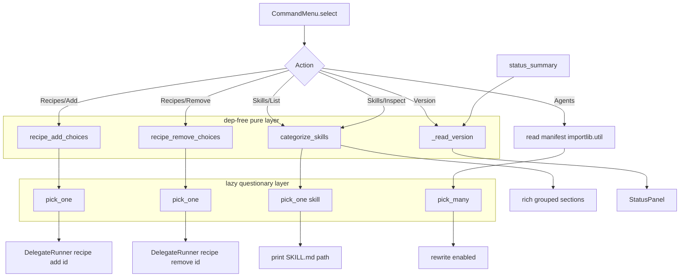

# Design: `hub-fixes` — full interactive consistency for the `ai-specs` TUI hub

Status: design (SDD)
Scope anchor: `lib/_internal/hub.py`, `lib/skills-list.sh`; read-only reuse of
`lib/_internal/doctor.py`, `lib/_internal/recipe-list.py`,
`lib/_internal/skill-resolution.py`, `lib/_internal/util.py`.
Reference: `openspec/changes/hub-fixes/proposal.md`.

Accepted defaults driving this design (from parent):
1. Skills submenu = interactive categorized listing + inspect this pass; add/remove stays delegated.
2. Recipe skills shown in a clearly labeled "Provided by recipes / catalog" section.
3. Version = raw `VERSION` string, single row in StatusPanel.
4. "Press Enter" pause stays lightweight but routes through one shared helper.
5. Full consistency pass across ALL hub submenus, staged so the 4 bugs land first.

---

## 1. Module decomposition

All work stays in-process; the interactive hub keeps its lazy-import contract
(`test_imports_without_third_party_deps` in `tests/test_hub.py` requires
`hub.py` to import with **no** `rich`/`questionary` on the path). Therefore the
design splits every new capability into two layers:

- **Pure layer** — module-level functions in `hub.py` with **zero** third-party
  imports. They compute data (version string, recipe choice lists, skill
  categories). Unit-testable dep-free.
- **Widget layer** — thin functions that `import questionary` *inside their body*
  (never at module scope) and consume the pure layer's data.

### Sibling modules loaded once at import (join existing `_util`, `_doctor`)

```python
_util   = _load_sibling("util")          # existing
_doctor = _load_sibling("doctor")        # existing
_recipes = _load_sibling("recipe-list")  # NEW — list_recipes()
_skillres = _load_sibling("skill-resolution")  # NEW — collect_skills()
```

All four sibling modules are stdlib-only (`recipe-list.py` and
`skill-resolution.py` import only `os`, `sys`, `pathlib`, `tomllib`,
`importlib.util`), so adding them as top-level siblings does **not** break the
dep-free import contract. Verified: `recipe-list.py` lines 8–14,
`skill-resolution.py` lines 20–26.

### Changes in `hub.py`

| Area | Change | Lines (current) |
|---|---|---|
| Bug 1 | Add module-level `import importlib.util`; delete the redundant local `import importlib.util` in `_load_sibling` (it becomes dead). | top of file; `hub.py:21` |
| Bug 4 | Add `version: str` to `StatusSummary`; add pure `_read_version()`; populate in `status_summary()`; render row in `StatusPanel.render()` and `_run_noninteractive()`. | `76-85`, `88-110`, `118-130`, `163-193`, `196-201` |
| Bug 3 | New pure `recipe_add_choices()` / `recipe_remove_choices()`; rewrite Recipes Add/Remove to use `pick_one(...)`. | `225-266` |
| Bug 2 | New pure `categorize_skills()`; new `Action.SKILLS` interactive submenu (categorized listing + inspect); drop `Action.SKILLS` from `_SUB_ARGS`. | `204-206`, add branch near `225` |
| Consistency | New shared widget helpers `pick_one`, `pick_many`, `confirm_action`, `pause`. Route every submenu + every `input("Press Enter…")` through them. | `225-345` |

`_SUB_ARGS` shrinks to `{}` (Skills no longer delegates to `skills list` for its
default listing). It may be deleted entirely if no other action needs extra args;
keep the dict only if a future action reuses it — decision: **delete** the map
and the `_extra = _SUB_ARGS.get(...)` lookup, calling `runner.run(action)` with
no extra for the remaining plain-delegate actions (Sync, Doctor, Rules audit,
Upgrade, Help). This removes a now-empty indirection.

### What does NOT move to a new file

Per proposal scope ("centered on `packages/coding-agent`"/this repo's
`lib/_internal`), we do **not** create a new interaction module. The helper set
is small (4 widget wrappers + 3 pure builders) and lives beside its only caller
in `hub.py`. A separate module would add a sibling-load line for no reuse benefit.

---

## 2. Interaction vocabulary (shared helpers)

Widget layer. Each imports `questionary` lazily. Return `None` == user aborted
(Esc / Ctrl-C) so callers uniformly `continue`/return. Signatures:

```python
def pick_one(message: str,
             options: list[tuple[str, str]],
             *, default: str | None = None) -> str | None:
    """questionary.select. options = [(label, value), ...].
    Returns chosen value, or None if aborted/empty."""

def pick_many(message: str,
              options: list[tuple[str, str, bool]]) -> list[str] | None:
    """questionary.checkbox. options = [(label, value, checked), ...].
    Returns list of chosen values, or None if aborted."""

def confirm_action(message: str, *, default: bool = True) -> bool | None:
    """questionary.confirm. Returns bool, or None if aborted."""

def pause(message: str = "Press Enter to return…") -> bool:
    """Lightweight blocking pause between actions (default #4).
    Wraps input(); returns True normally, False on EOFError so the caller
    can quit cleanly. Replaces every inline try/except EOFError block."""
```

- `pick_one`/`pick_many` build `questionary.Choice(title=label, value=value,
  checked=…)` objects internally so callers pass plain tuples (dep-free data).
- **Empty-list contract**: `pick_one`/`pick_many` return `None` immediately when
  `options == []` (no widget shown); callers detect empty upstream and print an
  informational line first (see §7).
- `pause` is the single funnel for the four current
  `try: input("Press Enter to return…") except EOFError: return 0` sites
  (`hub.py:262-265, 327-330, 342-345`, and the Recipes branch). Loop pattern
  becomes:
  ```python
  if not pause():
      return 0
  continue
  ```

Non-goal: converting `pause` to a `questionary.confirm` (default #4 keeps the
lightweight `input()` semantics; only the call site is unified).

---

## 3. Skills categorization contract

Goal: never label a CLI-shipped skill "local"; never present recipe skills as
project skills. Three data sources, all already in-process:

- `_doctor.bundled_skill_names(cli_home)` → `list[str]` of CLI-shipped skill dir
  names (source of truth; `doctor.py:21-27`, falls back to
  `["skill-creator","skill-sync"]` when `bundled-skills/` is absent).
- `_skillres.collect_skills(project_root)` → `{skill_id: (source_type, path)}`
  where `source_type ∈ {"local","recipe","dep"}` (`skill-resolution.py:158-180`).
- `_recipes` / catalog dir — for available-but-not-installed catalog skills
  (secondary, listing only).

### Pure function

```python
def categorize_skills(project_root: Path, cli_home: Path) -> dict[str, list[dict]]:
    """Returns buckets, each a sorted list of {'id','path','desc'} dicts:
      'bundled': collect_skills source=='local' AND id in bundled_skill_names
      'local'  : collect_skills source=='local' AND id NOT in bundled_skill_names
      'recipe' : collect_skills source=='recipe'   (the "Provided by recipes" set)
      'dep'    : collect_skills source=='dep'      (registered vendored deps)
    """
```

Rationale for the bundled/local split: bundled skills are copied into
`ai-specs/skills/` at init, so `collect_skills` reports them as `source=="local"`.
The discriminator is membership in `bundled_skill_names()`. This is exactly the
contract Doctor uses, so hub and doctor agree.

`desc` is read from each skill's `SKILL.md` front-matter `description:` when
present (mirrors `skills-list.sh:skill_description`), else empty. Keep this in a
tiny stdlib helper (`_skill_description(path)`) so the pure layer stays dep-free.

### Skills submenu (default #1 — listing + inspect only)

`Action.SKILLS` becomes an interactive submenu mirroring Recipes:

```
Skills:
  List skills (categorized)   → render buckets via rich, grouped with headers:
                                  "Bundled (CLI-shipped)", "Local / vendored (project)",
                                  "Provided by recipes / catalog", "Registered deps"
  Inspect a skill             → pick_one over all skill ids (label shows id + origin);
                                  print the skill's SKILL.md path + description
  Back
```

Add/remove remain out of this submenu (delegated to `ai-specs skills …` only if a
user runs the subcommand directly). "Provided by recipes / catalog" is the
distinctly labeled section required by default #2. Empty buckets render `(none)`.

---

## 4. Recipe picker contract

Source: `_recipes.list_recipes(target)` → `list[{id,name,version,status}]` where
`status ∈ {"available","installed","disabled","error (…)"}`
(`recipe-list.py:46-90`).

### Pure builders

```python
def recipe_add_choices(recipes: list[dict]) -> list[tuple[str, str]]:
    """Recipes installable now = status == 'available'.
    label = f"{name} ({id})  v{version}", value = id. Skips 'error' rows."""

def recipe_remove_choices(recipes: list[dict]) -> list[tuple[str, str]]:
    """Recipes currently in the manifest = status in {'installed','disabled'}.
    label = f"{name} ({id})  [{status}]", value = id."""
```

### Wiring (replaces `hub.py:242-256`)

```python
if sub == "add":
    choices = recipe_add_choices(list_recipes(target))
    if not choices:
        console.print("[yellow]No catalog recipes available to add.[/yellow]")
        if not pause(): return 0
        continue
    rid = pick_one("Recipe to add:", choices)
    if rid is None: continue
    rc = runner.run(Action.RECIPES, extra=["add", rid])
# remove: symmetric with recipe_remove_choices + "No recipes installed to remove."
```

Mutation still delegates to the `recipe add|remove <id> <target>` subcommand via
`DelegateRunner` (unchanged contract). Only id acquisition changes: picker in,
free-text out. `disabled` recipes are offered under Remove (they are installed,
just toggled off) — this matches the manifest reality.

---

## 5. StatusPanel version integration

Single source of truth, shared with `_print_version()`:

```python
def _read_version() -> str:
    p = _util.ai_specs_home() / "VERSION"
    return p.read_text(encoding="utf-8").strip() if p.is_file() else "unknown"
```

`_print_version()` is refactored to `print(_read_version())` (no behavior change).

- `StatusSummary` gains `version: str` (dataclass field, `hub.py:76-85`).
- `status_summary(root)` sets `version=_read_version()` (`hub.py:101-110`).
- `StatusPanel.render()` adds a first row: `table.add_row("version",
  self.summary.version)` before the `target` row (`hub.py:174`).
- `_run_noninteractive()` prints a `version:` line under the headline
  (`hub.py:120-121`).

Format: raw string, one row (default #3). No install-path enrichment.

---

## 6. Skills list shell fix (`skills-list.sh`)

Current bug: the "Local skills" loop (`skills-list.sh:117-151`) lists every dir
under `ai-specs/skills/` minus registered deps, so bundled `skill-creator` /
`skill-sync` show as "Local". Fix mirrors `bundled_skill_names()` in bash:

1. Compute bundled ids from the same source Doctor uses — directories under
   `$AI_SPECS_HOME/bundled-skills/` (fallback `skill-creator skill-sync` when the
   dir is absent):
   ```bash
   BUNDLED_IDS=()
   if [[ -d "$AI_SPECS_HOME/bundled-skills" ]]; then
       for b in "$AI_SPECS_HOME/bundled-skills"/*/; do
           [[ -d "$b" ]] && BUNDLED_IDS+=("$(basename "$b")")
       done
   else
       BUNDLED_IDS=(skill-creator skill-sync)
   fi
   ```
2. In the Local loop, `continue 2` when `name` is in `BUNDLED_IDS` (in addition to
   the existing `REGISTERED_IDS` skip) so bundled skills leave the Local section.
3. Add a new section **before** Local:
   ```
   ── Bundled skills (CLI-shipped) ──
   ```
   iterating `$SKILLS_DIR/*/`, emitting only names present in `BUNDLED_IDS`
   (reuse `skill_description`). `(none)` when empty.
4. Keep the "Available catalog skills" section as-is but the header stays stable
   ("Available catalog skills (catalog/skills/)"); it already lives apart from the
   project skills, satisfying "recipe/catalog not conflated with project skills".

Section-name stability: "── Local skills (ai-specs/skills/) ──" and "── Registered
deps ([[deps]]) ──" headers are unchanged; only a new "Bundled skills" header is
added. Update any test asserting bundled names under "Local".

---

## 7. Edge cases

| Case | Detection | Behavior |
|---|---|---|
| Empty catalog / no recipes | `list_recipes(target)` → `[]` or filtered builder → `[]` | Print informational line ("No catalog recipes available to add." / "…to remove."), `pause()`, `continue`. Never open an empty picker, never crash. |
| No `VERSION` file | `_read_version()` `is_file()` false | Returns `"unknown"`; panel/noninteractive still render a version row. |
| Missing manifest | existing guard `hub.py:271` | Keep: `"[red]Manifest not found — run ai-specs init first[/red]"`, `continue`. Recipe/skills submenus that need the manifest reuse the same guard. |
| Invalid manifest (TOML error) | `list_recipes` swallows to `{}` (`recipe-list.py:56-61`); recipes still list from catalog with status `available` | No crash; add/remove operate on catalog truth. |
| No TTY | `decide_mode` already routes non-TTY to `NONINTERACTIVE_STATUS` / `ERROR_UNINITIALIZED` (`hub.py:44-47`). Interactive helpers never run without a TTY. | `pause()` returns `False` on `EOFError` → clean `return 0`. `questionary.ask()` returns `None` on abort → callers `continue`/return. |
| Empty skill buckets | `categorize_skills` returns empty lists | Each section prints `(none)`; Inspect picker guarded like recipes (inform + pause when no skills). |
| `error (…)` recipe rows | status starts with `"error"` | Excluded from add/remove choices (builders skip non-`available` / non-`installed|disabled`); still visible in the delegated `recipe list`. |

---

## 8. Test plan

Follow strict TDD (`./tests/run.sh`); new tests RED against pre-fix code, GREEN
after. Split by dep requirement, matching the existing
`test_hub.py` (dep-free) / `test_hub_tui.py` (`@skipUnless(_has_deps())`) divide.

### Unit — dep-free (`tests/test_hub.py`)

1. **Version source** — `_read_version()` returns raw `VERSION` contents; returns
   `"unknown"` when the file is absent (temp `AI_SPECS_HOME`).
2. **StatusSummary.version populated** — `status_summary(root).version ==
   _read_version()`.
3. **Non-interactive shows version** — `_run_noninteractive` output contains the
   version string (extend `TestNonInteractiveStatus`).
4. **Recipe choice builders** — `recipe_add_choices` keeps only `available`;
   `recipe_remove_choices` keeps `installed`+`disabled`; both skip `error`; labels
   include id; from synthetic `list_recipes`-shaped input.
5. **Skills categorization** — `categorize_skills` puts a bundled-named skill in
   `bundled` (not `local`), a project-only skill in `local`, a `.recipe/*/skills`
   skill in `recipe`, a `.deps/*/skills` skill in `dep`. Build a temp project tree
   + stub `bundled-skills/` under a temp `AI_SPECS_HOME`.
6. **Import contract preserved** — existing
   `test_imports_without_third_party_deps` must still pass (guards that the new
   sibling loads + helpers introduced no top-level `questionary`/`rich` import).
7. **Empty-list builders** — builders return `[]` for empty/all-error input
   (drives the §7 empty-picker guard).

### Shell (`tests/test_hub.py`, subprocess to `skills-list.sh`)

8. **Bundled categorization at source** — init a project, assert `skills list`
   output has a "Bundled skills" section containing `skill-creator`/`skill-sync`
   and that those names do **not** appear under "Local skills".

### Deps-gated PTY / behavioral (`tests/test_hub_tui.py`, `@skipUnless(_has_deps())`)

9. **Agents no `NameError`** — drive the Agents branch (mock `questionary.checkbox`
   to return a selection, mock `CommandMenu.prompt` → `[AGENTS, QUIT]`, mock
   `input`), assert `_run_interactive_hub` returns 0, no exception, manifest
   `enabled` rewritten. (Mirrors `TestDelegateRunnerResume` style, `test_hub_tui.py:144`.)
   A cheaper guard test also asserts `hasattr(hub, "importlib")` at module scope.
10. **Version row in panel** — extend `TestStatusPanelRender` to assert the
    rendered panel text contains the version string.
11. **Recipe Add picker built from real recipes** — mock `pick_one` capture the
    `options` it was handed; assert values are real catalog ids and no
    `questionary.text` is invoked for id entry.
12. **PTY skills submenu** — extend `TestHubPTYE2E`: navigate to Skills, assert
    output shows the categorized headers ("Bundled", "Provided by recipes /
    catalog") and no `Traceback`.

PTY tests gate behind `_has_deps()` (`test_hub_tui.py:23-35`) exactly as today;
pure/shell tests never require rich/questionary.

---

## 9. Data flow



---

## 10. Staging (default #5 — bugs first, independently shippable)

1. **Stage A (bugs, shippable):** Bug 1 import; Bug 4 version; Bug 3 recipe
   pickers; Bug 2 categorization (`categorize_skills` + `skills-list.sh`).
2. **Stage B (consistency):** extract `pick_one/pick_many/confirm_action/pause`,
   migrate every submenu + pause site onto them, add Skills interactive submenu
   (listing + inspect), delete empty `_SUB_ARGS` indirection.

Each stage is revertible per the proposal's Rollback section.

---

## 11. Contracts touched / preserved

- **Preserved:** subcommand flags/output (except `skills list` gains a Bundled
  section); manifest schema; recipe/skill data model; `DelegateRunner` argv shape;
  dep-free `hub.py` import; `decide_mode` gating; `rich`+`questionary` only (no Textual).
- **Changed (user-visible):** StatusPanel + non-interactive summary show a version
  row; Recipes Add/Remove are pickers not text prompts; Skills is an interactive
  categorized submenu; `skills list` labels bundled skills correctly. README to be
  updated in the apply/cleanup phase for these four.
