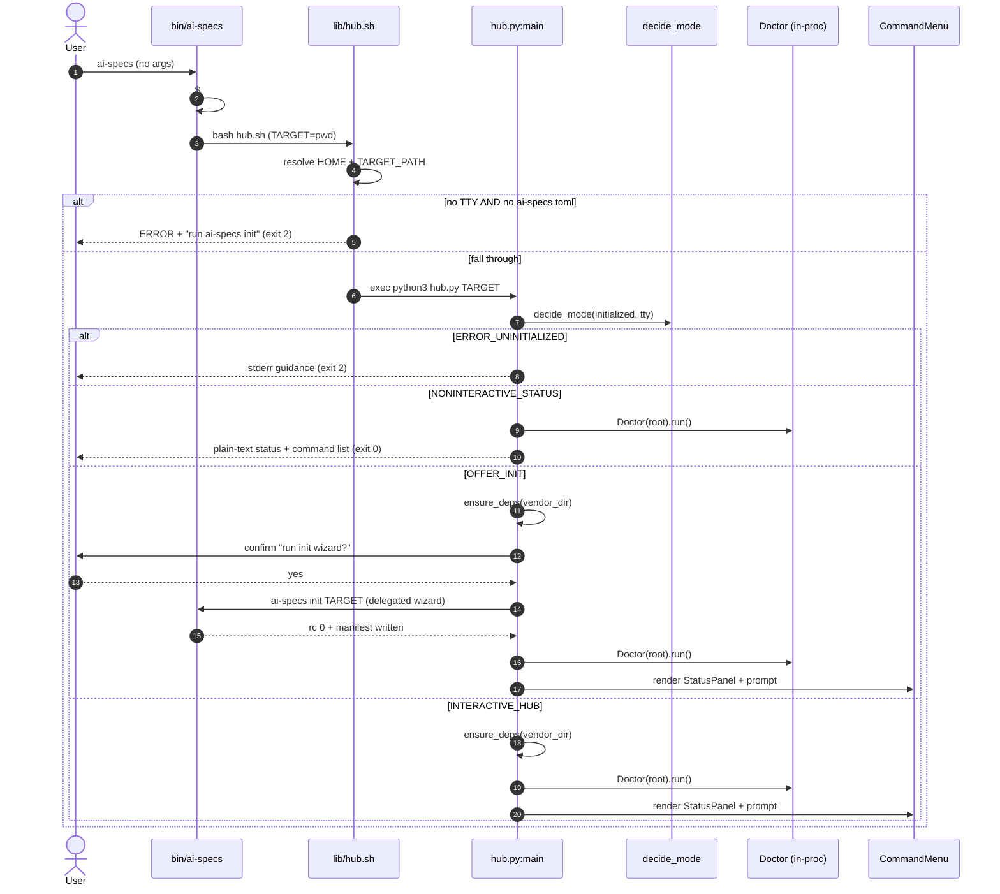
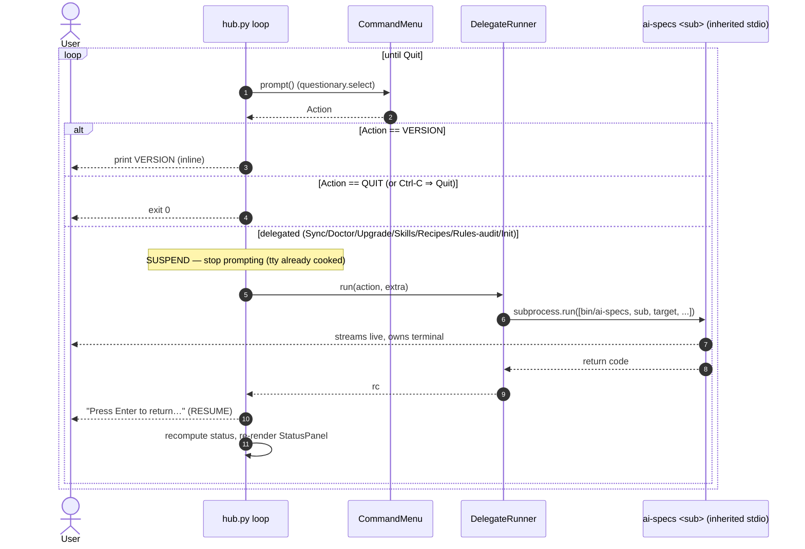

# Design: `ai-specs` TUI hub (no-subcommand entrypoint)

Status: design
Change: tui-hub
Depends on: `openspec/changes/tui-hub/proposal.md` (approved)
Scope anchor: `lib/_internal/hub.py`, `lib/hub.sh`, `bin/ai-specs`, `lib/_internal/util.py` (new), `lib/_internal/init_tui.py` (extract), `tests/test_hub.py` + `tests/test_hub_tui.py` (new).

---

## 0. Summary of decisions (from proposal, locked)

1. **rich + questionary**, NOT Textual (Textual is a heavy dep; rich+questionary are the established stack in `init_tui.py`).
2. **Standalone `_internal` CLI** `hub.py` with `main() -> int`, wrapped by a thin `lib/hub.sh` shim that mirrors `doctor.sh`.
3. **Doctor by two roles**: status panel imports the `Doctor` dataclass **in-process** (read-only, dep-free); the menu "Doctor" action **delegates** to `ai-specs doctor` for canonical, streamed output.
4. **Version inline**; Sync / Upgrade / full Doctor / Skills / Recipes / Rules-Audit **suspend the TUI → run the existing shim with inherited stdio → resume** the menu.

This document fixes the module decomposition, function signatures, the shell contract, the delegation mechanics, the questionary-vendoring recommendation, and the test plan.

---

## 1. `hub.py` module structure

`lib/_internal/hub.py` follows the `_internal` convention already used by `init_tui.py` and `doctor.py`: a script with a `main() -> int` guarded by `if __name__ == "__main__": sys.exit(main())`, pure-stdlib at import time, and rich/questionary imported **lazily** only after the deps gate passes.

### 1.1 Import-time contract (dep-free)

`hub.py` must be importable in a unit test via `importlib.util.spec_from_file_location` **without** rich/questionary installed and **without** `_internal` on `sys.path`. To achieve that:

- rich/questionary are imported **inside** functions, never at module top.
- Sibling modules (`doctor`, `util`) are loaded via an explicit absolute-path loader (the same pattern `init_tui._load_toml_write()` already uses), so importing `hub` works regardless of how it is invoked:

```python
def _load_sibling(name: str):
    """Load a same-directory _internal module by absolute path (sys.path-independent)."""
    import importlib.util
    path = Path(__file__).with_name(f"{name}.py")
    spec = importlib.util.spec_from_file_location(name, path)
    if spec is None or spec.loader is None:
        raise RuntimeError(f"unable to load sibling module {path}")
    module = importlib.util.module_from_spec(spec)
    sys.modules[spec.name] = module
    spec.loader.exec_module(module)
    return module

_util = _load_sibling("util")
_doctor = _load_sibling("doctor")   # pure stdlib at import time — safe
```

Both `util.py` and `doctor.py` are pure-stdlib at import time, so this never pulls rich/questionary. This is what makes `GatingDecision` and `status_summary` unit-testable with zero deps and zero TTY.

### 1.2 GatingDecision — pure 4-state matrix

The single source of truth for the init×TTY matrix. No I/O, no side effects — trivially unit-testable.

```python
from enum import Enum

class Mode(Enum):
    INTERACTIVE_HUB       = "interactive-hub"      # init + TTY
    NONINTERACTIVE_STATUS = "noninteractive-status" # init + no-TTY  → exit 0
    OFFER_INIT            = "offer-init"           # not-init + TTY
    ERROR_UNINITIALIZED   = "error-uninitialized"  # not-init + no-TTY → exit 2

def decide_mode(*, initialized: bool, tty: bool) -> Mode:
    if initialized:
        return Mode.INTERACTIVE_HUB if tty else Mode.NONINTERACTIVE_STATUS
    return Mode.OFFER_INIT if tty else Mode.ERROR_UNINITIALIZED
```

`tty` is `sys.stdin.isatty() and sys.stdout.isatty()` (both, matching `init_tui.run_wizard`'s guard at `init_tui.py:211` and `init.sh:148`).

### 1.3 StatusPanel — in-process Doctor summary

Splits into a **dep-free summary** (unit-testable) and a **rich view** (snapshot-testable under the deps gate).

```python
from dataclasses import dataclass

@dataclass(frozen=True)
class StatusSummary:
    root: Path
    ok: int
    info: int
    warn: int
    error: int
    exit_code: int          # Doctor.run() return: 1 if any ERROR else 0
    headline: str           # e.g. "healthy" / "2 warnings" / "1 error"
    checks: list            # list[doctor.Check] for detailed rendering

def status_summary(root: Path) -> StatusSummary:
    doc = _doctor.Doctor(root)
    exit_code = doc.run()                       # populates doc.checks
    Sev = _doctor.Severity
    counts = {s: sum(1 for c in doc.checks if c.severity == s) for s in Sev}
    ...
    return StatusSummary(root=root, ok=counts[Sev.OK], ..., checks=doc.checks)

@dataclass
class StatusPanel:
    summary: StatusSummary
    def render(self):                           # -> rich renderable
        from rich.panel import Panel
        from rich.table import Table
        table = Table.grid(padding=(0, 1))      # one row per non-OK check + summary line
        ...
        return Panel(table, title="ai-specs", border_style=<by worst severity>)
```

- `status_summary` is **dep-free** (only `doctor` + stdlib) → deterministic unit tests.
- `StatusPanel.render` builds a `rich` `Panel` wrapping a `Table` (severity-colored border: green/yellow/red by worst severity) → snapshot-like tests gated by `_has_deps()`.
- Non-interactive mode does **not** use `StatusPanel`; it prints `status_summary` as plain text (no rich required — CI-safe).

### 1.4 CommandMenu — questionary.select

```python
class Action(Enum):
    SYNC        = "sync"
    DOCTOR      = "doctor"
    SKILLS      = "skills"
    RECIPES     = "recipe"
    RULES_AUDIT = "rules-audit"
    UPGRADE     = "upgrade"
    VERSION     = "version"
    HELP        = "help"
    INIT        = "init"        # re-run init wizard
    QUIT        = "quit"

# (title, one-line description) drives questionary.Choice
_MENU: list[tuple[Action, str, str]] = [
    (Action.SYNC,        "Sync",        "Reconcile manifest → bundled + vendor + AGENTS.md + agents"),
    (Action.DOCTOR,      "Doctor",      "Full project health report (read-only)"),
    (Action.SKILLS,      "Skills",      "List / add / remove vendored skills"),
    (Action.RECIPES,     "Recipes",     "List / add recipes from the catalog"),
    (Action.RULES_AUDIT, "Rules audit", "Inventory legacy rules for migration"),
    (Action.UPGRADE,     "Upgrade",     "Upgrade the global ai-specs installation"),
    (Action.VERSION,     "Version",     "Print the CLI version"),
    (Action.HELP,        "Help",        "Show ai-specs command help"),
    (Action.INIT,        "Init wizard", "Re-run interactive onboarding"),
    (Action.QUIT,        "Quit",        "Exit the hub"),
]

@dataclass
class CommandMenu:
    def prompt(self) -> Action:
        import questionary
        choices = [questionary.Choice(title=title, value=act, description=desc)
                   for act, title, desc in _MENU]
        answer = questionary.select("What do you want to do?", choices=choices).ask()
        return answer if answer is not None else Action.QUIT   # Ctrl-C/EOF ⇒ Quit
```

`.ask()` returns `None` on Ctrl-C/EOF; the hub treats that as `Action.QUIT` (clean exit 0), matching `init_tui`'s cancel semantics.

### 1.5 DelegateRunner — suspend → run → resume

Delegation runs the **public CLI** (`bin/ai-specs <subcommand> <target>`) as a child process with **inherited stdio**. Because the child inherits the hub's real terminal fds, it streams live and owns the terminal for its lifetime. questionary/rich here render on the normal screen (not the alternate screen) and questionary restores cooked-mode after each `.ask()`, so there is **no raw-mode terminal state to save/restore** across delegation — "suspend" is simply "stop prompting", and "resume" is "re-render status + re-enter the menu loop".

```python
@dataclass
class DelegateRunner:
    cli: Path        # AI_SPECS_HOME/bin/ai-specs (util.ai_specs_home()/"bin"/"ai-specs")
    target: Path

    def run(self, action: Action, extra: list[str] | None = None) -> int:
        argv = [str(self.cli), action.value, str(self.target), *(extra or [])]
        # inherited stdio (no capture): child owns the terminal and streams live
        return subprocess.run(argv).returncode
```

Routing through `bin/ai-specs` (not the per-command shim path) keeps the hub a pure composer: it never hard-codes shim locations and automatically honors any future dispatch change. Version is the one exception — rendered **inline** (see 1.6) to avoid a subprocess for a one-line read.

**Skills / Recipes submenu (optional depth, P3):** selecting `SKILLS`/`RECIPES` opens a second `questionary.select` (list / add / remove / back). `list` delegates `ai-specs skills list`; `add`/`remove` prompt a `questionary.text` for the URL/id, then delegate `ai-specs skills add <url>` / `skills remove <id>`. The mutation still happens **inside the delegated subcommand** — the hub itself never writes (honors non-goal "NOT a write surface"). First slice may delegate straight to `skills list` / `recipe list` and add the submenu as a follow-up.

### 1.6 `main()` — the orchestrator

```python
def main(argv: list[str] | None = None) -> int:
    args = _parse_args(argv)                     # positional target (default cwd); --help
    target = Path(args.target).resolve()
    if not target.is_dir():
        print(f"ERROR: target is not a directory: {target}", file=sys.stderr)
        return 2

    tty = sys.stdin.isatty() and sys.stdout.isatty()
    mode = decide_mode(initialized=_util.is_initialized(target), tty=tty)

    if mode is Mode.ERROR_UNINITIALIZED:
        _print_uninit_error(target)              # stderr guidance
        return 2                                 # (bash shim already guards this; belt-and-suspenders)
    if mode is Mode.NONINTERACTIVE_STATUS:
        return _run_noninteractive(target)       # plain-text status + command list; NO deps; exit 0

    # interactive paths need rich + questionary
    err = _util.ensure_deps(_util.vendor_dir())
    if err is not None:
        return err                               # exit 3 (with guidance)

    if mode is Mode.OFFER_INIT:
        if not _offer_init(target):              # confirm → delegate `ai-specs init`
            return 0                             # user declined → clean exit
        # init succeeded → fall through into the hub

    return _run_interactive_hub(target)          # status panel + menu loop; Quit ⇒ 0
```

Supporting helpers:

- `_parse_args(argv) -> argparse.Namespace` — `--help` and a single optional positional `target` (default `os.getcwd()`), mirroring `doctor.py:main` argument style.
- `_run_noninteractive(target) -> int` — prints `status_summary(target)` as plain text + the command list (names + one-line descriptions), then returns `0`. Dep-free. This is what pipes/CI see.
- `_offer_init(target) -> bool` — prints a short message, `questionary.confirm("Run the init wizard now?")`; on yes, `DelegateRunner(cli, target).run(Action.INIT)` (which invokes `ai-specs init <target>` → the existing TUI wizard under a TTY). Returns `True` iff the child returned 0 **and** `is_initialized(target)` is now true.
- `_run_interactive_hub(target) -> int` — loop: render `StatusPanel(status_summary(target)).render()`; `CommandMenu().prompt()`; dispatch (`VERSION` inline via `util.ai_specs_home()/"VERSION"`; `QUIT` → return 0; everything else via `DelegateRunner.run(...)` then `input("\nPress Enter to return…")` and re-loop). Doctor delegates for canonical output (decision 3).

---

## 2. Shared helpers — `lib/_internal/util.py` (new)

A new pure-stdlib module holding the helpers currently duplicated/ad-hoc across modules. Canonical home for **new** code; `init_tui.py` delegates to it (see 2.2). `doctor.py` is left untouched this change (read-only reuse; unifying its home constant is a documented follow-up — see 2.3).

```python
# lib/_internal/util.py
from __future__ import annotations
import os, subprocess, sys
from pathlib import Path

DEPS_SPEC = ["rich>=13.0.0,<15", "questionary>=2.0.0,<2.1"]  # moved from init_tui

def ai_specs_home() -> Path:
    env = os.environ.get("AI_SPECS_HOME")
    if env:
        return Path(env).resolve()
    return Path(__file__).resolve().parents[2]

def vendor_dir() -> Path:
    return ai_specs_home() / "lib" / "_vendor"

def is_initialized(root: Path) -> bool:
    """True when <root>/ai-specs/ai-specs.toml exists (thin Path check, not full Doctor)."""
    return (root / "ai-specs" / "ai-specs.toml").is_file()

def ensure_deps(vendor: Path, *, prompt: bool = True) -> int | None:
    """Make rich + questionary importable. Returns 3 if unavailable, else None.
    Body moved verbatim from init_tui._ensure_deps, parameterized by `vendor`."""
    ...
```

### 2.1 `is_initialized` decision

A **thin `Path.is_file` check**, not a `Doctor` run. Rationale: the gating decision only needs "is there a manifest?", which is exactly the marker `init.sh:148/155` and the ad-hoc `-f ai-specs/ai-specs.toml` checks already use. Running the full `Doctor` here would be wasteful and would conflate "initialized" with "healthy" (a project can be initialized but WARN/ERROR). Health is the StatusPanel's job; existence is `is_initialized`'s job.

### 2.2 `_ensure_deps` extraction — test-preserving

`test_init_tui.py:113-140` (`test_ensure_deps_mkdir_failure_returns_3`) mocks `self.mod._ai_specs_home` and `self.mod._vendor_dir` and then calls `self.mod._ensure_deps()`, expecting the patched vendor path to drive the mkdir. `test_init_tui.py:92-101` mocks `self.mod._ensure_deps`. To keep both green, the canonical logic moves to `util.ensure_deps(vendor)` **taking the vendor path as a parameter**, and `init_tui.py` keeps module-level wrappers whose names and patch-points survive:

```python
# lib/_internal/init_tui.py (after extraction)
_util = _load_sibling("util")          # same importlib-by-path pattern as _load_toml_write

def _ai_specs_home() -> Path:          # kept: patched by tests
    return _util.ai_specs_home()

def _vendor_dir() -> Path:             # kept: patched by tests
    return _util.vendor_dir()

def _ensure_deps() -> int | None:      # kept: patched by tests; delegates with patchable vendor
    return _util.ensure_deps(_vendor_dir())
```

Why this works:
- `run_wizard` calls the module-global `_ensure_deps` → `mock.patch.object(self.mod, "_ensure_deps", ...)` still intercepts (test at :98). ✔
- The mkdir-failure test patches `self.mod._vendor_dir` → the wrapper passes the patched `BoomPath` into `util.ensure_deps`, which does `vendor.mkdir(...)` → `PermissionError` → `3`. Because the vendor path is **injected**, the patch on the `init_tui` namespace still steers `util`'s logic. ✔
- `DEPS_SPEC` moves to `util`; `init_tui` re-references `_util.DEPS_SPEC` where needed (or keeps a module alias if any test reads it — none currently do).

`hub.py` calls `_util.ensure_deps(_util.vendor_dir())` directly.

### 2.3 `_ai_specs_home` / `_vendor_dir` duplication + the doctor divergence

Today there are **two** home resolvers that disagree:
- `init_tui._ai_specs_home()` honors `$AI_SPECS_HOME` then falls back to `parents[2]`.
- `doctor.py:18` uses a module constant `AI_SPECS_HOME = Path(__file__).resolve().parents[2]` — **ignores `$AI_SPECS_HOME`**.

`util.ai_specs_home()` adopts the env-honoring form (the more correct one; `bin/ai-specs` exports `AI_SPECS_HOME`). `init_tui` delegates to it. **`doctor.py` is intentionally NOT refactored in this change**: it is loaded via `importlib` in `test_doctor.py` and its path constants are asserted by tests; the proposal scopes Doctor as "read-only reuse" and lists "NOT migrating all ad-hoc init checks" as a non-goal. Unifying `doctor.py` onto `util.ai_specs_home()` is recorded here as a **follow-up**, out of scope for tui-hub.

---

## 3. Shell shim — `lib/hub.sh` (new)

Mirrors `doctor.sh` exactly (resolve `SCRIPT_DIR` → `AI_SPECS_HOME`, arg-parse loop, default `TARGET_PATH` to `pwd`, `exec python3`). Adds **one** thin bash-level guard for the must-not-proceed state.

```bash
#!/usr/bin/env bash
# hub.sh — interactive front door for bare `ai-specs`.
#
# Usage: ai-specs hub [path] [--help]
set -euo pipefail
SCRIPT_DIR="$(cd "$(dirname "${BASH_SOURCE[0]}")" && pwd)"
AI_SPECS_HOME="$(cd "$SCRIPT_DIR/.." && pwd)"
HUB_PY="$AI_SPECS_HOME/lib/_internal/hub.py"

usage() {
    cat <<'EOF'
Usage: ai-specs hub [path] [--help]
Open the interactive ai-specs hub: project status + command menu.
With no TTY, prints a non-interactive status summary (initialized) or errors (uninitialized).
Arguments:
  path    Target project root (default: current directory)
Flags:
  --help  Show this help
EOF
}

TARGET_PATH=""
while [[ $# -gt 0 ]]; do
    case "$1" in
        --help|-h) usage; exit 0 ;;
        --) shift; break ;;
        -*) echo "ERROR: unknown flag: $1" >&2
            echo "Run 'ai-specs hub --help' for usage." >&2
            exit 2 ;;
        *)  if [[ -z "$TARGET_PATH" ]]; then TARGET_PATH="$1"
            else echo "ERROR: unexpected positional argument: $1" >&2; exit 2; fi
            shift ;;
    esac
done
[[ -z "$TARGET_PATH" ]] && TARGET_PATH="$(pwd)"
TARGET_PATH="$(cd "$TARGET_PATH" && pwd)"

# Bash-level guard for the one state that must never launch Python:
# uninitialized + no TTY. Guarantees no hang, no deps requirement, fast exit 2
# in CI/pipes. All other states are decided authoritatively by hub.py.
if [[ ! -t 0 || ! -t 1 ]]; then
    if [[ ! -f "$TARGET_PATH/ai-specs/ai-specs.toml" ]]; then
        echo "ERROR: no ai-specs project at $TARGET_PATH" >&2
        echo "Run 'ai-specs init' to create one." >&2
        exit 2
    fi
fi

exec python3 "$HUB_PY" "$TARGET_PATH"
```

**One source of truth, one guard:** `decide_mode` in Python is authoritative for all four states. The bash guard duplicates *only* the `ERROR_UNINITIALIZED` decision, and only as a defensive fast-path so that bare `ai-specs` in a CI pipe (a) never blocks and (b) never even imports Python or requires vendored deps. This is a guard, not a parallel implementation of the matrix — the TTY-and-initialized paths always fall through to `hub.py`.

`is_initialized` at bash level is `[[ -f "$TARGET_PATH/ai-specs/ai-specs.toml" ]]` and the TTY test is `[[ -t 0 && -t 1 ]]`, byte-identical to `init.sh:148`.

---

## 4. `bin/ai-specs` routing

The only behavioral change to the dispatcher: **bare invocation** (`$# == 0`) routes to the hub; an explicit `help` argument is preserved unchanged.

Current (`bin/ai-specs:29-30`):
```bash
cmd="${1:-help}"
shift || true
```

New:
```bash
if [[ $# -eq 0 ]]; then
    cmd="hub"          # bare `ai-specs` → interactive/auto hub
else
    cmd="$1"
    shift
fi
```

Add one case arm alongside the others (`bin/ai-specs:31-42`):
```bash
hub) bash "$LIB_DIR/hub.sh" "$@" ;;
```

- **No-subcommand vs explicit help:** the distinction is `$# -eq 0`. Bare `ai-specs` → `hub`. `ai-specs help` / `-h` / `--help` still hit the existing `help|-h|--help)` arm and print the exact same static help text (regression-guarded by a test). This satisfies non-goal "NOT removing `ai-specs help`".
- **Default/unknown case:** unchanged — the `*)` arm still prints `unknown command` and `exit 2`. Because `hub` is now an explicit routed command, `ai-specs hub [path]` is also directly invocable (useful for tests and for scripting a specific target).
- **`shift`:** the new branch shifts only in the explicit-command path; the bare path leaves `"$@"` empty so `hub.sh "$@"` gets no args and defaults `TARGET_PATH` to `pwd`.

---

## 5. Delegation (suspend → run → resume)

Delegated actions: **Sync, Upgrade, Skills (add/remove/list), Recipes, Rules-Audit, full Doctor, Init wizard**. Inline action: **Version** (and Help falls back to `ai-specs help` via delegation, or inline text).

### 5.1 Mechanism

`hub.py` and its questionary prompts run on the **normal screen** with `Console(stderr=True)` (same as `init_tui`). questionary uses `prompt_toolkit`, which enters raw mode only for the duration of a single `.ask()` and **restores cooked mode on return**. Therefore, between menu iterations the terminal is already in its normal cooked state — there is no persistent raw-mode/alternate-screen state to checkpoint.

"Suspend → run → resume" is therefore:
1. **Suspend:** the menu loop stops prompting (we are already back in cooked mode after `.ask()` returned the selection).
2. **Run:** `subprocess.run([bin/ai-specs, <sub>, <target>, *extra])` with **inherited** `stdin/stdout/stderr` (default — no capture). The child owns the real terminal and streams live; the hub blocks until it exits.
3. **Resume:** print a `Press Enter to return to the menu…` pause (`input()`), then re-render `StatusPanel` and re-enter the loop. Status is recomputed each iteration so a Sync/Upgrade is reflected immediately.

### 5.2 Why this preserves terminal state

- No `openpty` juggling and no manual `termios` save/restore in `hub.py`: prompt_toolkit already leaves the tty cooked between prompts, and the child inherits the same tty fds.
- The child (e.g. `sync.sh`) sets its own `set -e`/output and returns; on return the hub's terminal is exactly as the child left it (cooked). The `input()` pause gives the user a beat to read the child's output before the screen re-renders.
- Ctrl-C **during a delegated child** is delivered to the child's process group; the child handles/aborts, `subprocess.run` returns a non-zero code, and the hub resumes the menu (it does not treat a child's non-zero exit as a hub failure — it reports and loops).

### 5.3 Signature recap

`DelegateRunner.run(action, extra=None) -> int` (see 1.5). The hub surfaces the child's return code in the resume banner (`✓ done` / `✗ exited N`) but the **hub's own exit code is governed by Quit (0)** — a failed subcommand does not crash the hub.

---

## 6. questionary vendoring decision

**Recommendation: Option B — pre-vendor `questionary` (with `prompt_toolkit` + `wcwidth`) and `rich` into `lib/_vendor/`, keeping `util.ensure_deps` as the on-demand fallback.**

Current state (verified): `lib/_vendor/` does **not** exist in the worktree; `util.ensure_deps` (extracted from `init_tui._ensure_deps`) pip-installs *both* rich and questionary into `lib/_vendor/` on first interactive run. So today **neither** dep is actually vendored — the first bare `ai-specs` on a fresh install triggers a network pip install on the primary entrypoint.

| | Option A: on-demand pip (today) | Option B: pre-vendored `lib/_vendor/` (recommended) |
|---|---|---|
| Repo size | Zero | + a few hundred KB (pure-Python wheels: rich, questionary, prompt_toolkit, wcwidth — no compiled extensions) |
| Offline / air-gapped | ✗ fails (`exit 3`) | ✓ works |
| First-run latency | Network install on the front door | None |
| Determinism | Version drifts within pin range | Pinned exact tree, reproducible |
| CI / restricted networks | Hostile (no pip, proxies) | ✓ robust |
| Maintenance | None | Must refresh vendor on dep bump (scripted target) |
| Cross-platform | wheels resolved per-platform | ✓ pure-Python is platform-agnostic |

**Rationale:** the hub makes rich+questionary a dependency of the *default* `ai-specs` invocation, not just `init`. A first-run pip install on the front door is poor UX and CI-hostile, and the risk register already flags "questionary not vendored → offline pip fails". All four packages are pure-Python (no C extensions), so a committed `lib/_vendor/` tree is portable and deterministic. Keep `ensure_deps` as a graceful fallback for installs that strip `_vendor/`, and add a maintenance script (e.g. `make vendor` / `scripts/vendor-deps.sh`) running `pip install --target lib/_vendor <DEPS_SPEC>` to refresh. The non-interactive status path needs **no** deps at all (plain-text), so pipes/CI never pay the vendor cost.

Vendoring is additive and reversible (delete the dir → `ensure_deps` fallback re-engages), matching the proposal's rollback note.

---

## 7. Test strategy

Runner: `./tests/run.sh` → `python3 -m unittest discover -s tests -p 'test_*.py'`. Strict TDD (RED → GREEN → TRIANGULATE → REFACTOR). Two new files.

### 7.1 `tests/test_hub.py` — unit + shell-gating (dep-free core)

Loads `hub.py` via `importlib.util.spec_from_file_location` (like `test_init_tui._load()`), proving the dep-free import contract.

- **`TestGatingDecision`** — the 4-state matrix, deterministic, no TTY/deps:
  - `decide_mode(initialized=True,  tty=True)  is Mode.INTERACTIVE_HUB`
  - `decide_mode(initialized=True,  tty=False) is Mode.NONINTERACTIVE_STATUS`
  - `decide_mode(initialized=False, tty=True)  is Mode.OFFER_INIT`
  - `decide_mode(initialized=False, tty=False) is Mode.ERROR_UNINITIALIZED`
- **`TestIsInitialized`** — `util.is_initialized` on temp dirs: manifest present → `True`; absent → `False`; a directory named `ai-specs.toml` (not a file) → `False`.
- **`TestStatusSummary`** — build/`init` a temp project via `subprocess [CLI, "init", tmp]` (matching `test_doctor.ai_specs_init`), then `status_summary(root)`: assert `ok >= 1`, `exit_code == 0` on a healthy init, and that mutating the manifest to raise a WARN/ERROR is reflected in the counts + `headline`. Dep-free (Doctor is stdlib).
- **`TestNonInteractiveStatus`** (shell integration via `subprocess`, piped stdio ⇒ not a TTY):
  - initialized temp project, `subprocess.run([CLI], cwd=tmp, capture_output=True)` → `rc == 0`; stdout contains the status summary and the command names (Sync/Doctor/…/Quit).
  - uninitialized temp dir, bare `[CLI]` piped → `rc == 2`; stderr mentions `init`.
  - `[CLI, "help"]` → `rc == 0` and stdout equals the existing help text (regression guard: bare≠help, help unchanged).
  - `[CLI, "definitely-not-a-command"]` → `rc == 2` (default-case preserved).
  - `[CLI, "hub", tmp]` explicit form works (routes to `hub.sh`).
- **`TestVendorFallback`** (optional) — with `AI_SPECS_HOME` pointed at a temp home lacking `_vendor/` and pip unavailable, interactive entry returns `3` (guidance path), not a crash.

### 7.2 StatusPanel snapshot — gated by `_has_deps()`

Reuse the `_has_deps()` helper pattern from `test_init_tui.py:237` (checks `lib/_vendor` first, then import rich/questionary). Under `@unittest.skipUnless(_has_deps(), ...)`:

- **`TestStatusPanelRender`** — render `StatusPanel(status_summary(root)).render()` into `rich.console.Console(file=io.StringIO(), width=80, force_terminal=True)`; assert stable substrings: the panel title `ai-specs`, the target path, a `Summary:`-style line, and severity tokens for the seeded checks. Snapshot-like (substring assertions, not byte-exact, to tolerate rich version jitter within the pin).

### 7.3 `tests/test_hub_tui.py` — PTY E2E, gated by `_has_deps()`

Mirrors `test_init_tui.TestInitTuiPTYE2E._spawn_pty` (os.openpty + Popen with slave fds + select.select + byte feed + deadline). Class-level `@unittest.skipUnless(_has_deps(), ...)`.

- **`test_version_inline_then_quit`** — initialized temp project; spawn `hub.py <target>` under a PTY; feed arrow/enter to select **Version** → assert the `VERSION` file contents appear; then select **Quit** → `rc == 0`.
- **`test_quit_immediately`** — select **Quit** (or Ctrl-C at the menu) → `rc == 0`, clean, no traceback.
- **`test_doctor_delegates_and_resumes`** — select **Doctor** → assert canonical doctor output (`ai-specs doctor` / `Summary:`) appears in the stream (proving delegation with inherited stdio), the `Press Enter to return…` pause is present, then Enter + **Quit** → `rc == 0`. Exercises DelegateRunner end-to-end.
- **`test_offer_init_decline`** — uninitialized temp dir + PTY; at the "Run the init wizard now?" confirm, feed `n` → `rc == 0`, no `ai-specs/ai-specs.toml` written (hub honored decline; non-goal "NOT a write surface").

**Gating strategy:** the 4-state matrix, `is_initialized`, `status_summary`, non-interactive shell gating, and routing are all **dep-free and TTY-free** → always run. StatusPanel rendering and every interactive/PTY test are **`_has_deps()`-gated** and PTY-based, so CI without vendored deps still exercises the entire decision surface and the CI-critical exit-2/exit-0/help paths.

---

## 8. Sequence diagrams

### 8.1 Startup flow



### 8.2 Delegation flow (menu selection → suspend → run → resume)



---

## 9. File impact (delta vs proposal)

| File | Change |
|---|---|
| `bin/ai-specs` | route bare (`$#==0`) → `hub`; add `hub)` case arm; help/unknown unchanged |
| `lib/hub.sh` | **new** — doctor.sh-shaped shim + one CI-safety guard |
| `lib/_internal/hub.py` | **new** — `main`, `decide_mode`/`Mode`, `StatusSummary`/`status_summary`/`StatusPanel`, `CommandMenu`/`Action`, `DelegateRunner`, `_load_sibling` |
| `lib/_internal/util.py` | **new** — `ai_specs_home`, `vendor_dir`, `is_initialized`, `ensure_deps`, `DEPS_SPEC` |
| `lib/_internal/init_tui.py` | delegate `_ai_specs_home`/`_vendor_dir`/`_ensure_deps` to `util` via `_load_sibling`; `DEPS_SPEC` moves to util |
| `lib/_internal/doctor.py` | **unchanged** (read-only reuse; home-constant unification is a documented follow-up) |
| `lib/_vendor/` | **new** — pre-vendored rich + questionary (+prompt_toolkit, wcwidth) |
| `tests/test_hub.py` | **new** — unit + shell-gating (dep-free) |
| `tests/test_hub_tui.py` | **new** — StatusPanel snapshot + PTY E2E (`_has_deps()`-gated) |
| `README.md` | **new** section documenting bare `ai-specs` behavior |

## 10. Risks → mitigations (design-level)

- **Extraction regresses `init_tui` tests** → `util.ensure_deps(vendor)` takes vendor as a param; `init_tui` keeps patchable `_ensure_deps`/`_vendor_dir`/`_ai_specs_home` wrappers. `test_init_tui.py` (esp. `:113-140`) guards byte-behavior.
- **Bare `ai-specs` hangs in CI** → bash guard + Python `NONINTERACTIVE_STATUS`/`ERROR_UNINITIALIZED` never prompt without a TTY; non-interactive path is dep-free.
- **Delegation corrupts TUI** → no persistent raw mode; child inherits cooked tty; resume re-renders.
- **`hub` import pulls rich at test time** → rich/questionary imported strictly lazily; `doctor`/`util` are stdlib-only at import.
- **Offline first-run** → pre-vendor (§6) with `ensure_deps` fallback.
- **`help` regression** → bare (`$#==0`) ≠ `help` arg; test asserts help text unchanged.

## 11. Rollout (phases, per proposal)

1. **P1 Infrastructure** — create `util.py`; extract `_ensure_deps`/home/vendor (RED tests first: `TestIsInitialized`, ensure_deps parity via existing `test_init_tui`); pre-vendor deps into `lib/_vendor/`.
2. **P2 Hub core (non-interactive first)** — `decide_mode`/`Mode`, `status_summary`, `_run_noninteractive`; `hub.sh`; route `bin/ai-specs`. `TestGatingDecision`, `TestNonInteractiveStatus`, routing/help regression.
3. **P3 Interactive menu + delegation** — `CommandMenu`, `StatusPanel`, `DelegateRunner`, `_offer_init`, `_run_interactive_hub`; StatusPanel snapshot + PTY E2E.
4. **P4 Docs + polish** — README; `./tests/run.sh` + `./tests/validate.sh` green; verify every proposal success criterion.
